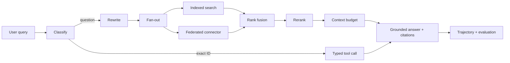

# Enterprise Search Agent

A small, runnable reference implementation of a grounded enterprise search agent. No API key, no cloud services, no database — `pip install`, `pytest`, `uvicorn`.

It exists to make one thing concrete: **how a query becomes a cited answer, and where quality is won or lost along the way.**

Covered: query classification, exact-ID routing to typed APIs, query rewrite, fan-out, indexed vs federated retrieval, ACL enforcement, reciprocal rank fusion, reranking, context budgeting, grounded answers with citations, MCP-style tool contracts, checkpoint/resume, agent trajectories, and offline retrieval metrics.

## Pipeline



## Why each step exists

| Step | Problem it solves | File |
| --- | --- | --- |
| **Classify** | "Where is ORDER-123456" is not a search problem. Route exact IDs to a typed API: exact, fast, always current. | `planner.py` |
| **Rewrite** | A lexical index can't match `MCP` against a document that says *model context protocol*. Expansions are **added**, never substituted. | `planner.py` |
| **Fan-out** | One query phrasing finds one slice of the corpus. A few complementary queries raise recall. Capped, because each one costs a retrieval call. | `planner.py` |
| **Indexed retrieval** | Low-latency ranking over synchronized content. Cheap, but only as fresh as the last sync. | `index.py` |
| **Federated retrieval** | Volatile data (stock, order state) read from the system of record at request time. Always current; costs latency and someone else's uptime. | `index.py` |
| **ACL filter** | Applied inside **every** channel, before scoring. A channel that forgets is a data leak. | `index.py`, `models.py` |
| **Rank fusion (RRF)** | A TF-IDF cosine of 0.3 and a connector score of 0.3 don't mean the same thing, so you cannot add them. RRF uses **ranks**, which every channel defines identically. Also the dedup step. | `ranking.py` |
| **Rerank** | Fusion optimizes recall; reranking optimizes precision at position 1. Scored against the **original** query, not the rewrite. | `ranking.py` |
| **Context budget** | Controls cost, latency, and hallucination in one place. Irrelevant context measurably degrades answers. | `answer.py` |
| **Grounded answer** | Every sentence carries a `[Source n]` marker that resolves to a real citation. | `answer.py` |
| **Trajectory** | Without a step-level audit log, a wrong answer is unexplainable. | `agent.py` |
| **Evaluation** | Retrieval and answer quality are measured **separately** — otherwise you can't tell a retrieval miss from a reading error. | `evaluation.py` |

## Layout

```text
.
├── app.py                 FastAPI layer: validate, call agent, map errors to status codes
├── conftest.py            puts the project root on sys.path so pytest runs from anywhere
├── src/enterprise_search/
│   ├── agent.py           the pipeline + step timing/checkpointing/trajectory
│   ├── planner.py         classify, exact-ID detection, rewrite, fan-out
│   ├── index.py           LocalIndex (TF-IDF) and FederatedConnector, both ACL-aware
│   ├── ranking.py         reciprocal rank fusion + rerank
│   ├── answer.py          context budget, extractive grounded answer, citations
│   ├── tools.py           MCP-style tool contracts (JSON Schema) + registry
│   ├── checkpoints.py     step-level checkpoint store (retry vs resume)
│   ├── evaluation.py      precision@k, recall@k, MRR@k, NDCG@k
│   ├── models.py          Document, SearchResult
│   ├── text.py            one shared tokenizer/sentence splitter
│   └── data.py            demo corpus
└── tests/
    ├── test_pipeline.py   unit tests per stage
    └── test_app.py        end-to-end API tests
```

## Run it

```bash
pip install -r requirements.txt
pytest -q
uvicorn app:app --reload --port 8000
```

Windows PowerShell:

```powershell
python -m venv .venv
.\.venv\Scripts\Activate.ps1
pip install -r requirements.txt
uvicorn app:app --reload --port 8000
```

Swagger UI: <http://localhost:8000/docs>

### Search

```bash
curl -X POST http://localhost:8000/search \
  -H 'Content-Type: application/json' \
  -d '{"query":"How should an agent reduce context bloat and use retry versus resume?","user_groups":["analytics"]}'
```

### Exact-ID routing (no retrieval at all)

```bash
curl -X POST http://localhost:8000/search \
  -H 'Content-Type: application/json' \
  -d '{"query":"Check ORDER-123456"}'

curl -X POST http://localhost:8000/search \
  -H 'Content-Type: application/json' \
  -d '{"query":"Price of SKU-99881?"}'
```

The order ID reaches `get_order`; the SKU reaches `get_product`. Each identifier pattern is bound to the tool that owns it.

### ACL enforcement

```bash
# 'commercial' can see the promotion policy
curl -sX POST http://localhost:8000/search -H 'Content-Type: application/json' \
  -d '{"query":"promotion discount approval policy","user_groups":["commercial"]}' | grep -o 'promotion-policy'

# 'guest' cannot — the document is never scored, let alone cited
curl -sX POST http://localhost:8000/search -H 'Content-Type: application/json' \
  -d '{"query":"promotion discount approval policy","user_groups":["guest"]}' | grep -o 'promotion-policy'
```

### Resume a run

```bash
# note the run_id from any /search response, then replay it
curl -X POST http://localhost:8000/search \
  -H 'Content-Type: application/json' \
  -d '{"query":"How do we reduce context bloat?","run_id":"PASTE_RUN_ID","resume":true}'
```

Every step comes back with `"status": "cached"` and `steps_replayed` equals the step count — nothing re-executed.

### Offline evaluation

```bash
curl -X POST http://localhost:8000/evaluate/search \
  -H 'Content-Type: application/json' \
  -d '{"retrieved_ids":["x","tech-001","tech-002"],"relevant_ids":["tech-001","tech-002"],"k":3}'
```

### Tool catalogue

```bash
curl http://localhost:8000/tools
```

## Docker

```bash
docker build -t enterprise-search-agent .
docker run --rm -p 8000:8000 enterprise-search-agent
```

---

## Interview notes

Short answers to the questions this project is usually asked about.

**Why RRF instead of just adding the scores?**
Scores from different retrievers aren't on a common scale and aren't calibrated — a 0.3 cosine and a 0.3 BM25 score carry different information. Ranks are the one thing every retriever agrees on. RRF sums `1/(k + rank)` per document, so documents that several retrievers rank highly rise, and the constant (60 by convention) keeps rank 1 from dominating ranks 2–5 outright. It needs no training data, which is why it's the standard first hybrid-search implementation.

**Fusion and reranking both reorder results. Why both?**
Different objectives. Fusion is a recall stage: cheap, applied to every candidate, merges channels. Reranking is a precision stage: more expensive, applied to a shortlist, decides position 1. In production the reranker is a cross-encoder that reads query and document together — too costly to run over the whole corpus, which is exactly why a cheap recall stage runs first. Here the reranker is a transparent weighted blend (`ranking.py`) so you can read why any document won.

**Indexed vs federated — how do you choose?**
By volatility and authority. Content that changes rarely and needs ranking goes in the index (policies, guides, tickets). Data that must be correct *right now* is federated (stock, order status, price). Indexing volatile data means confidently serving stale answers; federating everything means your latency is the sum of other teams' p99s.

**Retry vs resume?**
Retry re-runs the step that just failed — right for transient errors, safe only when the step is idempotent. Resume re-runs *nothing* that already succeeded: completed steps replay from their checkpoints and execution continues from the first unfinished one, so completed side effects never repeat. That's why `Tool` carries an `idempotent` flag — the agent can't choose correctly without it. See `checkpoints.py`.

**How does the context budget prevent hallucination?**
Indirectly but measurably. Irrelevant context degrades answers, and long context degrades attention to the middle of it. The budget forces a hard choice about what the model sees: dedup by document ID, keep best-scoring first, skip anything that doesn't fit. Grounding is the other half — every sentence must carry a source marker, and a run with no evidence returns an explicit refusal rather than a guess.

**How do you know it's any good?**
Two separate measurements. Retrieval: precision@k, recall@k, MRR@k, NDCG@k against labelled query/document pairs (`/evaluate/search`). Answers: correctness, faithfulness, citation coverage — judged by humans or an LLM judge, never by string match. Keeping them separate is the point: a bad answer from good evidence is a generation bug; a bad answer from missing evidence is a retrieval bug, and they have nothing to do with each other. The trajectory adds a third layer — did the agent take a sane path, and did it stay in budget.

**Why is the control flow hard-coded instead of letting the LLM decide the next step?**
Because the pipeline's shape is known in advance. Hard-coded control flow is cheaper, can't loop, and produces the same trajectory every run, which is what makes it testable. Give the LLM the choice only when the next step genuinely depends on what the previous one returned.

**What makes these tools "MCP-style"?**
Same contract shape MCP uses — `name`, `description`, `inputSchema` (JSON Schema) — so the handlers could be exposed over a real MCP server unchanged. The value is the boundary: the agent reasons about *what* a tool does, while auth, transport, retries, and legacy response shapes stay behind the handler. Arguments are validated against the schema *before* the handler runs, so a bad call is a 400, not a 500.

**Where would this break at scale?**
TF-IDF rebuilt in memory at startup (needs a real index with incremental sync); ACL evaluated after scoring rather than pushed into the engine as a pre-filter; checkpoints in a process-local dict (needs Redis/Postgres to survive a restart or be shared across workers); groups read from the request body instead of a validated token; no caching, rate limiting, or tracing.

## Production extensions

- Replace TF-IDF with hybrid retrieval (BM25 + embeddings) on a managed index; keep the same `search()` interface.
- Replace the extractive generator with an LLM call — same evidence list, same "cite every claim" contract.
- Replace `CheckpointStore` with Redis/Postgres, or move orchestration to a durable workflow engine.
- Push ACLs into the retrieval engine as a pre-filter and derive `user_groups` from a validated token.
- Add a cross-encoder reranker and measure the precision@1 lift before keeping it.
- Add OpenTelemetry spans per trajectory step, idempotency keys on non-idempotent tools, and a labelled evaluation set in CI so ranking changes have to prove themselves.
