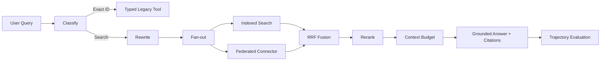

# Enterprise Search and Agent Reference System

A complete local demo covering enterprise search quality, query rewrite, query fan-out, rank fusion, reranking, context-bloat control, MCP-style tool contracts, exact legacy API routing, indexed versus federated retrieval, grounded answers, citations, agent trajectories, and offline evaluation.

## Architecture



## Why each step exists

1. **Classify**: routes exact IDs to deterministic APIs instead of fuzzy retrieval.
2. **Rewrite**: normalizes language and expands important concepts.
3. **Fan-out**: creates a small capped set of policy, architecture, and evaluation searches.
4. **Indexed retrieval**: provides fast retrieval over synchronized documents.
5. **Federated retrieval**: queries request-time operational information.
6. **RRF fusion**: combines ranked lists without treating incompatible raw scores as comparable.
7. **Reranking**: improves top-result precision using query-to-title and query-to-body overlap.
8. **Context budget**: deduplicates implicitly through document IDs and caps evidence at 3,500 characters.
9. **Answer generation**: creates an extractive grounded answer so the demo needs no cloud key.
10. **Trajectory evaluation**: exposes executed steps, latency, citations, and a validity check.

## Repository

```text
.
├── app.py
├── Dockerfile
├── requirements.txt
├── src/enterprise_search/
│   ├── agent.py
│   ├── data.py
│   ├── index.py
│   ├── models.py
│   ├── planner.py
│   ├── ranking.py
│   └── tools.py
└── tests/test_app.py
```

## Run locally

```bash
python -m venv .venv
source .venv/bin/activate
pip install -r requirements.txt
pytest -q
uvicorn app:app --reload --port 8000
```

On Windows PowerShell, activate with:

```powershell
.venv\Scripts\Activate.ps1
```

Open Swagger UI at `http://localhost:8000/docs`.

## Example search

```bash
curl -X POST http://localhost:8000/search \
  -H 'Content-Type: application/json' \
  -d '{"query":"How should an agent reduce context bloat and use retry versus resume?","user_groups":["analytics"]}'
```

## Exact-ID tool routing

```bash
curl -X POST http://localhost:8000/search \
  -H 'Content-Type: application/json' \
  -d '{"query":"Check ORDER-123456","user_groups":["analytics"]}'
```

## Search evaluation

```bash
curl -X POST http://localhost:8000/evaluate/search \
  -H 'Content-Type: application/json' \
  -d '{"retrieved_ids":["x","tech-001","tech-002"],"relevant_ids":["tech-001","tech-002"],"k":3}'
```

## Docker

```bash
docker build -t enterprise-search-agent .
docker run --rm -p 8000:8000 enterprise-search-agent
```

## Push to GitHub

```bash
git init
git add .
git commit -m "Initial enterprise search agent"
git branch -M main
git remote add origin YOUR_GITHUB_REPOSITORY_URL
git push -u origin main
```

## Production extensions

- Replace TF-IDF with a production vector and lexical retrieval stack.
- Replace the extractive generator with Gemini through your approved API configuration.
- Persist checkpoints in Redis, PostgreSQL, or a workflow engine.
- Add OAuth, source-level ACL propagation, secrets management, OpenTelemetry, and idempotency keys.
- Add graded relevance labels and production feedback for NDCG, MRR, recall, faithfulness, and trajectory quality.
