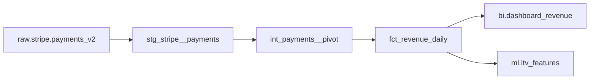

# Lesson 6 — AI Documentation & Catalogs

> **Type:** Article · Module 3 · AI for Pipeline Development
> Generating schema.yml, docstrings, lineage notes, and column-level descriptions at >85% coverage.

---

## The chronic problem

Documentation coverage on data projects is **consistently terrible**:
- 5–20% of columns have descriptions
- Schema.yml files are missing or stale
- Runbooks are outdated
- Lineage is "ask someone who's been here 2 years"

AI flips this from "nobody does it" to "documentation actually gets written." The win isn't the time per doc — it's that **docs exist at all**.

```
   Before AI: 15-30% coverage, takes a quarter to write
   After AI:  85%+ coverage in the same time it took to write 1 model manually
```

---

## The documentation generation workflow

```
   ┌────────────────────┐
   │  Pick a model      │
   └─────────┬──────────┘
             ▼
   ┌────────────────────────────────────────┐
   │  AI reads the model SQL + tests        │
   │  + query log history                   │
   │  + upstream sources                    │
   └─────────┬──────────────────────────────┘
             ▼
   ┌────────────────────────────────────────┐
   │  AI generates:                         │
   │  - model description                   │
   │  - column descriptions                 │
   │  - lineage notes (upstream + downstream)│
   │  - tests rationale                     │
   └─────────┬──────────────────────────────┘
             ▼
   ┌────────────────────────────────────────┐
   │  You review (10 min)                   │
   │  - fix business context AI cannot know │
   │  - spot-check 10% of columns           │
   └─────────┬──────────────────────────────┘
             ▼
   ┌────────────────────────────────────────┐
   │  Ship                                  │
   └────────────────────────────────────────┘
```

---

## The model-doc prompt

```text
ROLE: senior analytics engineer.

TASK: Given the following dbt model SQL, generate models/<model_name>.yml with:

1. model description (2-3 sentences: what this model is, grain, source)
2. column descriptions for every column
3. tests (not_null/unique on PK, accepted_values on categoricals)
4. a "business_notes" section for things AI cannot infer

MODEL SQL:
```sql
{{PASTE YOUR MODEL SQL}}
```

UPSTREAM SOURCES:
- raw.stripe.payments_v2

DOWNSTREAM DEPENDENTS (from manifest):
- fct_revenue_daily
- bi.dashboard_revenue

CONSTRAINTS:
- descriptions are 1 sentence each
- don't invent business context (leave a "TODO" if unsure)
- tests are minimal: PK + obvious invariants
- use dbt YAML schema syntax
```

---

## What AI generates well vs poorly

```
   AI generates well:                        AI generates poorly:
   ─────────────────                        ────────────────────
   ✅ column type description                ❌ business meaning of "status"
   ✅ "integer between 0 and 100"            ❌ "this column is critical for..."
   ✅ grain explanation                      ❌ ownership / on-call team
   ✅ relationship to upstream               ❌ SLA / freshness expectations
   ✅ "one row per X"                        ❌ downstream dependencies (without manifest)
   ✅ standard cardinality                   ❌ regulatory implications
```

**Rule:** AI drafts the **structural** descriptions. You write the **business** descriptions. Splitting the work this way gets you to 85% coverage in hours.

---

## Column-level descriptions — the recipe

For each column, generate:

| Field | Content | AI generates? |
|---|---|---|
| Description | What this column is | ✅ (verify) |
| Type | Logical type | ✅ |
| Nullable | Yes/No | ✅ |
| Range | Min/max or enum | ✅ |
| Example values | Top 3 distinct | ✅ |
| Source | Where it comes from | ✅ |
| Owner | Team that owns it | ❌ |
| PII | Yes/No + class | ❌ (verify) |
| Used in | Which dashboards | ⚠️ with manifest |

---

## The docstring prompt

```text
For the function below, generate a Google-style docstring including:
- one-line summary
- extended description (when / why to use)
- args (with types and description)
- returns
- raises (every exception the function can raise)
- example (one-line usage)

```python
{Paste your function}
```

CONSTRAINTS:
- don't over-document trivial helpers
- match the project's docstring style (Google vs NumPy vs reST)
- flag any function where the type hints don't match the docstring
```

---

## The catalog integration

Generated docs flow into the catalog:

```
   dbt model SQL + AI-generated schema.yml
                  │
                  ▼
   ┌──────────────────────┐
   │  dbt parse           │
   └──────────┬───────────┘
              ▼
   ┌──────────────────────┐
   │  manifest.json       │  ← AI-readable
   │  catalog.json        │  ← catalog-readable
   └──────────┬───────────┘
              ▼
   ┌──────────────────────┐
   │  Atlan / Alation /   │  ← searchable, with lineage
   │  Collibra / DataHub  │
   └──────────────────────┘
```

The AI-generated descriptions flow into the manifest, which flows into the catalog, which becomes **searchable**. Future questions like *"what does `lifetime_value` mean in this warehouse?"* return a real answer, not "ask Sarah, she's been here 7 years."

---

## The "write the README" prompt

```text
Generate the README.md for the data project in this repo.

Sections:
1. One-paragraph overview (what this is, who it's for)
2. Architecture diagram (sources → staging → marts, with key tools)
3. Local setup (uv install, dbt deps, env vars)
4. Running locally (dbt build, airflow dags list)
5. Testing (make test, integration tests)
6. Deployment (CI/CD, dbt cloud / Argo / GH Actions)
7. Contributing (style guide, PR template, code owners)
8. Runbooks (link to ./runbooks/)
9. On-call (link to PagerDuty schedule)

CONSTRAINTS:
- Mermaid diagrams (not images)
- every link must work
- no placeholder text — if unsure, leave a TODO
```

---

## The lineage extraction

AI can infer lineage from:
- `ref()` calls in dbt
- SQL JOINs in raw transformations
- The manifest.json

```text
From this dbt project, generate the lineage graph for fct_revenue_daily:
- list every upstream model (transitively)
- list every downstream consumer
- output as a Mermaid diagram
```

Result:


---

## The documentation deliverable

For every model, you ship:

```yaml
# models/marts/_models.yml
version: 2

models:
  - name: fct_orders
    description: |
      One row per order. Used by the revenue dashboard and the
      churn model. Refreshed daily at 06:00 UTC.
    columns:
      - name: order_id
        description: Unique order identifier (surrogate).
        tests:
          - not_null
          - unique
      - name: customer_id
        description: |
          FK to dim_customers. Nullable for guest checkout (3% of rows).
        tests:
          - not_null
          - relationships: { to: ref('dim_customers'), field: customer_id }
      - name: order_amount_usd
        description: Gross order amount in USD cents (integer).
        tests:
          - not_null
          - dbt_utils.expression_is_true: { expression: ">= 0" }
      - name: order_status
        description: |
          Current order status. Lifecycle:
          placed → paid → shipped → delivered (or returned/cancelled).
        tests:
          - accepted_values:
              values: ['placed', 'paid', 'shipped', 'delivered', 'returned', 'cancelled']
      - name: placed_at
        description: UTC timestamp of order placement.
        tests:
          - not_null
    tests:
      - dbt_utils.unique_combination_of_columns:
          combination_of_columns: [order_id, placed_at]
```

**Coverage: 6 columns, all with descriptions, all with tests.** Without AI, this file takes 30 minutes. With AI, it takes 5.

---

## The "documentation rot" pattern

Even with AI, docs go stale. Plan for it:

```
   Day 0:   doc generated
   Day 30:  schema changes (new column added)
   Day 60:  doc is stale
   Day 90:  nobody trusts the doc
```

**Fix:** regenerate docs on every PR. Add a CI check: *"if a column was added to the model, the schema.yml must have changed."* The doc and code move together.

---

## What Comes Next

> Lesson 7 — **Self-Healing Pipelines** — what auto-retry looks like in 2026, what AI agents can fix autonomously, and where the human stays in the loop.
