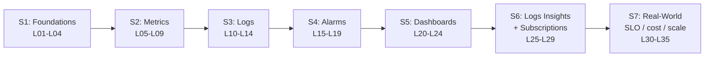

# L01 — Course Introduction & What You'll Build

> **Author:** Prem Vishnoi <prem.vishnoi@example.com>
> **Section:** 1 — Foundations
> **Duration:** 5:00

## Prereqs

None. This is the very first lecture. You don't need an AWS account, a
Python install, or any prior observability experience to follow this
overview.

## Key terms

- **Observability** — the ability to understand a system's internal state
  from its external outputs. The three pillars are metrics, logs, and
  traces.
- **CloudWatch** — AWS's managed observability service. It offers metrics,
  logs, alarms, dashboards, and (via EventBridge) events.
- **boto3** — the AWS SDK for Python. Every code demo in this course
  drives CloudWatch through `boto3`.
- **moto** — the AWS mocking library we use to run the demos locally
  without an AWS account.

## Lecture

Hi, I'm Prem Vishnoi, and welcome to the **AWS CloudWatch Crash Course**.
This is the lecture to watch before you do anything else.

### Who this course is for

- **Engineers running production workloads on AWS** who need to add
  metrics, dashboards, or alarms to their services.
- **Data engineers** who need to wire ETL jobs (Glue, EMR, Lambda) into
  CloudWatch so failures page on-call.
- **SREs** rolling out SLO/SLI monitoring and burn-rate alerts.
- **Architects** evaluating CloudWatch against third-party observability
  products (Datadog, Honeycomb, Grafana Cloud, etc.).

You do **not** need prior CloudWatch experience. Section 1 builds the
mental model from scratch.

### What you'll build

The course is anchored by **5 hands-on `boto3` demos** (one per major
sub-service) plus a graded SLO-dashboard assignment:

| # | Demo | What it does |
|---|---|---|
| 1 | `put_metric_data.py` | Publish a custom metric namespace, 5 data points, retrieve p99 |
| 2 | `create_log_group.py` | Create a log group + stream, write events, filter by time |
| 3 | `put_metric_alarm.py` | Create a CPU alarm with an SNS action, describe it |
| 4 | `create_dashboard.py` | Build a 3-widget dashboard (metric + insights + text) |
| 5 | `subscription_filter.py` | Forward matching log events to a Kinesis stream |

Each demo is **idempotent** (safe to re-run) and ships with **5+ moto
tests** that pass in < 5 seconds on a laptop.

### How the sections build on each other



The arc is deliberate: we learn each sub-service in isolation (sections
2–5), learn the cross-cutting features (Logs Insights, subscriptions,
section 6), and then put it all together in real-world patterns
(section 7).

## Hands-on

This lecture is orientation only — no lab. Your only homework is to
download the cheat sheet.

```bash
open aws_cloudwatch_course/downloads/cloudwatch_cheat_sheet.md
```

## Quiz prep

For this lecture, focus on the **big-picture** questions that show up
in section 1's quiz:

- How many sections and lectures does the course have? (7 sections, 35 lectures)
- Which AWS SDK do the demos use? (boto3)
- Which mocking library do the local tests use? (moto)

## Further reading

- `../../downloads/cloudwatch_cheat_sheet.md`
- `../../SYLLABUS.md` — authoritative lecture-to-file map.
- `../../README.md` — repo layout, "What you'll build" table.

## What's next

Next up is **L02 — The Three Pillars of Observability**, where we
explain *why* CloudWatch is split into metrics / logs / alarms /
dashboards the way it is.
