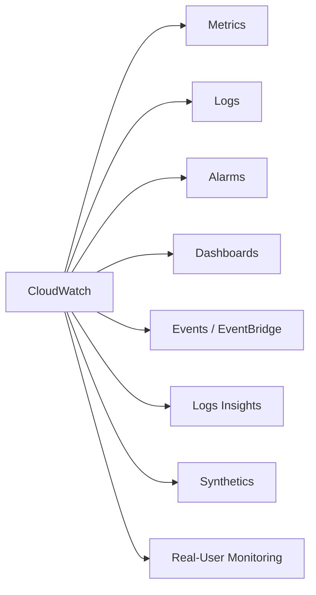

# L03 — CloudWatch Service Overview, Pricing & Free Tier

> **Author:** Prem Vishnoi <pvishnoi@avilx.com>
> **Section:** 1 — Foundations
> **Duration:** 8:00

## Prereqs

L02 (three pillars of observability).

## Key terms

- **Free tier** — most AWS services include a "perpetually free" or
  "12-month free" allowance. CloudWatch's free tier is mostly
  *perpetual*, not time-limited.
- **Metric data point** — one `(timestamp, value)` row in a metric. Billed
  per 1,000 data points.
- **Metric stream** — a near-real-time push of metrics to Kinesis Data
  Firehose, used to feed Datadog / 3rd-party tools.
- **Logs ingestion** — bytes received via `PutLogEvents` / agent.
- **Logs storage** — GB-month of stored logs (after retention).

## Lecture

CloudWatch is one of the few AWS services where the **free tier is
generous and perpetual**. The free tier is the reason many teams
*default* to CloudWatch instead of paying for Datadog, even before
considering functional fit.

### What CloudWatch offers



(Diagram lives at `diagrams/cloudwatch_anatomy.mmd`.)

### Free tier (US-East-1, as of 2026-10)

| Resource | Free allowance |
|---|---|
| Metrics | 10,000 metrics/month (1-min resolution, basic monitoring) |
| Metric data points | 1,000,000 per month for the first 5 months |
| API requests | 1,000,000 per month (GetMetricData, etc.) |
| Alarms | 10 metric alarms + 10 metric math alarms free |
| Dashboards | 3 dashboards (up to 50 metrics each) free for 12 months |
| Logs | 5 GB ingestion + 5 GB archive + 1 GB Insights queries free |
| Logs Insights | 10 queries / month, up to 30 days scanned |
| Events (EventBridge) | All state changes free; 1M custom events free / month |

Beyond the free tier, pricing is per-GB / per-1,000-metrics, with
**volume discounts** the further you go.

### When CloudWatch bills you

| Line item | Approx. cost |
|---|---|
| Standard-resolution metric (per 1,000 datapoints) | $0.01 |
| High-resolution metric (per 1,000 datapoints) | $0.03 |
| Custom metric (per metric-month) | $0.30 |
| Detailed monitoring for EC2 (per instance-month) | $3.00 |
| Logs ingestion (per GB) | $0.50 |
| Logs storage (per GB-month) | $0.03 |
| Logs Insights queries (per GB scanned) | $0.005 |
| Dashboard (additional beyond 3 free) | $3.00 / month |
| Alarm (beyond 10 free) | $0.10 / month |
| SNS notification (per million) | $0.50 |

### The cost-optimisation story

A few patterns we'll come back to in section 7:

1. **Don't enable detailed monitoring for EC2** unless you need 1-min
   resolution. The default 5-min basic monitoring is free.
2. **Use metric math, not raw metrics**, where possible — it doesn't
   count as a custom metric.
3. **Set log retention to 7 or 30 days**, not "Never", unless you really
   need to keep logs forever.
4. **Use anomaly detection bands** instead of 5 static thresholds per
   metric.
5. **Use metric streams** to a Firehose → S3 → Athena pipeline when
   per-second visibility is required; it's cheaper than CloudWatch
   Logs Insights for analytics workloads.

## Hands-on

No lab. Open the CloudWatch console in your account and verify you can
navigate Metrics / Logs / Alarms / Dashboards. We'll explore each in
the next sections.

```bash
# Sanity check
aws cloudwatch list-metrics --namespace AWS/EC2 --max-items 5
```

## Quiz prep

- Which CloudWatch sub-services are free-tier eligible perpetually?
  (Most: 10K metrics, 5 GB logs / month, 10 alarms, 3 dashboards, etc.)
- How is custom-metric data-point billing different from
  standard-resolution?
- What is the cheapest way to export all your metrics to S3?
  (Metric streams → Kinesis Data Firehose → S3)

## Further reading

- AWS pricing page: <https://aws.amazon.com/cloudwatch/pricing/>
- `../../downloads/cloudwatch_cheat_sheet.md` — service limits table.
- `07_real_world/lecture_scripts/L31_cost_optimization.md` (later).

## What's next

L04 — Console Tour: Metrics, Logs, Alarms, Dashboards.
