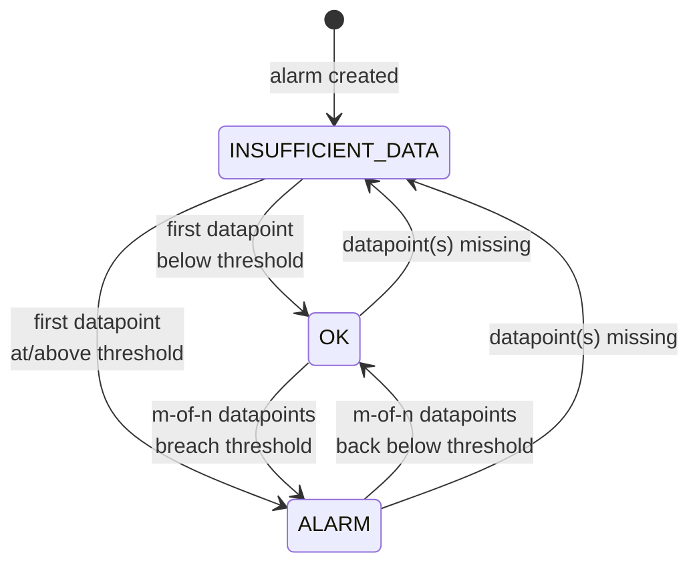

# L15 — Metric Alarms 101 — OK / ALARM / INSUFFICIENT_DATA

> **Author:** Prem Vishnoi <pvishnoi@avilx.com>
> **Section:** 4 — CloudWatch Alarms
> **Duration:** 10:00

## Prereqs

L14 (logs hands-on).

## Key terms

- **Alarm** — a CloudWatch object that watches a metric (or metric-math
  expression) and fires actions when a condition is met.
- **OK** — alarm state: metric is healthy, no actions fire.
- **ALARM** — alarm state: condition is breached; alarm actions fire.
- **INSUFFICIENT_DATA** — alarm state: not enough datapoints to
  evaluate (e.g. metric was just created, or the underlying instance
  is stopped).
- **TreatMissingData** — what an alarm does when a datapoint is
  missing (`breaching`, `notBreaching`, `ignore`, `missing`).
- **State transition** — the event of an alarm changing state; each
  transition is logged in the alarm's history (15 days free).

## Lecture

An alarm is the *thing that wakes you up at 3am*. Understanding its
state machine is the most important part of this section.

### The state machine



(Diagram at `../../diagrams/alarm_state_machine.mmd`.)

### Putting it all together

```python
import boto3

cw = boto3.client("cloudwatch")

cw.put_metric_alarm(
    AlarmName="checkout-high-5xx",
    AlarmDescription="Page on-call when 5xx rate > 1% for 5 min",
    Namespace="AWS/ApiGateway",
    MetricName="5XXError",
    Statistic="Sum",
    Dimensions=[{"Name": "ApiName", "Value": "checkout"}],
    Period=60,
    EvaluationPeriods=5,
    DatapointsToAlarm=3,
    Threshold=10.0,
    ComparisonOperator="GreaterThanThreshold",
    TreatMissingData="notBreaching",
    AlarmActions=["arn:aws:sns:us-east-1:111122223333:oncall-pager"],
    OKActions=["arn:aws:sns:us-east-1:111122223333:oncall-resolved"],
)
```

The key fields are:

| Field | Meaning |
|---|---|
| `Period` | window size in seconds for each datapoint |
| `EvaluationPeriods` | how many `Period`s to look back |
| `DatapointsToAlarm` | how many of those must breach (m-of-n) |
| `Threshold` | the comparison value |
| `ComparisonOperator` | `GreaterThanThreshold`, `LessThanThreshold`, etc. |
| `TreatMissingData` | what to do if a datapoint is missing |
| `AlarmActions` | ARNs to fire when entering ALARM |
| `OKActions` | ARNs to fire when returning to OK |
| `ActionsEnabled` | master switch (default `True`) |

### What's special about `INSUFFICIENT_DATA`

It's not a "fail-safe" state — it's a "I don't have enough info to
say" state. The most common cause: an instance is stopped, so EC2
metrics stop publishing. The alarm can't evaluate and goes into
INSUFFICIENT_DATA.

You control what happens next with `TreatMissingData`:

- `breaching` — treat missing as if the threshold is breached (good
  for "if it stopped reporting, page me").
- `notBreaching` — treat as OK (good for noisy transient data).
- `ignore` — stay in the current state (default).
- `missing` — preserve the current state. (Same as `ignore` for most
  purposes.)

### Actions in detail

An alarm can have up to **5 actions** per state. Action types:

| Action ARN | Effect |
|---|---|
| `arn:aws:sns:...:topic` | Send SNS notification |
| `arn:aws:autoscaling:...:autoScalingGroup:...` | Trigger ASG policy |
| `arn:aws:lambda:...:function:...` | Invoke Lambda |
| `arn:aws:swf:...:/actions/actions/AWS_EC2.InstanceId.Reboot/1.0` | Reboot EC2 |
| `arn:aws:swf:...:/actions/actions/AWS_EC2.InstanceId.Stop/1.0` | Stop EC2 |
| `arn:aws:swf:...:/actions/actions/AWS_EC2.InstanceId.Terminate/1.0` | Terminate EC2 |
| `arn:aws:swf:...:/actions/actions/AWS_EC2.InstanceId.Recover/1.0` | Recover EC2 |

We'll use SNS in L17 and Lambda in section 6.

## Hands-on

In your AWS account, create a "free" alarm against `AWS/Lambda` →
`Errors` for any function with non-zero errors. Subscribe your email
to a new SNS topic and confirm the subscription. Wait for the alarm
to fire (or trigger the function with an error).

## Quiz prep

- What are the three alarm states? (OK / ALARM / INSUFFICIENT_DATA)
- What does `TreatMissingData=breaching` do? (Treats a missing
  datapoint as a breach.)
- How many actions per state does CloudWatch support? (5)

## Further reading

- `https://docs.aws.amazon.com/AmazonCloudWatch/latest/monitoring/AlarmThatSendsEmail.html`

## What's next

L16 — Threshold types, Period, Evaluation Periods, Datapoints-to-Alarm.
