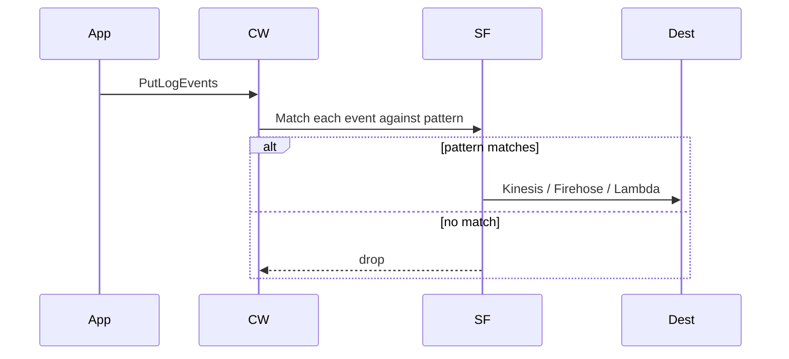

# L25 — Subscription Filters 101 — Real-Time Log Fan-out

> **Author:** Prem Vishnoi <pvishnoi@avilx.com>
> **Section:** 6 — Logs Insights + Subscriptions
> **Duration:** 12:00

## Prereqs

L24 (dashboards hands-on).

## Key terms

- **Subscription filter** — a CloudWatch Logs mechanism that streams
  matching log events in real time to a destination (Kinesis, Firehose,
  or Lambda).
- **Real-time** — events arrive at the destination within seconds.
  Compare to Insights (query-on-demand) and metric filters (counts
  only).
- **`put_subscription_filter`** — the API call to attach a filter.
- **`delete_subscription_filter`** — the API to remove a filter.
- **2 per log group** — the hard limit on subscription filters per log
  group.

## Lecture

CloudWatch Logs gives you three ways to *do something* with log
events:

| Mechanism | Latency | Output | Cost |
|---|---|---|---|
| **Metric filter** | ~1 min | a CloudWatch metric | metric datapoint cost |
| **Logs Insights** | on-demand | tabular query | per GB scanned |
| **Subscription filter** | seconds | a stream of events | destination + filter |

A subscription filter is the **real-time** option. Use it when you
need to react to logs as they happen:

- Ship ERRORs to S3 / OpenSearch for search.
- Hand log events to a Lambda for transformation + routing.
- Build a real-time dashboard with Kinesis Data Analytics.

### Architecture



(Diagram at `../../diagrams/subscription_filter_flow.mmd`.)

### Limits

- **2 subscription filters per log group.** If you need 3+ destinations,
  fan out from the first destination (e.g. Lambda → Kinesis + S3).
- Each log group can have **100 metric filters** (not subscription).
- Kinesis / Firehose / Lambda destinations are **regional** — the
  destination must be in the same region as the log group.

### Lifecycle

```python
import boto3
logs = boto3.client("logs")

# 1. Create a Kinesis stream (or Firehose, or Lambda)
kinesis = boto3.client("kinesis")
kinesis.create_stream(StreamName="logs-stream", ShardCount=1)

# 2. Put the subscription filter
logs.put_subscription_filter(
    logGroupName="/myapp/api",
    filterName="errors-to-kinesis",
    filterPattern="ERROR",
    destinationArn="arn:aws:kinesis:us-east-1:111122223333:stream/logs-stream",
    roleArn="arn:aws:iam::111122223333:role/CWLtoKinesisRole",
)

# 3. (later) tear it down
logs.delete_subscription_filter(
    logGroupName="/myapp/api",
    filterName="errors-to-kinesis",
)
```

### The role ARN

CloudWatch Logs needs permission to **put records** to the
destination. The role's trust policy must allow
`logs.<region>.amazonaws.com` to assume it; the role's permission
policy must allow the destination's API.

```json
{
  "Version": "2012-10-17",
  "Statement": [
    {"Effect": "Allow",
     "Principal": {"Service": "logs.us-east-1.amazonaws.com"},
     "Action": "sts:AssumeRole"},
    {"Effect": "Allow",
     "Action": ["kinesis:PutRecord", "kinesis:PutRecords"],
     "Resource": "arn:aws:kinesis:us-east-1:111122223333:stream/logs-stream"}
  ]
}
```

## Hands-on

In your AWS account:

1. Create a Kinesis stream `demo-logs-stream` (1 shard).
2. Create a role `CWLtoKinesisDemo` per the policy above.
3. Run the snippet in the lecture with your real ARNs.
4. Write a log event with `ERROR` and confirm it shows up in Kinesis
   (use the *Kinesis Data Streams → Data Viewer* tab).

## Quiz prep

- How many subscription filters per log group? (2)
- What's the latency of a subscription filter? (Seconds.)
- What are the three possible destinations? (Kinesis, Firehose, Lambda.)

## Further reading

- `https://docs.aws.amazon.com/AmazonCloudWatch/latest/logs/SubscriptionFilters.html`

## What's next

L26 — Filter Pattern Syntax.
