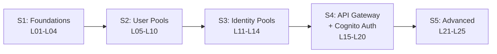

# L01 — Course Introduction & Why Cognito

> **Author:** Prem Vishnoi <prem.vishnoi@example.com>
> **Section:** 1 — Foundations
> **Duration:** 8:00

## Prereqs

None. This is the very first lecture. You do not need an AWS account or
a Python install to follow this overview.

## Key terms

- **AWS Cognito** — the AWS service for user identity and
  authentication. Two flavors: **User Pools** (a managed user directory
  that issues OAuth/OIDC tokens) and **Identity Pools** (a broker that
  trades those tokens — or SAML/OIDC tokens — for **temporary AWS
  credentials**).
- **Cognito User Pool Authorizer** — a built-in API Gateway
  authorization mechanism that validates Cognito-issued JWTs without
  you writing a line of code.
- **JWT (JSON Web Token)** — a signed, Base64URL-encoded token that
  carries user identity and authorization claims. Section 4 of this
  course validates them end-to-end.
- **MFA** — Multi-Factor Authentication. Cognito supports SMS, TOTP,
  and WebAuthn (passkeys).
- **Federation** — letting users sign in with an identity they already
  have (Google, Okta, Azure AD, etc.) instead of standing up a new
  username/password store.

## Lecture

Hi, I'm Prem Vishnoi, and welcome to **AWS Cognito Authorizers — Crash
Course**. In the next eight minutes I want to answer the question
"why should I learn Cognito at all?" — and then give you the road map
for the next 5 hours of the course.

### Why Cognito exists

Every modern application needs **two** things:

1. A way to know **who the user is** — typically a username + password,
   plus MFA, plus social login.
2. A way to **authorize API calls** — typically a token attached to
   every HTTP request.

Before Cognito, the default answer for an AWS-based app was "stand up
your own PostgreSQL `users` table, roll your own login endpoints, hand
out JWTs from your Lambda, and pray." That works — but it means you
re-solve the same 18 problems every team solves:

- Password storage (bcrypt? argon2? pepper? rotation?)
- Account-recovery flows (email links, SMS codes, security questions)
- MFA (SMS? TOTP? WebAuthn?)
- Social login (Google, Facebook, Apple, Amazon)
- Enterprise SSO (SAML, OIDC)
- Email verification
- Phone verification
- Rate-limiting logins
- Lockout after N failed attempts
- Compliance (GDPR delete, data export)
- Migration from another identity store
- Token rotation
- Token revocation
- Cross-region replication of identity data
- Audit logging
- Password policy enforcement
- Compromised credential checks (Have I Been Pwned)
- GDPR / COPPA / parental consent for minors

AWS Cognito answers **all** of those with a fully managed, pay-per-MAU
service. You configure the policies; Cognito runs the infrastructure.
You spend your engineering time on your actual product.

### What Cognito is NOT

Cognito is **not** an identity provider for your AWS *services*. It
doesn't manage your IAM users, it doesn't mint IAM credentials directly,
and it doesn't replace AWS SSO. It's an identity provider for your
**end users** — the people using your app.

If you need machine identity, you want IAM roles + STS. If you need
your employees to access the AWS console, you want IAM Identity Center
(AWS SSO). Cognito is for the people on the other side of your REST
API.

### The two flavors of Cognito

| | User Pool | Identity Pool |
|---|---|---|
| What it is | A managed user directory | A token-exchange broker |
| Tokens it issues | ID, access, refresh (JWTs) | Temporary AWS credentials |
| What it knows | Username, password, attributes, groups | Nothing, it just maps tokens → roles |
| Direct access to AWS? | No | Yes (via STS) |
| Standalone value? | Yes (you can use it without Identity Pool) | Only meaningful with a User Pool or external IdP |

We'll spend section 2 (L05–L10) entirely on User Pools, section 3
(L11–L14) on Identity Pools, and section 4 (L15–L20) on the most
common production pattern: **User Pool + API Gateway authorizer**. Section
5 (L21–L25) covers advanced patterns: custom auth flows, triggers, and
SAML/OIDC federation.

### The arc of the course

Section 1 (this section) is the **theory** — OAuth, OIDC, JWTs — so
that everything in sections 2–5 makes intuitive sense. Sections 2–3
are the **boto3 + moto hands-on**: we build a real User Pool, a real
Identity Pool, and we test them offline with `moto`. Section 4 is
where we attach Cognito to **API Gateway** as an authorizer. Section 5
is where we cover the production patterns (custom auth challenges,
Lambda triggers, federation) that turn a "hello world" Cognito
deployment into a production-grade identity layer.

### What you'll build

By the end of the course you will have written **two** working
scripts and one end-to-end architecture:

1. `02_user_pools/code/create_user_pool.py` — idempotent boto3 script
   that creates a Cognito User Pool with email-as-username, password
   policy, app client (no secret), a test user, and a permanent
   password. 6 moto tests pass.
2. `03_identity_pools/code/identity_pool_demo.py` — idempotent boto3
   script that creates an Identity Pool, links the User Pool as the
   auth provider, and configures an IAM role for authenticated users.
   4 moto tests pass.
3. An understanding of how to wire a Cognito User Pool Authorizer
   onto API Gateway so that every API call is validated end-to-end
   (section 4 — see `diagrams/jwt_validation_flow.mmd`).

### Prerequisites (one slide)

You need:

- An AWS account (free tier is enough)
- Python 3.11+
- AWS CLI v2 (`aws configure`)
- Basic HTTP/REST and JSON fluency
- Basic Python fluency

You do **not** need:

- Any prior Cognito, OAuth, or JWT knowledge — sections 1–2 cover that
- Any prior Lambda or API Gateway expertise — section 4 explains the
  API Gateway parts we need
- Any paid third-party SaaS subscriptions

### The 2 downloadable resources

You have **2 downloads** in `downloads/`:

| # | File | When you'll use it |
|---|---|---|
| 1 | `cognito_cheat_sheet.pdf` | Throughout the course — User Pool fields, Identity Pool fields, limits, IAM ARNs |
| 2 | `jwt_validation_cheat_sheet.pdf` | Section 4 (L19) and Section 5 (L25) — JWT claims, JWKS endpoint, validation recipe in `pyjwt` |

I'd grab **`cognito_cheat_sheet.pdf`** now — it's the one you'll flip
back to most often.

## Hands-on

No code in this lecture. Your only "homework" is to skim the cheat
sheet and decide which AWS region you'll use. **Strong recommendation:
`us-east-1`** — it's where Cognito's most recent features land first,
and where every code sample in this course assumes.

## Quiz prep

For this lecture, focus on the big-picture questions:

- What's the difference between a User Pool and an Identity Pool?
- When would you use Cognito vs IAM Identity Center?
- How many sections are in this course, and what's the role of section 1?

## Further reading

- Download: [`../../downloads/cognito_cheat_sheet.pdf`](../../downloads/cognito_cheat_sheet.pdf)
- `../../SYLLABUS.md` — authoritative lecture-to-file map.
- AWS docs: <https://docs.aws.amazon.com/cognito/>

## What's next

Next up is **L02 — Authentication vs Authorization**, where we lock
down the mental model that every other lecture will rely on.