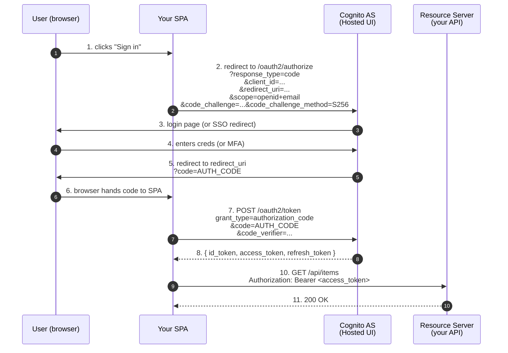

# L03 — OAuth 2.0 — Roles, Flows & Tokens

> **Author:** Prem Vishnoi <pvishnoi@avilx.com>
> **Section:** 1 — Foundations
> **Duration:** 15:00

## Prereqs

- Watched **L02 — AuthN vs AuthZ** (mandatory — this lecture builds on
  the mental model).

## Key terms

- **OAuth 2.0** — an **authorization** delegation framework defined in
  RFC 6749. **Not** an authentication protocol on its own (that's OIDC,
  L04). It defines how a client can act on a resource owner's behalf
  without holding the owner's password.
- **Resource Owner (RO)** — the user. The person who owns the data.
- **Client** — the app that wants to act on the user's behalf. Three
  flavors: **public** (SPA, mobile, CLI), **confidential** (server with
  a secret), **first-party**.
- **Authorization Server (AS)** — issues tokens. In Cognito, this is
  the User Pool's OAuth endpoint (`https://<prefix>.auth.<region>.amazoncognito.com/oauth2/...`).
- **Resource Server (RS)** — the API that accepts the token. In Cognito
  terms, your API Gateway + Lambda.
- **Access Token** — a bearer credential the client uses to call the
  Resource Server.
- **Refresh Token** — a long-lived credential used to mint new access
  tokens without re-prompting the user.
- **Scope** — a string describing what the client is asking permission
  for (e.g. `openid`, `email`, `https://api.example.com/read:items`).
- **Grant Type** — the flow. OAuth 2.0 defines four (authorization
  code, implicit, client credentials, resource owner password
  credentials). Cognito supports three of them.

## Lecture

Welcome back. In the last lecture we separated **who** from **what**.
Now we're going to look at the protocol that solves "what": **OAuth 2.0**.
By the end of this lecture you'll be able to read any "Sign in with
Google" dialog and trace, step by step, what's happening.

### The core idea: delegation, not sharing

OAuth 2.0 exists because the old model — "give your password to the
third-party app" — is broken. If you give your Google password to
ToDoApp.com, ToDoApp can now read your email, delete your Drive files,
and change your password. There's no way to limit the blast radius.

OAuth's solution: **don't share the password, share a capability**.
The user grants the third-party app a **scoped, time-limited,
revocable capability** to act on their behalf. If you don't like
ToDoApp anymore, you revoke its capability in one click — without
changing your Google password.

### The four roles

```
+--------+         +----------------+         +----------------+
|        |         |                |         |                |
|  User  |<------->| Authorization  |<------->|     Client     |
|   (RO) |  login  |     Server     |  tokens |     (App)      |
|        |         |     (AS)       |         |                |
+--------+         +----------------+         +----------------+
                           ^                          |
                           |  access tokens used     |
                           |  to call                v
                    +----------------+
                    |   Resource     |
                    |    Server      |
                    |     (RS)       |
                    +----------------+
```

| Role | In our Cognito course |
|---|---|
| Resource Owner | The end-user (browser) |
| Client | Your SPA / mobile / CLI |
| Authorization Server | Cognito User Pool (Hosted UI or `oauth2/token`) |
| Resource Server | API Gateway + Lambda |

### The four grant types Cognito supports

| Grant | Use case | Cognito flow name |
|---|---|---|
| **Authorization Code** | Web apps with a backend, mobile apps (PKCE) | `code` |
| **Implicit** (deprecated) | Legacy SPAs | `implicit` (not recommended) |
| **Client Credentials** | Service-to-service (no user) | `client_credentials` |
| **Resource Owner Password Credentials** (ROPC) | First-party trusted apps only | n/a (use `USER_PASSWORD_AUTH` in Cognito instead) |

**Recommendation:** always use **Authorization Code + PKCE** unless you
have a specific reason not to. Cognito's Hosted UI (L09) makes this
trivial.

### Authorization Code flow — step by step

This is the flow you'll use 95% of the time. It involves two
back-and-forths: first to get an auth code, then to exchange the code
for tokens.



Two things to notice:

1. **The SPA never sees the user's password.** Cognito's Hosted UI
   hosts the login form, so credentials never leave the Cognito domain.
2. **PKCE (`code_challenge` / `code_verifier`)** prevents an attacker
   who intercepts the auth code from redeeming it — they don't have
   the verifier, which is bound to the original request by a one-way
   hash.

### Client Credentials flow (machine-to-machine)

No user. Just a server-to-server handoff.

```http
POST /oauth2/token HTTP/1.1
Host: my-pool.auth.us-east-1.amazoncognito.com
Content-Type: application/x-www-form-urlencoded
Authorization: Basic <base64(client_id:client_secret)>

grant_type=client_credentials
&scope=https://api.example.com/read:items
```

Response:

```json
{
  "access_token": "eyJraWQi...",
  "token_type": "Bearer",
  "expires_in": 3600,
  "scope": "https://api.example.com/read:items"
}
```

This is what you use for backend services that need to call other
backend services. Cognito supports it but you have to enable
`client_credentials` on the App Client and define a **resource
server** with custom scopes (we do this in section 2, L07).

### Refresh tokens — the long-lived credential

A refresh token lasts 30 days by default. To use it:

```http
POST /oauth2/token HTTP/1.1
Content-Type: application/x-www-form-urlencoded

grant_type=refresh_token
&refresh_token=rt_abc...
&client_id=...
```

Response: a new access token (and optionally a new ID token +
refresh token if you've enabled rotation).

### Scope — what the user is agreeing to

Scopes are strings, but they have a hierarchical structure:
`<resource-server-identifier>/<scope-name>`. Examples:

- `openid` — required by OIDC, always present
- `email` — gives access to the `email` claim
- `profile` — gives access to the standard profile claims
- `https://api.example.com/read:items` — custom scope on your resource
  server

The user sees these scopes on the consent screen and either approves
or denies the lot.

### Bearer tokens and the threat model

OAuth 2.0 access tokens are bearer tokens — anyone holding the token
can use it. If the token leaks from a log file, a Slack paste, or a
referer header, it's game over until the token expires.

Mitigations that don't require a new protocol:

- **Short access-token TTL** (5 min) + **silent refresh**
- **Audience restriction** so a token for "web" can't be replayed
  against "mobile"
- **Refresh-token rotation** — issue a new refresh token on every
  refresh; invalidate the old one
- **Don't log tokens** — yes, really; this is still a bug in 2026

Mitigations that require a different protocol: DPoP (RFC 9449) and
sender-constrained tokens (mTLS). Cognito does not yet support these
as of October 2026.

## Hands-on

No code. Draw the **authorization code flow** for your own app on a
whiteboard. Label every arrow with the actual URL and the actual
query parameters. You'll refer back to this in L04.

## Quiz prep

For this lecture, focus on:

- The four OAuth roles and which one Cognito plays
- Why authorization code + PKCE is the recommended grant type
- What scope does (limit blast radius; user-consented; revocable)
- The difference between an access token and a refresh token

## Further reading

- RFC 6749 — The OAuth 2.0 Authorization Framework: <https://datatracker.ietf.org/doc/html/rfc6749>
- RFC 7636 — PKCE: <https://datatracker.ietf.org/doc/html/rfc7636>
- RFC 9449 — DPoP (current state-of-the-art): <https://datatracker.ietf.org/doc/html/rfc9449>
- Cognito OAuth grants: <https://docs.aws.amazon.com/cognito/latest/developerguide/token-endpoint.html>

## What's next

Next up is **L04 — OpenID Connect (OIDC) & JWTs**, where we add the
**authentication** layer on top of OAuth 2.0.