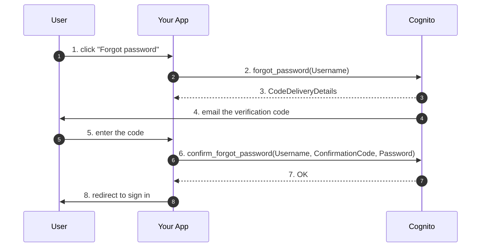

# L08 — Password Policy, MFA & Account Recovery

> **Author:** Prem Vishnoi <pvishnoi@avilx.com>
> **Section:** 2 — Cognito User Pools
> **Duration:** 14:00

## Prereqs

- Watched **L07 — Sign-up, Sign-in & Custom Attributes**.

## Key terms

- **Password policy** — the set of rules every password must obey
  (length, complexity, temporary password validity).
- **Compromised-credentials check** — Cognito's optional integration
  with Have I Been Pwned that blocks sign-in with known-leaked
  passwords.
- **MFA** — Multi-Factor Authentication. Cognito supports SMS, TOTP
  (authenticator apps), and email.
- **TOTP** — Time-based One-Time Password. RFC 6238. The user scans a
  QR code with Google Authenticator, Authy, 1Password, etc., and
  enters the 6-digit code on each sign-in.
- **SMS MFA** — Cognito sends a 6-digit code via SMS. **Paid per SMS**
  — budget for it.
- **Account recovery** — the "I forgot my password" flow. Cognito
  emails (or SMSes) the user a verification code, then lets them set
  a new password.
- **Risk-based authentication** — Cognito's adaptive authentication
  that raises the bar (requires MFA, blocks) when a sign-in looks
  suspicious (new device, unusual location).

## Lecture

Welcome back. In L07 we created a user and signed them in. Today we
harden the pool so that **the same flow with a stolen password is
still secure**. Passwords alone are not enough — they leak, they get
phished, they get re-used. MFA is what actually protects the account.

### The password policy, in detail

```python
"Policies": {
    "PasswordPolicy": {
        "MinimumLength": 8,             # 6 - 99
        "RequireUppercase": False,
        "RequireLowercase": False,
        "RequireNumbers":   False,
        "RequireSymbols":   True,       # ← at least one special char
        "TemporaryPasswordValidityDays": 7,
    }
}
```

| Field | Min | Max | Default | Notes |
|---|---|---|---|---|
| `MinimumLength` | 6 | 99 | 8 | The single most important knob. NIST 800-63B says ≥ 8. |
| `RequireUppercase` | – | – | False | Strongly discouraged by NIST — entropy comes from length, not capitals |
| `RequireLowercase` | – | – | False | Same |
| `RequireNumbers` | – | – | False | Same |
| `RequireSymbols` | – | – | False | Same |
| `TemporaryPasswordValidityDays` | 0 | 365 | 7 | How long a temp password is good for |

The course sets `MinimumLength=8`, `RequireSymbols=True` because it
demonstrates the API; for production I'd recommend `MinimumLength=12`
and **all** complexity booleans `False`, per NIST 800-63B.

### Compromised-credentials check

Available since 2020. When enabled, Cognito hashes the user's
password with the first 5 chars of the SHA-1 hash and sends it to
Have I Been Pwned's k-anonymity API. If the hash appears in the
breach corpus, sign-in is rejected.

This is **not** free. Cognito charges per lookup. Expect fractions
of a cent per sign-in.

```python
cognito.set_user_pool_mfa_config(
    UserPoolId=pool_id,
    SmsMfaConfiguration={"SmsAuthenticationMessage": "Your code: {####}"},
    # Compromised credentials risk configuration is set at create time
    # via UserPoolAddOns (not editable after pool creation).
)
# You have to set this at create_user_pool time:
#   UserPoolAddOns={"AdvancedSecurityMode": "ENFORCED"}
```

If you set `AdvancedSecurityMode=ENFORCED`, you also get
risk-based adaptive authentication for free.

### MFA: three flavors

| | SMS | TOTP | Email |
|---|---|---|---|
| Cost | ~$0.05/SMS in the US | Free | Free |
| UX | "Enter the code we just texted" | "Scan QR with Authy / 1Password" | "Enter the code we just emailed" |
| Phishable? | Yes (SIM swap) | No (sort of — but requires interaction) | Yes |
| Recommended for | Legacy enterprise apps | **Yes — most production apps** | Only as a last resort |
| Latency | ~2s | Instant (TOTP is computed client-side) | ~1s |
| Cognito support | Mature | Mature | New (2023+) |

**Strong recommendation: TOTP for production.** It's free, instant,
and not phishable over the network.

#### Enabling TOTP

```python
cognito.set_user_pool_mfa_config(
    UserPoolId=pool_id,
    SoftwareTokenMfaConfiguration={"Enabled": True},
    MfaConfiguration="OPTIONAL",  # or "ON" to require for every user
)
```

Flow:

1. User signs in with username + password.
2. Cognito returns the `SOFTWARE_TOKEN_MFA` challenge.
3. Your app calls `associate_software_token` to get a `SecretCode` and
   QR code.
4. User scans the QR code with their authenticator app.
5. User enters the 6-digit code.
6. Your app calls `verify_software_token` with the code.
7. On the next sign-in, Cognito returns the `SOFTWARE_TOKEN_MFA`
   challenge again; the user enters the current code from their
   authenticator.

If you set `MfaConfiguration=ON`, every user **must** enroll in MFA
on first sign-in.

### Account recovery

When a user clicks "I forgot my password":



Configure at pool creation:

```python
"AccountRecoverySetting": {
    "RecoveryMechanisms": [
        {"Name": "verified_email", "Priority": 1},
        # {"Name": "verified_phone_number", "Priority": 2},
    ],
},
```

`verified_email` is the default and is what you'll use 95% of the
time. `verified_phone_number` is for SMS-only flows. `admin_only`
blocks self-service recovery entirely (admin resets via the console
or `admin_reset_user_password`).

### Risk-based adaptive authentication

Cognito's **Advanced Security Features** have three modes:

| Mode | Compromised-credentials check | Risk-based MFA |
|---|---|---|
| `OFF` | No | No |
| `AUDIT` | Yes (logs but doesn't block) | Yes (logs but doesn't require) |
| `ENFORCED` | Yes (blocks) | Yes (requires) |

`ENFORCED` is the production default unless you have a specific
reason to disable it. It's not free — you pay per
active-user-month — but the cost is small compared to a single
account-takeover incident.

### Putting it together — a hardened pool

```python
cognito.create_user_pool(
    PoolName="my-prod-pool",
    UsernameAttributes=["email"],
    AutoVerifiedAttributes=["email"],
    Policies={"PasswordPolicy": {"MinimumLength": 12}},
    MfaConfiguration="ON",
    EnabledMfas=["SMS_MFA", "SOFTWARE_TOKEN_MFA"],
    UserPoolAddOns={"AdvancedSecurityMode": "ENFORCED"},
    AccountRecoverySetting={
        "RecoveryMechanisms": [{"Name": "verified_email", "Priority": 1}],
    },
    AdminCreateUserConfig={"AllowAdminCreateUserOnly": True},
    # ...
)
```

This is roughly the minimum for a 2026 production pool. It costs a
few cents per MAU, and it's worth it.

## Hands-on

In the AWS Console:

1. Open your pool → "Sign-in experience" tab.
2. Change `MinimumLength` to 12.
3. Enable TOTP MFA.
4. Enable "Enhanced (or Advanced) security" → ENFORCED.
5. Add a test user with TOTP enrolled. Use Google Authenticator or
   1Password to scan the QR code.

The advanced-security feature requires a feature plan (`Lite` is
free; `Plus` is paid). For the course, `Lite` is enough.

## Quiz prep

For this lecture, focus on:

- The 5 fields of `PasswordPolicy`
- The 3 MFA flavors and the recommendation (TOTP)
- What "ENFORCED" mode in Advanced Security does
- The forgot-password flow (4 API calls)

## Further reading

- NIST 800-63B — Digital Identity Guidelines (Authentication): <https://pages.nist.gov/800-63-3/sp800-63b.html>
- AWS docs — MFA: <https://docs.aws.amazon.com/cognito/latest/developerguide/user-pool-settings-mfa.html>
- AWS docs — Advanced Security: <https://docs.aws.amazon.com/cognito/latest/developerguide/cognito-user-pool-settings-advanced-security.html>
- `../../downloads/cognito_cheat_sheet.pdf`

## What's next

Next is **L09 — Hosted UI, OAuth 2.0 Flows & App Client Settings**,
where we wire the Hosted UI to your app and pick the right OAuth
flow.