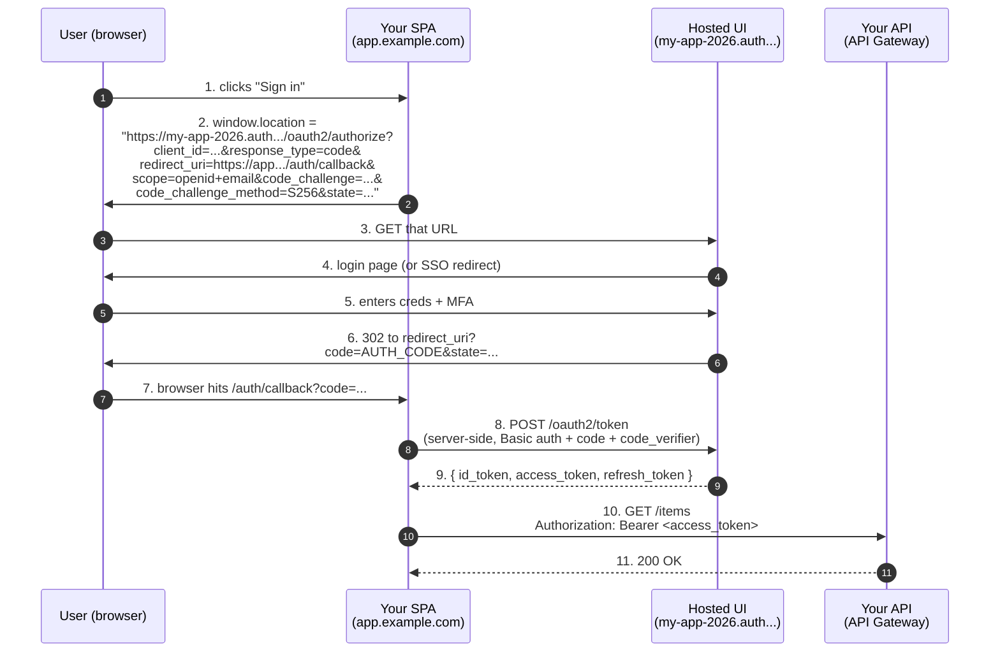

# L09 — Hosted UI, OAuth 2.0 Flows & App Client Settings

> **Author:** Prem Vishnoi <prem.vishnoi@example.com>
> **Section:** 2 — Cognito User Pools
> **Duration:** 15:00

## Prereqs

- Watched **L08 — Password Policy, MFA & Account Recovery**.
- Section 1 (L01–L04) — the OAuth 2.0 + OIDC theory.

## Key terms

- **Hosted UI** — the pre-built login page Cognito hosts for you.
  Handles sign-up, sign-in, MFA, forgot-password, and OAuth flows.
- **Domain prefix** — the unique hostname fragment of the Hosted UI,
  e.g. `my-app-2026` → `my-app-2026.auth.us-east-1.amazoncognito.com`.
- **Callback URL** — where Cognito redirects after a successful sign-in.
  Must be on the App Client's `CallbackURLs` allowlist.
- **Sign-out URL** — where Cognito redirects after sign-out.
- **PKCE** — Proof Key for Code Exchange (RFC 7636). A defense against
  authorization-code interception.
- **`/oauth2/authorize`** — the Hosted UI's authorization endpoint.
  This is where your SPA redirects the browser to begin the flow.
- **`/oauth2/token`** — the token endpoint. Your **server-side** code
  exchanges the authorization code for tokens here.
- **`/oauth2/userInfo`** — the OIDC UserInfo endpoint. Returns the
  user's claims given a valid access token.
- **`/.well-known/openid-configuration`** — the OIDC discovery
  document. Lists all the above endpoints programmatically.
- **`/logout`** — the RP-initiated logout endpoint.

## Lecture

In section 1 (L03) we covered the OAuth 2.0 authorization code flow
in the abstract. Today we apply it to Cognito's Hosted UI, which is
the **single most-used production pattern** for Cognito. By the end
of this lecture you should be able to wire a Hosted UI to a React
SPA, a Next.js server-rendered app, or a mobile app, and explain
every redirect.

### What the Hosted UI gives you

Without the Hosted UI, you'd have to build your own login page. That
means:

- Forms for sign-up, sign-in, forgot-password, MFA challenge
- Email/SMS code entry
- Password strength meter
- "Remember me" cookie
- Captcha (for sign-up spam protection)
- Mobile-responsive layout
- Internationalization
- Accessibility (WCAG 2.1 AA)

The Hosted UI gives you all of that for free, with a customizable
CSS template. You focus on your app; Cognito focuses on the auth UI.

### Setting up a Hosted UI — three steps

1. **Create a domain.** The prefix is globally unique.

```python
cognito.create_user_pool_domain(
    Domain="my-app-2026",
    UserPoolId=pool_id,
)
# → https://my-app-2026.auth.us-east-1.amazoncognito.com
```

2. **Configure the App Client.** Tell it which OAuth flows, scopes,
   and callback URLs are allowed.

```python
cognito.update_user_pool_client(
    UserPoolId=pool_id,
    ClientId=client_id,
    AllowedOAuthFlows=["code"],          # auth-code flow
    AllowedOAuthFlowsUserPoolClient=True,
    AllowedOAuthScopes=["openid", "email", "profile"],
    CallbackURLs=["https://app.example.com/auth/callback"],
    LogoutURLs=["https://app.example.com/"],
    SupportedIdentityProviders=["COGNITO"],
    PreventUserExistenceErrors="ENABLED",
)
```

3. **Configure the Hosted UI itself.** You can do this in the
   console (Cognito → Hosted UI customization) or with
   `set_ui_customization`. The default is fine for the course.

### The authorization code flow, end-to-end



Two subtle things to note:

- **The SPA never sees the user's password.** The browser is
  redirected to `my-app-2026.auth...`, the user types their password
  there, and the password never leaves the Cognito domain.
- **The token exchange is server-side.** A pure SPA can't safely
  store a client secret. The trick is **PKCE**: instead of a secret,
  the SPA proves it's the same client that started the request by
  presenting a `code_verifier` whose SHA-256 matches the
  `code_challenge` it sent in step 2.

### When to use which flow

| App type | Flow | Why |
|---|---|---|
| React / Vue / Angular SPA | Authorization Code + PKCE | No backend to hold a secret. PKCE is the workaround. |
| Next.js / Nuxt / SvelteKit (SSR) | Authorization Code (with `client_secret`) | Backend holds the secret. |
| iOS / Android | Authorization Code + PKCE | Mobile apps can't keep secrets either. |
| Server-to-server (microservice) | Client Credentials | No user; just a service identity. |
| CLI tool / one-off script | Resource Owner Password Credentials (ROPC) | Yes, deprecated, but still works for first-party tools. Avoid for new code. |
| Legacy SPA (2014–2019) | Implicit (deprecated) | **Don't** — use PKCE. |

The 95% case is **SPA + PKCE** or **SSR + client_secret**. We'll
do both in the assignment (`assignments/assignment_1_user_pool_api.md`).

### The OIDC discovery document

Cognito publishes the OIDC discovery document at:

```
https://cognito-idp.<region>.amazonaws.com/<pool-id>/.well-known/openid-configuration
```

Sample:

```json
{
  "issuer": "https://cognito-idp.us-east-1.amazonaws.com/us-east-1_aBcDe",
  "authorization_endpoint": "https://my-app-2026.auth.us-east-1.amazoncognito.com/oauth2/authorize",
  "token_endpoint":        "https://my-app-2026.auth.us-east-1.amazoncognito.com/oauth2/token",
  "userinfo_endpoint":     "https://my-app-2026.auth.us-east-1.amazoncognito.com/oauth2/userInfo",
  "jwks_uri":              "https://cognito-idp.us-east-1.amazonaws.com/us-east-1_aBcDe/.well-known/jwks.json",
  "end_session_endpoint":  "https://my-app-2026.auth.us-east-1.amazoncognito.com/logout",
  "response_types_supported": ["code"],
  "subject_types_supported":  ["public"],
  "id_token_signing_alg_values_supported": ["RS256"]
}
```

Your OIDC client library (e.g. `oidc-client-ts`, `next-auth`,
`@auth0/angular-jwt`) reads this document and discovers the
endpoints automatically. No URL hard-coding required.

### Sign-out

There are **two** ways to sign a user out of Cognito:

1. **Local sign-out** — your SPA just deletes the tokens from its
   storage. The refresh token is still valid; if an attacker stole
   it, they can still get a new access token.
2. **Global sign-out** — your SPA redirects to
   `https://my-app-2026.auth.../logout?client_id=...&logout_uri=...`.
   Cognito invalidates the **refresh token**. The user must sign in
   again.

Always do **both** for a security-sensitive app.

```python
# boto3 also has admin_user_global_sign_out for the admin path:
cognito.admin_user_global_sign_out(UserPoolId=pool_id, Username=username)
```

### Customizing the Hosted UI

You can override the CSS for the Hosted UI:

```python
cognito.set_ui_customization(
    UserPoolId=pool_id,
    ClientId=client_id,            # omit for pool-wide
    CSS=".btn-custom { background: #FF9900; }",
    # You can also override the logo URL via the console.
)
```

For a real production app, this is enough to make the Hosted UI
look like your brand without forking the entire page.

## Hands-on

In the AWS Console:

1. Pool → App integration → "Domain name" → create a unique prefix.
2. Pool → App clients → your client → "Hosted UI settings":
   - Allowed callback URL: `https://localhost:3000/callback` (or your
     real app)
   - Sign out URL: `https://localhost:3000/`
   - OAuth flows: **Authorization code grant**
   - OAuth scopes: **openid, email, profile**
3. Test it: paste the constructed authorize URL into your browser:

```
https://<your-prefix>.auth.us-east-1.amazoncognito.com/oauth2/authorize
    ?client_id=<your-app-client-id>
    &response_type=code
    &scope=openid+email
    &redirect_uri=https://localhost:3000/callback
```

You'll be sent through sign-in and redirected back to your callback
URL with `?code=...`. You can then exchange the code for tokens
with `curl -X POST https://<prefix>.auth.../oauth2/token -d ...` (this
is the server-side step).

## Quiz prep

For this lecture, focus on:

- The 4 endpoints on the Hosted UI (authorize, token, userInfo, logout)
- Why PKCE is required for SPAs
- The OIDC discovery document
- Local sign-out vs global sign-out

## Further reading

- AWS docs — Hosted UI: <https://docs.aws.amazon.com/cognito/latest/developerguide/cognito-user-pools-app-integration.html>
- OIDC Core 1.0: <https://openid.net/specs/openid-connect-core-1_0.html>
- `oidc-client-ts` (recommended SPA library): <https://github.com/authts/oidc-client-ts>
- `../../downloads/cognito_cheat_sheet.pdf`

## What's next

Next is **L10 — Hands-on: Create a User Pool with boto3 + moto**, the
climax of section 2: a 140-line boto3 script that creates a real
User Pool, plus 6 moto tests.