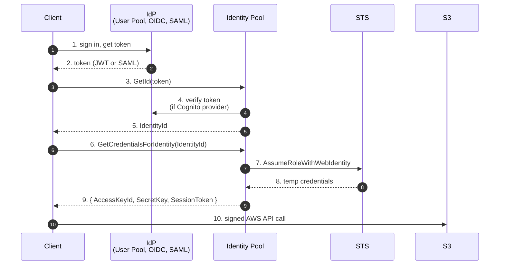

# L12 — Authentication Providers

> **Author:** Prem Vishnoi <prem.vishnoi@example.com>
> **Section:** 3 — Cognito Identity Pools
> **Duration:** 15:00

## Prereqs

- Watched **L11 — Section Overview**.

## Key terms

- **Authentication provider (IdP)** — a system that can authenticate
  the user and return a token the Identity Pool trusts.
- **OIDC IdP** — an OpenID Connect provider. Identity Pools can
  accept ID tokens from any compliant OIDC provider, not just
  Cognito User Pools.
- **SAML 2.0 IdP** — a SAML identity provider (Okta, Azure AD,
  PingFederate, ADFS). Requires a SAML metadata document.
- **Provider name** — the string identifier the Identity Pool uses
  to refer to a specific provider. For Cognito User Pools, this is
  `cognito-idp.<region>.amazonaws.com/<user-pool-id>`.
- **AllowUnauthenticatedIdentities** — pool-level flag. If `True`,
  callers can get an Identity ID without any token (and assume the
  guest role). If `False`, every caller must present a token.
- **`ServerSideTokenCheck`** — flag on a Cognito User Pool provider.
  If `True`, Identity Pools call Cognito to verify the token's
  signature server-side instead of trusting the client. **Always
  enable in production.**

## Lecture

Welcome back. In L11 I described the Identity Pool mental model. Today
we enumerate every authentication provider an Identity Pool can
accept, when to use each, and how to wire them up. By the end of
this lecture you'll be able to look at a federated AWS deployment
and say "this Identity Pool has a Cognito provider for end users, an
OIDC provider for the B2B partner, and guest access for the public
landing page".

### The 4 sources of identity

| Source | Token shape | Best for |
|---|---|---|
| Cognito User Pool | JWT (ID or access token) | Your own end users, already on Cognito |
| OIDC IdP | JWT (ID token) | B2B partner with their own OIDC stack (Auth0, Okta) |
| SAML 2.0 IdP | SAML assertion | Enterprise B2B with on-prem AD or Okta/Azure AD |
| Social IdP (Google/Facebook/Apple/Amazon) | Opaque token from the social | Consumer apps that want "Sign in with Google" |
| Developer-authenticated | Whatever you mint | Legacy migration or custom IdP |

For the course we use **Cognito User Pool** in section 2 + section 3,
and explore **OIDC** and **SAML** in section 5 (L24–L25).

### Wiring a Cognito User Pool provider

The most common case. You already have a User Pool from section 2:

```python
identity.create_identity_pool(
    IdentityPoolName="my-app-idpool",
    AllowUnauthenticatedIdentities=False,
    CognitoIdentityProviders=[
        {
            "ProviderName": f"cognito-idp.{region}.amazonaws.com/{user_pool_id}",
            "ClientId": app_client_id,
            "ServerSideTokenCheck": True,   # ← always true in production
        },
    ],
)
```

`ServerSideTokenCheck=True` means **Cognito re-validates the JWT**
against the User Pool's JWKS before issuing AWS credentials. This
catches a forged or expired token even if the client lies.

### Adding an OIDC provider

You might have a B2B partner with their own OIDC stack. Register
their issuer URL and client id:

```python
identity.create_identity_pool(
    IdentityPoolName="my-app-idpool",
    AllowUnauthenticatedIdentities=False,
    OpenIdConnectProviderARNs=[
        "arn:aws:iam::123456789012:oidc-provider/partner.example.com",
    ],
    # OIDC providers don't have a CognitoIdentityProviders entry.
    # Identity Pools call sts:AssumeRoleWithWebIdentity directly
    # using the token's iss + sub claims.
)
```

You must first call `iam.create_open_id_connect_provider` to
register the OIDC issuer:

```python
iam.create_open_id_connect_provider(
    Url="https://partner.example.com",
    ClientIDList=["my-app-client-id"],
    ThumbprintList=["<SHA1-of-their-TLS-cert>"],
)
```

This is the same flow you'd use for any non-AWS OIDC provider
(Auth0, Google, Okta, Login.gov). Identity Pool will accept the
ID token as long as its `iss` matches a registered OIDC provider.

### Adding a SAML provider

```python
identity.create_identity_pool(
    IdentityPoolName="my-app-idpool",
    AllowUnauthenticatedIdentities=False,
    SamlProviderARNs=[
        "arn:aws:iam::123456789012:saml-provider/MyOktaProvider",
    ],
)
```

You must first call `iam.create_saml_provider` with the IdP's
metadata XML. This is the path for enterprise customers running
Okta, Azure AD, or ADFS.

For the course we don't demo SAML in code (it's verbose and the
XML metadata files are environment-specific). See L24 for a
detailed walkthrough.

### Adding guest / unauthenticated access

If you set `AllowUnauthenticatedIdentities=True`, an unauthenticated
client can call `GetId` with no token at all and get back an
Identity ID. They assume the **guest role** you attach to the pool.

```python
identity.create_identity_pool(
    IdentityPoolName="my-app-idpool",
    AllowUnauthenticatedIdentities=True,  # ← guest allowed
    CognitoIdentityProviders=[...],
)
identity.set_identity_pool_roles(
    IdentityPoolId=pool_id,
    Roles={
        "authenticated": "arn:aws:iam::...:role/AuthRole",
        "unauthenticated": "arn:aws:iam::...:role/GuestRole",
    },
)
```

Guest role patterns:

- **Public read-only S3 bucket** (e.g. marketing assets)
- **Rate-limited public API** (through API Gateway, not through
  identity pool credentials directly)
- **Free-tier feature gate** (no token = you can read the public
  catalog but not your private data)

**Always** make the guest role **strictly less powerful** than the
authenticated role. The default policy should be a `Deny` plus a
narrow `Allow` for the public assets only.

### Multiple providers in one pool

You can mix-and-match. A typical B2B setup:

```
Identity Pool "my-app-idpool"
├── Cognito User Pool (your end users)
├── OIDC provider (B2B partner 1)
├── OIDC provider (B2B partner 2)
├── SAML provider (enterprise customer)
└── (no guest)
```

Each provider's tokens resolve to the same authenticated role.
Per-provider authorization is enforced by **IAM policy `Condition`
blocks** using the `cognito-identity.amazonaws.com:aud` (the
identity pool id) and `cognito-identity.amazonaws.com:amr` (the
auth method) claim. See L13.

### The flow at runtime



Two round-trips to Cognito, then **direct AWS calls** until the
credentials expire (1 hour default). Most clients cache the
credentials and refresh at 75% of TTL.

### A common gotcha: `ClientId` vs `UserPoolId`

In the `CognitoIdentityProviders` entry, `ClientId` is the **App
Client ID**, not the User Pool ID. If you accidentally pass the
pool ID, the federation will silently fail (no error, just no
credentials). Always double-check.

### What's coming next

L13 — IAM Roles for Authenticated & Guest Users. We write the actual
role policies that scope per-user access.