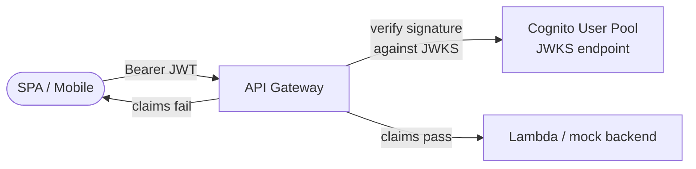

# L15 — Section Overview & Auth Methods Recap

> **Author:** Prem Vishnoi <pvishnoi@avilx.com>
> **Section:** 4 — API Gateway + Cognito Authorizer
> **Duration:** 12:00

## Prereqs

- Watched **section 2 + section 3** (L05–L14). You should know what a
  User Pool is, what an Identity Pool is, and what JWT claims look
  like.

## Key terms

- **API Gateway** — AWS's managed front door for HTTP, REST, and
  WebSocket APIs. Two flavors: **REST API** (the older, more
  configurable) and **HTTP API** (the newer, cheaper, faster).
- **Authorizer** — an API Gateway feature that gates requests
  before they reach your backend. Three flavors: IAM, Cognito
  User Pool, and Lambda.
- **Cognito User Pool Authorizer** — an authorizer that validates
  Cognito-issued JWTs without you writing a line of code.
- **Lambda Authorizer** — a custom authorizer implemented as a
  Lambda function. More powerful (you can validate any token, do
  per-resource authorization), but more code.
- **JWT Authorizer** — HTTP API's name for what is essentially a
  Cognito User Pool Authorizer. Same idea, different name.

## Lecture

Welcome to section 4. This is the **culmination** of the course —
where User Pool tokens meet a real API. In the next 100 minutes
you'll learn the four auth methods API Gateway supports, when to
pick each, and how to wire them up with the Cognito User Pool we
created in L10.

### The four API Gateway auth methods

| Auth method | Where it works | Token shape | Use case |
|---|---|---|---|
| **AWS IAM (SigV4)** | REST + HTTP + WebSocket | AWS signature v4 | Service-to-service, EC2, on-prem with IAM credentials |
| **Cognito User Pool** | REST API only (legacy name) | JWT (ID or access) | End-user SPA / mobile backed by Cognito |
| **JWT Authorizer** | HTTP API only | JWT (any OIDC IdP) | Same idea, newer API, more flexible |
| **Lambda Authorizer** | REST + HTTP + WebSocket | Whatever your Lambda decides | Custom AuthN / AuthZ, third-party IdP, per-route rules |
| **API Key** | REST + HTTP (limited) | Opaque key | Service-to-service throttling, partner APIs |
| **No auth** | REST + HTTP | – | Public endpoints only |

We focus on **Cognito User Pool Authorizer** (REST) and **JWT
Authorizer** (HTTP) in this section. L19 walks through the underlying
JWT algorithm in case you want a Lambda Authorizer.

### Which API type when?

| | REST API | HTTP API |
|---|---|---|
| Pricing | $3.50/million | $1.00/million |
| Latency | ~30ms | ~10ms |
| Cognito User Pool Authorizer | **Yes** | n/a (use JWT Authorizer) |
| JWT Authorizer (any OIDC IdP) | n/a | **Yes** |
| Usage plans + API keys | Yes | Limited |
| Request validation | Yes | No (yet) |
| WAF integration | Yes | Yes |
| OpenAPI / Swagger export | Yes | Yes |
| Best for | Production APIs that need full control | New projects, low-latency, simpler needs |

For the course we cover both, because real teams have both. Most
new projects should start with **HTTP API** unless you need a feature
REST API has and HTTP API doesn't (e.g. usage plans).

### The Cognito User Pool Authorizer — high level

Three things happen on every request:

1. **API Gateway extracts the token** from the
   `Authorization: Bearer ...` header.
2. **API Gateway validates the JWT** (signature, `iss`, `aud`,
   `exp`) against the User Pool's JWKS. **You don't write any of this
   code.**
3. **API Gateway passes the claims** to your backend as
   `event.requestContext.authorizer.claims` (REST) or
   `event.requestContext.authorizer.jwt.claims` (HTTP).

Your backend code reads the claims and enforces any
**per-resource** authorization (e.g. "is this user in the `admins`
group?"). The authorizer handles authentication; your code handles
authorization.

### What's coming in this section

| Lecture | Outcome |
|---|---|
| L16 | You can wire a Cognito User Pool Authorizer on a REST API with boto3 (or in the console) |
| L17 | You can wire a JWT Authorizer on an HTTP API |
| L18 | You can scope per-endpoint authorization with scopes and groups |
| L19 | You can implement your own JWT validation in Python (`pyjwt`) and know exactly what API Gateway is doing |
| L20 | You can put it all together in a 15-step end-to-end demo |

By the end of L20 you'll be ready to secure any production API with
Cognito in under an hour.

## Hands-on

No code yet. Open the API Gateway console in your AWS account:

1. API Gateway → Create API → "REST API" (or "HTTP API" — try both
   for comparison).
2. Pick "New API", give it a name like `cognito-demo`.
3. Don't bother adding resources/methods yet — we'll do that in L16.
4. Look at the "Authorizers" tab and read the descriptions of each
   type.

## Quiz prep

For this lecture, focus on:

- The 4 auth methods API Gateway supports
- The difference between REST API and HTTP API
- What the Cognito User Pool Authorizer does for you (and what it
  doesn't)

## Further reading

- AWS docs — API Gateway auth: <https://docs.aws.amazon.com/apigateway/latest/developerguide/apigateway-control-access.html>
- AWS docs — REST vs HTTP API: <https://docs.aws.amazon.com/apigateway/latest/developerguide/http-api-vs-rest.html>
- `../../downloads/cognito_cheat_sheet.pdf`

## What's next

Next is **L16 — Cognito User Pool Authorizer on REST APIs**, the
first hands-on lecture of section 4.