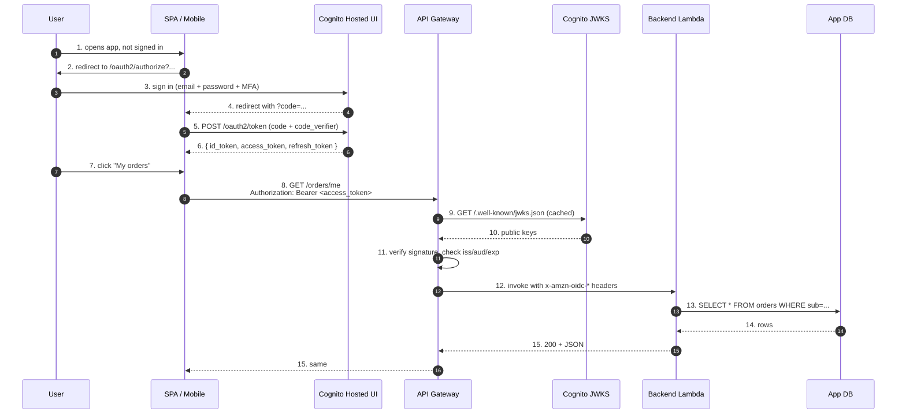

# L20 — End-to-End Demo — Secure a REST API End-to-End

> **Author:** Prem Vishnoi <prem.vishnoi@example.com>
> **Section:** 4 — API Gateway + Cognito Authorizer
> **Duration:** 18:00

## Prereqs

- Watched **L15–L19** (the entire section 4).

## Key terms

- **End-to-end demo** — a single, integrated walkthrough that
  exercises every component in the stack: User Pool → tokens →
  API Gateway → authorizer → Lambda → response.

## Lecture

Welcome to the climax of section 4. In the next 18 minutes we walk
through the entire stack top-to-bottom, end-to-end. By the end of
this lecture you should be able to draw the full request path on a
whiteboard from memory.

### The 15 steps, top-to-bottom



That's the **production flow** for almost every serverless API on AWS.

### What we built in section 2

- User Pool `demo-cognito-course-pool`
- App Client `demo-cognito-course-client` (no secret)
- Test user `alice@example.com` with permanent password
- OAuth code flow enabled via Hosted UI

### What we built in L16/L17

- REST API `cognito-demo`
- Resource `/items` with `GET` method
- Cognito User Pool Authorizer attached
- Mock integration returning `{"items": ["alpha", "beta"]}`
- Stage `v1` deployed

### What we wired in L18

- Resource server `https://api.example.com` with scope `read:items`
- Scope added to App Client's `AllowedOAuthScopes`
- Method requires the scope

### What we wrote in L19

- A 30-line Python JWT validator using `pyjwt`

### The end-to-end test

```bash
# 1. Configure
export USER_POOL_ID=us-east-1_aBcDeFgHi
export APP_CLIENT_ID=7a1b2c3d4e5f6g7h
export API_ID=abc123def
export INVOKE_URL=https://${API_ID}.execute-api.us-east-1.amazonaws.com/v1

# 2. Sign the user in (USER_PASSWORD_AUTH — server-side, no MFA)
TOKEN=$(aws cognito-idp initiate-auth \
    --auth-flow USER_PASSWORD_AUTH \
    --client-id $APP_CLIENT_ID \
    --auth-parameters USERNAME=alice@example.com,PASSWORD='TempPass!2026' \
    --query 'AuthenticationResult.AccessToken' --output text)

# 3. Call the protected endpoint
curl -i -H "Authorization: Bearer $TOKEN" $INVOKE_URL/items
# → 200 OK
# → {"items": ["alpha", "beta"]}

# 4. Call without a token
curl -i $INVOKE_URL/items
# → 401 Unauthorized
# → WWW-Authenticate: Bearer

# 5. Call with a malformed token
curl -i -H "Authorization: Bearer not-a-jwt" $INVOKE_URL/items
# → 401 Unauthorized

# 6. Decode the access token (dev only)
python3 -c "
import jwt
print(jwt.decode('$TOKEN', options={'verify_signature': False}))
"
# → {'sub': '505c1bfa-...', 'auth_time': 1730655500, ...}
```

### The 5 error modes your client should handle

| Error | Cause | Client should |
|---|---|---|
| `401 Unauthorized` | Missing or invalid token | Refresh the token, retry once |
| `403 Forbidden` | Token valid, but scope/group check failed | Show "you don't have access" |
| `429 Too Many Requests` | API Gateway throttle | Backoff + retry |
| `500 Internal Server Error` | Backend bug | Show "something went wrong" |
| `503 Service Unavailable` | Cognito or API Gateway down | Backoff + retry |

For 401, the client should call `oauth2/token` with the refresh
token and retry the original request. If the refresh fails, redirect
the user back to sign-in.

### Where each course concept lives in the flow

| Concept | Lives in step |
|---|---|
| OAuth code flow | 2–5 |
| Cognito User Pool | 3, 4, 9–10 |
| ID + access + refresh tokens | 6 |
| Hosted UI | 3–5 |
| JWT validation | 9–11 |
| Cognito User Pool Authorizer | 11 |
| API Gateway | 8, 12, 15 |
| Lambda authorizer (L19) | 11 (alternative to built-in) |
| Scope enforcement | 11 |
| Group/ABAC check | 13 (in your Lambda) |

### A note on "do I need a Lambda Authorizer?"

Most APIs don't. The built-in Cognito User Pool Authorizer (L16) or
JWT Authorizer (L17) is enough. You only need a Lambda Authorizer if:

- You have authorization logic that doesn't fit in scopes/groups
  (e.g. "deny if tenant is suspended")
- You support multiple IdPs (Cognito + a partner's OIDC) and want one
  authorizer
- You need per-route rules that change frequently without redeploying
  the authorizer config

If you're not sure, **start without a Lambda Authorizer**. You can
always add one later.

### Cleaning up

After the demo, delete the API and the pool:

```bash
# API Gateway
aws apigateway delete-rest-api --rest-api-id $API_ID

# Cognito User Pool
aws cognito-idp delete-user-pool --user-pool-id $USER_POOL_ID
```

The demo resources cost nothing if you don't enable SMS MFA.

### What's coming

Section 4 is done. Section 5 is the advanced material: custom auth
challenges, Lambda triggers, and SAML/OIDC federation.