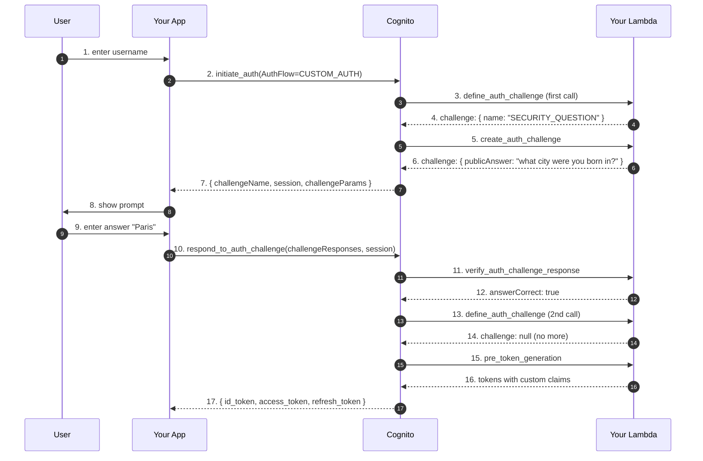

# L21 — Section Overview & Custom Auth Challenge Flow

> **Author:** Prem Vishnoi <pvishnoi@avilx.com>
> **Section:** 5 — Advanced Patterns
> **Duration:** 12:00

## Prereqs

- Watched **sections 1–4** (L01–L20).

## Key terms

- **Custom auth challenge** — a sign-in flow you control end-to-end.
  Cognito calls your Lambda to issue a challenge (e.g. "what's the
  answer to your security question?"); the user answers; your Lambda
  validates the answer and either lets the user in or doesn't.
- **Define auth challenge** — the Lambda that decides which
  challenges to issue in which order.
- **Create auth challenge** — the Lambda that **generates** the
  challenge (e.g. mints a one-time code).
- **Verify auth challenge** — the Lambda that **validates** the
  answer.
- **Pre token generation** — the Lambda that runs just before
  Cognito mints the ID/access tokens. Lets you inject custom
  claims.
- **Pre authentication** — the Lambda that runs before Cognito
  checks the password. Can short-circuit (deny the sign-in
  without even checking creds).

## Lecture

Welcome to section 5. The first four sections got you to a working
"hello world" Cognito deployment. The next five lectures cover the
four patterns that turn that into something you can put in front of
a million users.

### Why "advanced" matters

A hello-world Cognito deployment looks like this:

```python
cognito.create_user_pool(
    PoolName="my-pool",
    UsernameAttributes=["email"],
    AutoVerifiedAttributes=["email"],
)
```

It works. It issues tokens. It validates them.

But it can't answer "is this user allowed to sign in right now?"
(custom logic), "add a `custom:tenant_id` claim to my token"
(inject custom claims), or "let my enterprise customers sign in
with their Okta" (SAML federation).

Section 5 covers all three.

### The 14 Lambda triggers

Cognito supports 14 different Lambda trigger events. They split into
3 categories:

| Category | Triggers |
|---|---|
| **Sign-up** | Pre sign-up, Post confirmation, Pre token generation |
| **Authentication** | Custom message, Pre authentication, Post authentication, Define auth challenge, Create auth challenge, Verify auth challenge, Pre token generation (overlap) |
| **Migration** | User migration |

Plus the **KMS** key for custom SMS sender.

In L22 we cover the four most important: pre-token-generation, post-
confirmation, pre-authentication, and pre-sign-up.

### The custom auth challenge flow

The most flexible (and most error-prone) trigger pattern. Used for:

- "Security question" authentication
- One-time code via your own delivery system
- WebAuthn (passkey) authentication
- Magic-link sign-in
- Any sign-in flow that doesn't fit Cognito's defaults

The flow:



Three Lambdas. Two separate challenge rounds. The first round
issues a question; the user answers; the second round confirms. After
all challenges pass, Cognito calls `pre_token_generation` to let you
modify the tokens, then returns them.

### When to use it (and when not to)

Use custom auth when:

- You have an unusual sign-in flow Cognito doesn't support natively
- You're migrating from a legacy auth system and want to keep the
  existing UX during the transition
- You want to do per-user risk-based blocking that Cognito's
  Advanced Security doesn't quite cover

Don't use it when:

- Username + password + MFA works (use the defaults)
- You just want to inject custom claims (use `pre_token_generation`
  only, with `AuthFlow=USER_SRP_AUTH`)
- You're adding magic-link sign-in (consider a third-party like
  Auth0 or Stytch instead)

### The other 10 triggers

The 14-trigger list looks intimidating, but in practice you'll use
3–5 of them:

| Trigger | When to use it |
|---|---|
| **Pre sign-up** | Validate sign-up data (e.g. block disposable email domains) |
| **Post confirmation** | Provision downstream resources (e.g. create a Stripe customer) |
| **Pre authentication** | Block sign-in for suspended users before the password check |
| **Post authentication** | Audit logging, last-seen timestamps |
| **Pre token generation** | Inject custom claims (most common) |
| **Custom message** | Customize the verification / welcome email body |
| **Custom email sender** | Send email through your own SES config |
| **Custom SMS sender** | Send SMS through your own Twilio / Pinpoint |
| **Define auth challenge** | Decide the challenge flow |
| **Create auth challenge** | Generate the challenge data |
| **Verify auth challenge** | Validate the user's response |
| **User migration** | Migrate users from a legacy store during sign-in |

We cover the four most important in L22 (pre sign-up, post
confirmation, pre auth, pre token generation). We cover the custom
message and sender triggers in L23. We cover the auth-challenge
triggers only at a high level in this lecture — full coverage is in
L23.

### What's coming in this section

| Lecture | Outcome |
|---|---|
| L22 | You can wire the four most common triggers (`pre_token_generation`, `post_confirmation`, `pre_authentication`, `pre_sign_up`) |
| L23 | You can customize the email/SMS sender and the message body |
| L24 | You can wire SAML 2.0 federation with Okta / Azure AD / Ping |
| L25 | You can wire OIDC federation with Auth0 / Google / Login.gov, plus a course wrap-up |

## Hands-on

No code yet. Pick **one** trigger from the list above that your
current production system needs. Read its
[AWS docs page](https://docs.aws.amazon.com/cognito/latest/developerguide/cognito-user-identity-pools-working-with-aws-lambda-triggers.html).
Note: most triggers require the Lambda to return JSON in a specific
schema. The first mistake everyone makes is forgetting the version
field (`"version": 2, "triggerSource": "..."`).

## Quiz prep

For this lecture, focus on:

- The 14 triggers and which 3 are most commonly used
- The 3-Lambda custom auth challenge flow
- When to use custom auth vs the built-in flows

## Further reading

- AWS docs — Lambda triggers: <https://docs.aws.amazon.com/cognito/latest/developerguide/cognito-user-identity-pools-working-with-aws-lambda-triggers.html>
- AWS samples — Cognito Lambda triggers: <https://github.com/aws-samples/amazon-cognito-identity-pool-terraform-reference-deduplicated>

## What's next

Next is **L22 — Lambda Triggers**, where we cover the four most
common triggers in detail.