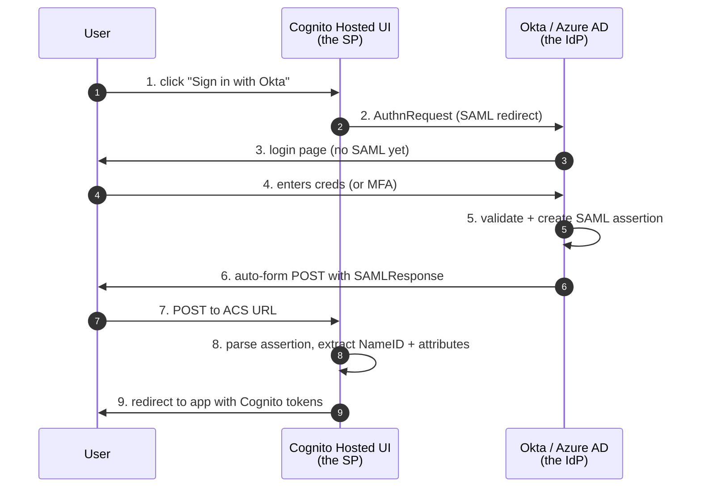

# L24 — SAML 2.0 Federation with Corporate IdPs

> **Author:** Prem Vishnoi <pvishnoi@avilx.com>
> **Section:** 5 — Advanced Patterns
> **Duration:** 18:00

## Prereqs

- Watched **L23 — Custom Message & Sender Triggers**.

## Key terms

- **SAML 2.0** — Security Assertion Markup Language. An XML-based
  federation protocol. The dominant choice for enterprise SSO.
- **IdP (Identity Provider)** — in SAML, the team that asserts the
  user's identity (Okta, Azure AD, PingFederate, OneLogin, ADFS).
- **SP (Service Provider)** — in SAML, the team that **trusts** the
  IdP's assertions. Cognito is the SP.
- **SAML metadata XML** — an XML document the IdP publishes that
  describes its entity ID, SSO URL, and public key. You import this
  into Cognito.
- **ACS URL (Assertion Consumer Service)** — the URL the IdP
  redirects to with the SAML assertion. For Cognito's hosted UI,
  this is automatically constructed.
- **NameID** — the SAML field that uniquely identifies the user.
  Usually the user's email or UPN (User Principal Name in AD).
- **Attribute mapping** — how Cognito maps SAML attributes (e.g.
  `http://schemas.xmlsoap.org/ws/2005/05/identity/claims/emailaddress`)
  to Cognito user attributes (`email`).

## Lecture

SAML is the **enterprise standard** for SSO. Every Fortune 500 has an
Okta or Azure AD tenant; every employee has an account there; every
new SaaS app they buy must accept sign-in via that tenant. By the end
of this lecture you'll know how to wire Cognito as a SAML SP
(Service Provider) that accepts assertions from Okta, Azure AD, or
PingFederate.

### The SAML flow at a high level



Three redirects, one POST. The user never leaves the browser.

### The 6 setup steps

1. **In Cognito:** Pool → "Sign-in experience" → "Federated identity
   providers" → "Add identity provider" → "SAML".
2. **Cognito gives you:** a `metadataURL` and an `ACS URL`. Copy
   both.
3. **In your IdP:** create a new SAML application. Paste the ACS URL.
   Paste the metadata URL (or download Cognito's metadata XML and
   upload it).
4. **Map SAML attributes to Cognito attributes:**
   - `NameID` → `sub` (or `email`)
   - `http://schemas.xmlsoap.org/ws/2005/05/identity/claims/emailaddress` → `email`
   - `http://schemas.xmlsoap.org/ws/2005/05/identity/claims/name` → `name`
   - `http://schemas.microsoft.com/ws/2008/06/identity/claims/groups` → `cognito:groups`
5. **Download the IdP's metadata XML.**
6. **Back in Cognito:** upload the metadata XML. Save.

### Doing it with boto3

```python
with open("okta-metadata.xml", "rb") as f:
    metadata_xml = f.read()

cognito.create_identity_provider(
    UserPoolId=pool_id,
    ProviderName="OktaSAML",                    # local name
    ProviderType="SAML",
    ProviderDetails={
        "MetaDataURL":  "",                     # unused if you upload XML
        "MetadataURL":  "",
        "IDPMetadata":  metadata_xml.decode("utf-8"),
    },
    AttributeMapping={
        "sub":     "NameID",
        "email":   "http://schemas.xmlsoap.org/ws/2005/05/identity/claims/emailaddress",
        "name":    "http://schemas.xmlsoap.org/ws/2005/05/identity/claims/name",
        "groups":  "http://schemas.microsoft.com/ws/2008/06/identity/claims/groups",
    },
    IdpIdentifiers=["OktaSAML"],
)
```

After this, the Hosted UI shows a "Continue with Okta" button. Clicking
it redirects to Okta's login page, the user signs in there, and they
return to your app with Cognito-issued tokens.

### Attribute mapping — the fiddly part

The mapping is where SAML trips everyone up. The IdP's SAML
attributes use **long XML schema URIs** as keys. Cognito's
attributes use **short names**. You have to map one to the other.

Common mappings:

| IdP attribute | Maps to Cognito |
| --- | --- |
| `NameID` (or `urn:oasis:names:tc:SAML:1.1:nameid-format:emailAddress`) | `sub` or `email` |
| `http://schemas.xmlsoap.org/ws/2005/05/identity/claims/emailaddress` | `email` |
| `http://schemas.xmlsoap.org/ws/2005/05/identity/claims/name` | `name` |
| `http://schemas.xmlsoap.org/ws/2005/05/identity/claims/givenname` | `given_name` |
| `http://schemas.xmlsoap.org/ws/2005/05/identity/claims/surname` | `family_name` |
| `http://schemas.microsoft.com/ws/2008/06/identity/claims/groups` (Azure AD) | `cognito:groups` |
| `http://schemas.xmlsoap.org/claims/Group` (Okta) | `cognito:groups` |
| `http://schemas.microsoft.com/identity/claims/tenantid` (Azure AD) | `custom:tenant_id` |

Pro tip — if a group claim is missing from the IdP's assertion, you
can't map it. Check the IdP's "Include group claim" config.

### Just-in-time (JIT) provisioning

By default, Cognito creates a new user in the User Pool the first
time they sign in via SAML. You don't pre-provision. The user pool
populates itself.

If you want to control which IdP users are allowed, set the
`AutoVerifiedAttributes` to skip auto-verification, and add a
`pre_token_generation` trigger (L22) to enforce tenant/role
membership.

### The "user already exists" problem

If a user signed up via the User Pool directly (`alice@example.com`)
and then their company enrolls in SAML and Alice's email matches
their SAML `NameID`, Cognito merges them. The same `sub` is used
for both sign-in paths.

If the user pool attribute mapping doesn't have an `email` → `email`
mapping, the merged user won't have an email attribute until they sign
in via SAML once. Add `email` to the mapping even if it's optional.

### SAML vs OIDC for enterprise federation

| | SAML | OIDC |
|---|---|---|
| Token format | XML assertion | JWT |
| Adoption | Enterprise (every Fortune 500) | Newer, growing |
| Setup complexity | High (metadata XML, attribute URIs) | Low (issuer URL + client ID) |
| Cognito support | Yes | Yes (L25) |
| Group claim | `cognito:groups` via attribute mapping | `cognito:groups` (if IdP includes it) |
| Best for | Okta/Azure AD/ADFS | Auth0/Google/Cloudflare Access/anything modern |

For Okta and Azure AD specifically, **both** work. SAML is the
enterprise-default; OIDC is the modern default. Pick whichever your
customer's IT team prefers (most prefer SAML because their
provisioning system is built for it).

### The 4 common SAML setup bugs

1. **Wrong ACS URL.** The IdP posts to a URL that doesn't match
   what Cognito expects. The user gets a 400 error.
2. **Wrong NameID format.** The IdP sends `transient` NameIDs
   instead of `emailAddress` or `persistent`. Set the IdP's NameID
   format to `emailAddress`.
3. **Clock skew.** The SAML assertion has a 5-minute validity
   window. If your server clock is off by more than 5 minutes, the
   assertion is rejected.
4. **Missing attribute mappings.** The assertion arrives but
   Cognito doesn't know how to map the attributes. Result: the
   user is created but has no `email` claim. Configure mappings
   before going live.

### What's coming

L25 — OIDC federation (Auth0, Google, Login.gov) and the course
wrap-up.