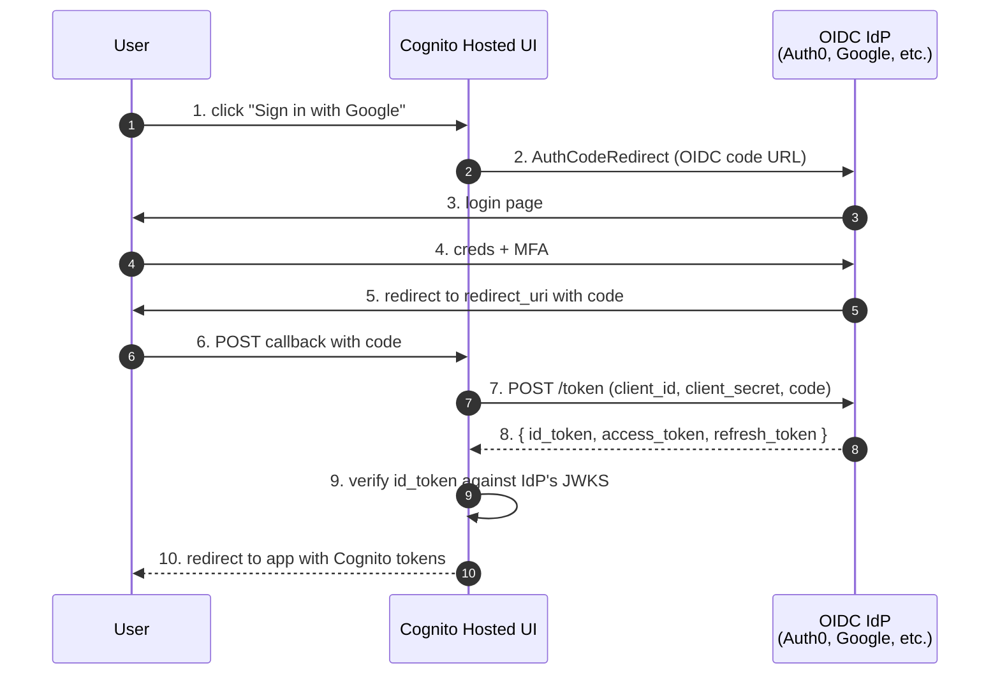

# L25 — OIDC Federation & Course Wrap-up

> **Author:** Prem Vishnoi <prem.vishnoi@example.com>
> **Section:** 5 — Advanced Patterns
> **Duration:** 18:00

## Prereqs

- Watched **L24 — SAML Federation**.

## Key terms

- **OIDC (OpenID Connect)** — see L04. The OAuth 2.0 + identity
  layer. Modern federation standard.
- **Issuer URL** — the IdP's stable OIDC issuer URL. e.g.
  `https://accounts.google.com`.
- **Client ID / Client Secret** — OIDC credentials. Cognito needs
  both for confidential clients.
- **Authorization endpoint, Token endpoint, JWKS** — three of the
  URLs from the OIDC discovery document
  (`/.well-known/openid-configuration`).
- **Login.gov, ID.me, Verify** — US government IdPs that support
  OIDC for citizen identity. Required for any app that handles
  government services.
- **Course wrap-up** — the closing lecture: where to go from here.

## Lecture

Today we close the course. We cover OIDC federation (the modern
alternative to SAML for enterprise SSO), and then zoom out and
summarize everything you've built across the 25 lectures. By the
end of this lecture you'll have a complete mental model of Cognito
and a clear path to deeper topics.

### The OIDC federation flow



Three redirects (instead of SAML's three, plus one POST). The
mechanism is **OAuth 2.0 Authorization Code + PKCE**, just like the
standard Hosted UI flow.

### Adding an OIDC IdP in boto3

```python
cognito.create_identity_provider(
    UserPoolId=pool_id,
    ProviderName="Google",
    ProviderType="OIDC",
    ProviderDetails={
        "client_id":     "<google-client-id>",
        "client_secret": "<google-client-secret>",
        "attributes_request_method": "GET",
        "oidc_issuer":   "https://accounts.google.com",
        "authorize_url": "https://accounts.google.com/o/oauth2/v2/auth",
        "authorize_scopes": "openid email profile",
        "token_url":     "https://oauth2.googleapis.com/token",
        "jwks_uri":      "https://www.googleapis.com/oauth2/v3/certs",
    },
    AttributeMapping={
        "sub":   "sub",
        "email": "email",
        "name":  "name",
    },
    IdpIdentifiers=["Google"],
)
```

You need to register your app with the IdP first (Google Cloud
Console, Auth0 dashboard, etc.) and get a client_id + client_secret.
For Google specifically, you also need to add the Cognito Hosted UI
URL to the IdP's allowed redirect URLs.

### The 4 most common OIDC IdPs

#### 1. Google (Sign in with Google)

- Issuer: `https://accounts.google.com`
- Authz: `https://accounts.google.com/o/oauth2/v2/auth`
- Token: `https://oauth2.googleapis.com/token`
- JWKS: `https://www.googleapis.com/oauth2/v3/certs`
- Free. Required verification process if you want a green
  "verified" badge.

#### 2. Auth0

- Issuer: `https://<tenant>.auth0.com/`
- Authz: `https://<tenant>.auth0.com/authorize`
- Token: `https://<tenant>.auth0.com/oauth/token`
- JWKS: `https://<tenant>.auth0.com/.well-known/jwks.json`
- Free tier up to 7,000 MAU. Great for B2B SaaS apps that need
  passwordless / WebAuthn / social login out of the box.

#### 3. Login.gov

- Issuer: `https://secure.login.gov/`
- Required for any US federal app that handles citizen identity.
- Supports IAL1 (basic), IAL2 (verified identity), and IAL3
  (in-person verification). Cognito can integrate at IAL1 and IAL2.

#### 4. Microsoft Entra ID (Azure AD)

- Issuer: `https://login.microsoftonline.com/<tenant-id>/v2.0`
- Supports both OIDC and SAML — most teams use OIDC for new apps.
- Has the richest B2B federation story (multi-tenant apps can
  accept sign-in from any Entra tenant).

### Multiple IdPs in one pool

Most production apps wire **multiple IdPs**:

```
User Pool "my-app-prod"
├── Cognito (default — direct username + password)
├── Google (consumer convenience)
├── Sign in with Apple (required for iOS apps with social login)
├── Auth0 (B2B partner 1)
├── SAML: Okta (B2B partner 2)
└── SAML: Azure AD (B2B enterprise customers)
```

After configuring, the Hosted UI shows a button per IdP:

```
┌──────────────────────────────────────┐
│         Sign in to my-app            │
│                                      │
│  [Continue with Google]              │
│  [Continue with Apple]               │
│  [Continue with Auth0]               │
│  [Continue with Okta]                │
│  [Continue with Azure AD]            │
│                                      │
│  ─────── or ───────                  │
│                                      │
│  [Email] [Password] [Sign in]        │
│                                      │
└──────────────────────────────────────┘
```

The user picks the IdP; the rest is the OAuth 2.0 flow.

### The 4-token exchange pattern

When a user signs in via an OIDC IdP:

1. They get an OIDC IdP token (Auth0, Google, …).
2. Cognito exchanges it for Cognito tokens (ID, access, refresh).
3. The client exchanges the Cognito access token for AWS
   credentials (if using an Identity Pool — section 3).
4. The AWS credentials are used to call S3/DynamoDB/Lambda.

Four token exchanges, four different audiences. The mental model from
section 1 (L02/L03) is exactly what makes this manageable.

### Course wrap-up

Let's zoom out. Over 25 lectures you've covered:

| Section | Lectures | Outcome |
|---|---|---|
| 1 — Foundations | L01–L04 | Mental model: AuthN vs AuthZ, OAuth 2.0, OIDC, JWT |
| 2 — User Pools | L05–L10 | A working, idempotent boto3 User Pool with 6 moto tests |
| 3 — Identity Pools | L11–L14 | A working, idempotent boto3 Identity Pool with 5 moto tests |
| 4 — API Gateway | L15–L20 | Cognito User Pool Authorizer on REST + HTTP APIs |
| 5 — Advanced | L21–L25 | Triggers, custom auth, SAML, OIDC |

That's the **entire Cognito surface** — what it is, how to use it,
how to extend it, and how to federate with the rest of the world's
identity systems.

### Where to go from here

#### Production hardening

- Read the AWS Cognito **Security Best Practices** whitepaper:
  <https://docs.aws.amazon.com/cognito/latest/developerguide/security-best-practices.html>
- Enable **Advanced Security Features** in `ENFORCED` mode (L08)
- Set up **CloudTrail** logging on the user pool
- Use a **custom KMS key** for sensitive pools (HIPAA-eligible
  workloads)

#### IaC

- **AWS CDK v2**: there's a `@aws-cdk/aws-cognito` module. Use
  `UserPool.fromUserPoolArn()` to import an existing pool.
- **CloudFormation**: `AWS::Cognito::UserPool`,
  `AWS::Cognito::UserPoolClient`, `AWS::Cognito::UserPoolDomain`,
  `AWS::Cognito::IdentityPool`. The CFN reference is the
  authoritative schema.

#### Other courses in this repo

If you liked the cognito coverage, the natural next step is the **API
Security** lectures in the `aws_lambda_course/09_api_security_*/`
folder. They cover **Lambda Authorizers** (custom JWT validation),
the **Lambda Authorizer** pattern for Cognito-issued tokens, and the
end-to-end security story for a serverless CRUD API.

### Final quiz

Try the section-5 quiz in `quizzes/section_5.md`. If you can answer
all 10 questions without looking at the lecture, you've mastered
section 5. Same for sections 1–4.

### Thank you

Thanks for taking **AWS Cognito Authorizers — Crash Course**. If you
have feedback, find me at prem.vishnoi@example.com — I read every
email.

Good luck, and may your tokens always verify on the first try.

— Prem Vishnoi