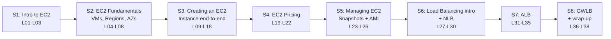

# L01 — Course Overview

> **Author:** Prem Vishnoi <pvishnoi@avilx.com>
> **Section:** 01
> **Duration target:** 5:00
> **Lecture ID:** L01

## Status

Authored. This is the first lecture of the course.

## Prereqs

- None — this is the very first lecture.

## Key terms

- **EC2** — Elastic Compute Cloud, AWS's resizable virtual server service. EC2 lets you provision compute capacity in the cloud in seconds, scale it up or down, and pay only for what you use.
- **AWS Region** — a physical geographic area in which AWS runs data centers (for example `us-east-1`, `eu-west-1`). EC2 instances are launched inside a specific region.
- **Availability Zone (AZ)** — one or more discrete data centers within a region, each with independent power, networking, and connectivity. Regions contain multiple AZs that you can deploy across for fault tolerance.
- **AMI (Amazon Machine Image)** — a pre-configured template (operating system, applications, data) that you use to launch an EC2 instance. AMIs are the image; instances are the running VM.
- **Instance type** — the hardware configuration of an EC2 instance: CPU, memory, storage, and network performance. EC2 groups these into families like `t`, `m`, `c`, `r`, and `g`.
- **Elastic Load Balancing (ELB)** — AWS's managed load-balancing service. We cover all three ELB types in this course: the Network Load Balancer (NLB), Application Load Balancer (ALB), and Gateway Load Balancer (GWLB).

## Lecture

Hi, I'm Prem Vishnoi, and welcome to the **AWS EC2 + Load Balancing Crash Course**. In the next five minutes I'm going to give you the 60-second pitch for the course, walk through the eight sections at a glance, and explain what you will be able to do by the end.

EC2 — Elastic Compute Cloud — is the original AWS compute service and, even after fifteen years, still one of the most important services in the AWS catalog. Every other AWS service, from Lambda to ECS to EKS, ultimately runs on top of EC2 or on a sibling virtualization layer that looks exactly like it. If you understand EC2, you understand the foundation of nearly every other compute primitive in AWS. That is why we start there.

The course has **8 sections, 38 lectures, 8 quizzes, 6 working code demos**, and **5 architecture diagrams**. The first three sections cover the EC2 mental model and the creation wizard in depth. Sections four and five cover pricing and lifecycle management (stop, start, resize, snapshot, custom AMI). The last three sections cover **Elastic Load Balancing** in detail — Network Load Balancer, Application Load Balancer, and Gateway Load Balancer. Each load-balancer section ends with a boto3 demo that you can run against a `moto`-mocked AWS account, so you do not need to spend a cent to follow along.

Here is the section arc in one view:

A few design decisions worth calling out before we dive in. **First**, every code sample is `moto`-mockable. That means you can run the full course on a laptop with no AWS account and no internet connection — `moto` intercepts every boto3 call and returns realistic responses. The same scripts run unchanged against a real AWS account when you are ready. **Second**, the course is short on purpose. The 38 lectures average about three minutes each. I would rather you finish a focused course than abandon a sprawling one. **Third**, the load-balancing sections are where the course earns its keep. NLB, ALB, and GWLB are not just three flavors of the same thing; they operate at different layers of the network stack, solve different problems, and show up in different kinds of architectures. We cover all three.

By the end of the course you will be able to launch an EC2 instance from the AWS console and from a boto3 script, choose the right instance type for a workload, estimate cost across on-demand, reserved, savings-plan, and spot pricing, snapshot a volume and bake a custom AMI, and stand up an NLB, ALB, or GWLB in front of a fleet of targets. You will be ready to talk about EC2 and load balancing in a technical interview, on a Solutions Architect certification exam, or in an architecture review at work.

## Hands-on

This lecture is orientation only. No lab. Confirm that you can see the `01_intro_to_ec2/lecture_scripts/` directory and the `quizzes/section_1.md` file on disk before moving on.

## Quiz prep

- The course has 8 sections, 38 lectures, 6 working code demos, and 5 architecture diagrams.
- EC2 stands for Elastic Compute Cloud and is AWS's resizable virtual server service.
- All three load balancers (NLB, ALB, GWLB) are covered, in sections 6, 7, and 8 respectively.
- Every code sample in the course is `moto`-mockable, so you can complete the course without an AWS account.

## Further reading

- [AWS EC2 product page](https://aws.amazon.com/ec2/)
- [EC2 getting-started guide](https://docs.aws.amazon.com/AWSEC2/latest/UserGuide/concepts.html)
- [`../../SYLLABUS.md`](../../SYLLABUS.md) — authoritative lecture-to-file map.
- [`../../README.md`](../../README.md) — repo layout and "What you will build" table.
