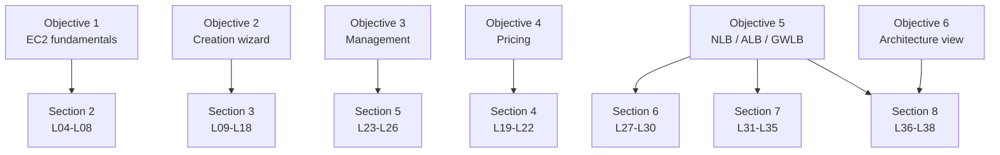

# L02 — What You'll Learn

> **Author:** Prem Vishnoi <pvishnoi@avilx.com>
> **Section:** 01
> **Duration target:** 5:00
> **Lecture ID:** L02

## Status

Authored. The companion to L01 — the formal learning objectives.

## Prereqs

- L01 — Course Overview (recommended but not strictly required).

## Key terms

- **EC2 fundamentals** — the mental model you need before you click "Launch instance": virtual machines, hypervisors, regions, availability zones, AMIs, and instance types. This is section 2 of the course.
- **EC2 creation wizard** — the multi-step console flow (and the equivalent boto3 call) that takes you from "I want a server" to "I have a running instance". This is section 3 of the course.
- **EC2 management** — the day-2 operations: starting, stopping, resizing, terminating, taking EBS snapshots, and building custom AMIs. This is section 5 of the course.
- **EC2 pricing** — the four pricing models AWS exposes: on-demand, reserved instances, savings plans, and spot instances. We also touch on dedicated hosts. This is section 4 of the course.
- **Network Load Balancer (NLB)** — a Layer-4 load balancer that forwards TCP/UDP traffic. Operates at the transport layer and is the right choice for extreme performance, static IPs, and non-HTTP protocols. Section 6.
- **Application Load Balancer (ALB)** — a Layer-7 load balancer that understands HTTP and HTTPS. Supports host-based and path-based routing rules. Section 7.
- **Gateway Load Balancer (GWLB)** — a Layer-3 load balancer used to deploy, scale, and manage third-party virtual appliances (firewalls, intrusion detection, deep-packet inspection). Section 8.

## Lecture

In the last lecture I gave you the 60-second pitch. In this one I want to spell out the **six concrete things you will be able to do by the end of the course**. These map one-to-one onto sections 2 through 8.

**1. EC2 fundamentals.** You will understand what an EC2 instance actually is — a virtual machine running on a physical host managed by a hypervisor, in a region, in an availability zone. You will know the difference between an AMI and an instance, between an instance type and an instance size, and between a region and an availability zone. You will be able to look at an instance type like `m6i.large` and tell me, from the family letter alone, roughly what it is optimized for. This objective maps to section 2 (L04 through L08) and ends with a short boto3 + `moto` demo called `region_az_demo.py`.

**2. The EC2 creation wizard.** You will be able to launch an instance from the AWS console and from a boto3 script. You will know what an AMI is, how to pick the right one, and how to find the AMI ID for Amazon Linux 2, Ubuntu 22.04, or Windows Server 2022 in any region. You will be able to choose an instance type that matches the workload (compute-bound, memory-bound, or burstable). You will configure networking (VPC, subnet, public IP), storage (EBS volume size, type, encryption), user data scripts, key pairs, and security groups. This is section 3 (L09 through L18) and ends with `launch_instance.py` plus six moto tests.

**3. EC2 management.** You will be able to stop, start, resize, and terminate instances without losing data. You will take EBS snapshots, restore volumes from snapshots, and build a custom AMI from a running instance. You will understand when a snapshot is enough and when you really need an AMI. This is section 5 (L23 through L26) and ends with `snapshot_ami_demo.py` plus four moto tests.

**4. EC2 pricing.** You will understand the four pricing models — on-demand, reserved instances, savings plans, and spot instances — and you will be able to estimate the monthly cost of a small fleet under each. You will know when spot is safe to use (stateless, fault-tolerant workloads) and when it is not (stateful databases, single-replica services). This is section 4 (L19 through L22) and ends with `pricing_calc.py`, a pure-Python script that does not even need AWS credentials to run.

**5. The three load balancers — NLB, ALB, GWLB.** This is the second half of the course and the part that most directly maps to real-world architecture. You will be able to stand up a **Network Load Balancer** in front of a fleet of EC2 instances or IP targets, with health checks, cross-zone load balancing, and either internet-facing or internal scheme. You will be able to stand up an **Application Load Balancer** with host-based rules (api.example.com vs app.example.com) and path-based rules (/api vs /static). You will be able to deploy a **Gateway Load Balancer** in front of a fleet of third-party virtual appliances for traffic inspection. Sections 6, 7, and 8 each end with a boto3 + moto demo.

**6. The 30,000-foot architectural view.** Beyond the individual services, you will be able to read an architecture diagram that includes EC2, an ELB, an ASG (auto-scaling group), and an RDS database, and tell me what each component is for, where the failure modes are, and how the diagram would change for a multi-region deployment. This is the synthesis objective — it is what section 8's wrap-up quiz is really testing.

Here is how the six objectives map to the course sections:

## Hands-on

No code yet. Your only task is to skim `../../README.md` and `../../SYLLABUS.md` so you can see how the six objectives above map onto the file layout. Section 2 starts the hands-on work.

## Quiz prep

- The course covers six learning objectives, mapped to sections 2 through 8.
- Objective 5 covers all three load balancers: NLB (L4), ALB (L7), and GWLB (third-party appliances).
- Objective 4 (pricing) is the only section whose code demo does not need AWS credentials at all.

## Further reading

- [AWS EC2 Instance Types](https://aws.amazon.com/ec2/instance-types/)
- [Elastic Load Balancing product page](https://aws.amazon.com/elasticloadbalancing/)
- [Comparison: NLB vs ALB vs GWLB](https://docs.aws.amazon.com/elasticloadbalancing/latest/userguide/what-is-load-balancing.html)
- [`../../README.md`](../../README.md) — "What you will learn" bullet list.
