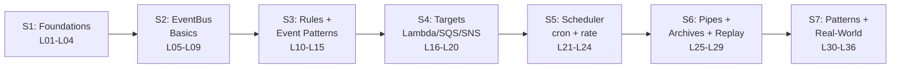

# L01 — Course Overview

> **Author:** Prem Vishnoi <prem.vishnoi@example.com>
> **Section:** 1 — Foundations
> **Duration:** 4:00

## Prereqs

None. This is the very first lecture. You don't need an AWS account, a
Python install, or any prior serverless experience to follow this overview.
The cheat sheet is linked in **Further reading** if you'd like to read
ahead while you listen.

## Key terms

- **Amazon EventBridge** — a serverless event bus that connects your
  applications, AWS services, and SaaS partners using events.
- **Event** — a JSON document (the "thing that happened"), routed by
  EventBridge from a *source* to one or more *targets* via *rules*.
- **boto3** — the AWS SDK for Python. We use it throughout this course
  to call the `events`, `lambda`, `sqs`, and `scheduler` APIs.
- **moto** — the AWS mocking library we use to test every code sample
  offline. No AWS account required.
- **IaC (Infrastructure as Code)** — defining AWS resources in
  version-controlled templates. We touch IaC lightly here; the focus is
  on EventBridge itself.

## Lecture

Hi, I'm Prem Vishnoi, and welcome to the **AWS EventBridge Crash
Course**. This is the lecture to watch before you do anything else in
the course. In the next four minutes I'll explain what EventBridge is,
who this course is for, what you'll build, and how the seven sections
hang together.

### Who this course is for

This course is designed for a few different audiences:

- **Cloud beginners.** If you've never used EventBridge — or aren't sure
  what an "event bus" even is — you are exactly in the right place.
  Section 1 starts from "what is event-driven architecture?" before we
  ever open the AWS console.
- **Developers who know Python and boto3 but haven't used EventBridge.**
  I assume you can read Python comfortably; I do **not** assume you've
  ever wired a rule to a Lambda target. We build that from the ground up.
- **Engineers coming from SNS, SQS, or CloudWatch Events.** If you've
  used those services, you'll find EventBridge is a superset of them
  with some new tricks (SaaS partners, archives, replay, schema
  registry). The course calls out where the services overlap and where
  they differ.

### What you'll build — the 5 working demos

The course is anchored by **five production-style boto3 demos**, each
fully tested with `moto` so you can run them without an AWS account:

1. **`create_event_bus.py`** (Section 2) — create custom and partner
   event buses, attach resource-based policies, list ARNs.
2. **`put_rule.py`** (Section 3) — create rules with JSON event
   patterns, list targets, delete in place.
3. **`put_targets.py`** (Section 4) — wire rules to Lambda, SQS, SNS,
   Step Functions with retry policies + DLQs.
4. **`schedule_cron.py`** (Section 5) — EventBridge Scheduler cron and
   rate expressions, the modern replacement for the deprecated CW
   Events schedule API.
5. **`archive_replay.py`** (Section 6) — archive events, replay them
   back into a bus, the killer feature for backfills and debugging.

Section 7 is **patterns + real-world** — no new code, just production
patterns (cross-account, schema registry, DLQs, retry policies) you'll
combine with the previous sections.

### How the 7 sections build on each other

Here is the course arc in one view:



The structure is deliberate: we learn the *vocabulary* in section 1
(event-driven, pub/sub, why EventBridge), the *resources* in section 2
(event buses), the *logic* in section 3 (rules + patterns), the
*endpoints* in section 4 (targets), the *triggers* in section 5
(scheduler), and the *operational* features in section 6 (pipes,
archives, replay). Section 7 ties it all together with the patterns you
actually ship to production.

### The 1 downloadable resource

You have **1 download** in `downloads/`:

| # | File | When you'll use it |
|---|---|---|
| 1 | `eventbridge_cheat_sheet.pdf` | Throughout the course — limits, event envelope fields, pattern syntax |

I'd grab it now — it's the one you'll flip back to most often.

## Hands-on

This lecture is orientation only — no lab. Your "homework" is to
download the cheat sheet and skim it.

```bash
# From the repo root
open aws_eventbridge_course/downloads/eventbridge_cheat_sheet.pdf
```

In L02 we'll define what event-driven architecture actually means.

## Quiz prep

For this lecture, focus on the **big-picture** questions that show up
in section 1's quiz:

- How many working demos does the course build? (5)
- How many sections is the course split into? (7)
- What is the difference between a rule and a target? (Rule = matching
  logic; Target = what gets invoked)

## Further reading

- Download: [`../../downloads/eventbridge_cheat_sheet.pdf`](../../downloads/eventbridge_cheat_sheet.pdf)
- `../../SYLLABUS.md` — authoritative lecture-to-file map.
- `../../README.md` — repo layout, "What you'll build" table.

## What's next

Next up is **L02 — What is Event-Driven Architecture?**, where we
define the vocabulary we'll use for the rest of the course.

**Ready? Let's start with the foundations.**
