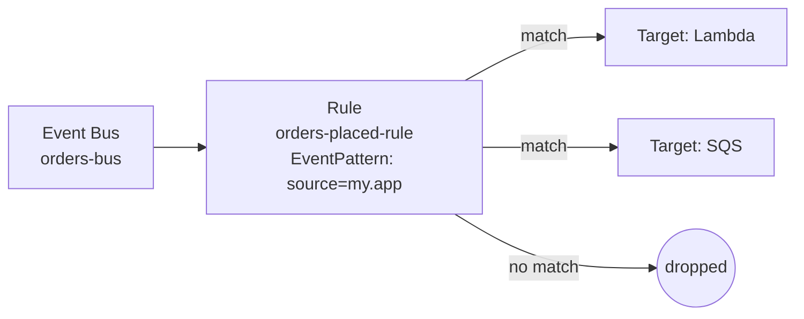

# L10 — Rules 101: The Event-Pattern-to-Target Mapping

> **Author:** Prem Vishnoi &lt;prem.vishnoi@example.com&gt;
> **Section:** 3 — Rules + Event Patterns
> **Duration:** 8:20

## Prereqs

- You know what an **event bus** is (L05–L09).
- You have an AWS account (or you can run the tests offline with `moto`).
- Python 3.11+ with `boto3` 1.34+ and `moto[events]>=5.0` installed
  (the course's `requirements.txt` covers this).

## Key terms

- **Rule** — a single EventBridge configuration that pairs an **event
  pattern** (the predicate) with one or more **targets** (the actions).
- **EventPattern** — a JSON object that is matched against every
  event that lands on the bus. If the event matches, the rule fires.
- **Target** — the AWS resource (Lambda function, SQS queue, SNS
  topic, Step Functions state machine, etc.) that receives the
  matched event.
- **State** — every rule is either `ENABLED` or `DISABLED`. Disabled
  rules still exist and still match, but they don't invoke targets.
- **RuleArn** — the unique ARN of a rule, e.g.
  `arn:aws:events:us-east-1:123456789012:rule/orders-bus/orders-placed-rule`.

## Lecture

Hi, I'm Prem Vishnoi. Welcome to **Section 3** of the AWS EventBridge
Crash Course. This is the section that turns EventBridge from a
fancy bus stop into a real routing engine. We left Section 2 with a
working event bus — we know how to put events on it. Now we need
to figure out **what happens to those events**. That's the rule.

### What a rule is

A rule is a single piece of configuration that does exactly two
things:

1. **Filters events** using a JSON document called an **event
   pattern** — the same shape as the events themselves.
2. **Routes matched events** to one or more **targets** — the AWS
   resources that do something with the event.

Conceptually, it's a router line in a switchboard:



If a rule has no targets attached, it still **matches** events but
does nothing with them — the events just go in and come out the
same. We call those "observability rules" and they're useful for
debugging, but you almost always want at least one target.

### The EventPattern → Target contract

A rule is **immutable** in one important way: once you create it, the
target list and event pattern can be **replaced**, but the rule
itself is not. To "edit" a rule you call `put_rule` again with the
new pattern, or `put_targets` to change the target list.

The full boto3 picture:

```python
import boto3, json

events = boto3.client("events", region_name="us-east-1")

# 1. Create the rule with an event pattern
events.put_rule(
    Name="orders-placed-rule",
    EventBusName="orders-bus",
    EventPattern=json.dumps({
        "source": ["my.app"],
        "detail-type": ["Order Placed"]
    }),
    State="ENABLED",
)

# 2. Attach a target
events.put_targets(
    Rule="orders-placed-rule",
    EventBusName="orders-bus",
    Targets=[{
        "Id": "lambda-process-order",
        "Arn": "arn:aws:lambda:us-east-1:123456789012:function:processOrder"
    }]
)
```

Two calls, two responsibilities. `put_rule` decides **what matches**;
`put_targets` decides **where it goes**. Section 4 is entirely about
the second call.

### ENABLED vs DISABLED state

Every rule has a `State` field:

- **`ENABLED`** (the default) — events are evaluated and matched
  events invoke the targets.
- **`DISABLED`** — events are still evaluated (so you can see matches
  in CloudWatch metrics) but **no target is invoked**.

You toggle state with `enable_rule` and `disable_rule`. The classic
use case: you want to ship a new version of your Lambda handler but
don't want to fire it in production yet. Disable the rule, deploy
the new code, re-enable.

```bash
# Console equivalent
aws events disable-rule --name orders-placed-rule \
    --event-bus-name orders-bus
```

### The role that EventBridge assumes

When a rule has a Lambda target (or any AWS target), EventBridge
needs an **IAM role** with permission to invoke the target. The role
is passed per target:

```python
events.put_targets(
    Rule="orders-placed-rule",
    EventBusName="orders-bus",
    Targets=[{
        "Id": "lambda-process-order",
        "Arn": "arn:aws:lambda:...",
        "RoleArn": "arn:aws:iam::123456789012:role/EventBridgeInvokeLambda"
    }]
)
```

The role's trust policy must allow `events.amazonaws.com` to assume
it, and its permission policy must allow `lambda:InvokeFunction` (or
the relevant call for the target type). We cover this in detail in
L17 for Lambda and L18 for SQS/SNS.

### Rules are regional + bus-scoped

A rule lives on **one** event bus in **one** region. If you want
the same rule in two regions, you have to create it twice. There
is **no** global rule. (L14 covers cross-account and cross-region
event patterns.)

A rule's ARN looks like:

```
arn:aws:events:us-east-1:123456789012:rule/orders-bus/orders-placed-rule
└──────────┘ └────────┘ └──────────────┘ └────────┘ └────────────────────┘
   service    region        account         bus        rule-name
```

The bus name is in the ARN even for the **default** bus — it just
appears as `rule/default/...` or as the empty string depending on
the API call.

### What the demo does (preview of L15)

In L15 we'll walk through `code/put_rule.py`, which:

1. Creates a custom event bus `orders-bus` (idempotent).
2. Calls `put_rule` with an event pattern for `source: "my.app"`
   and `detail-type: "Order Placed"`.
3. Sets `State="ENABLED"`.
4. Calls `describe_rule` to print the result.

It is **idempotent** — re-running it is safe; the second call
replaces the pattern in place rather than failing.

## Hands-on

```bash
# After L15, you'll be able to:
python3 03_rules/code/put_rule.py --dry-run
python3 -m pytest 03_rules/code/test_put_rule.py -v
```

For now, just read the lecture and we'll cover the event pattern
syntax in L11.

## Quiz prep

For this lecture, focus on the big-picture questions that show up
in Section 3's quiz:

- What are the two responsibilities of a rule? (Filter + route)
- What's the difference between ENABLED and DISABLED? (DISABLED
  matches but does not invoke targets)
- Is a rule global or regional? (Regional + bus-scoped)

## Further reading

- AWS docs: [EventBridge rules](https://docs.aws.amazon.com/eventbridge/latest/userguide/eb-rules.html)
- AWS docs: [Event patterns](https://docs.aws.amazon.com/eventbridge/latest/userguide/eb-event-patterns.html)
- [`../quizzes/section_3.md`](../quizzes/section_3.md) — Section 3 quiz
- [`./L11_pattern_matching.md`](./L11_pattern_matching.md) — next lecture

## What's next

L11 — **Event Pattern Matching (the JSON predicate)** — we go deep
on the JSON syntax of the event pattern: exact-match, what fields
exist on an event, and how matching is actually evaluated.
