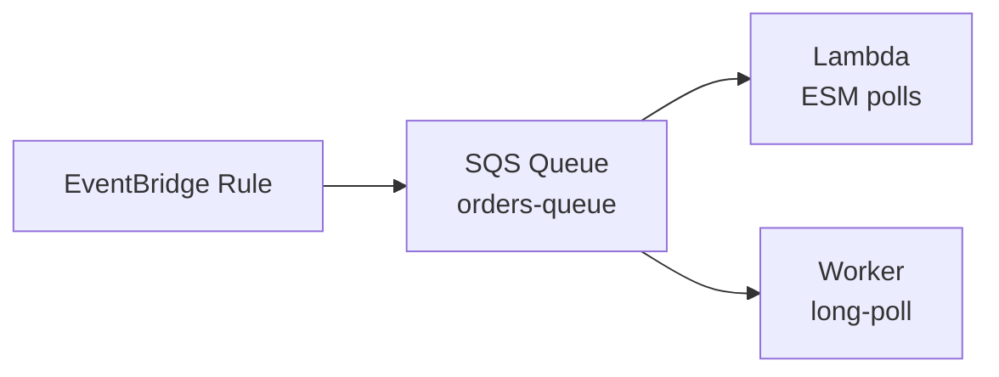
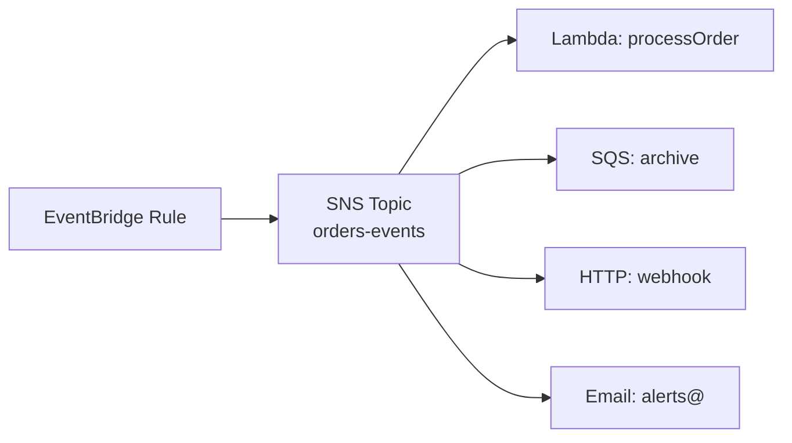

# L18 — SQS + SNS Targets: Queue with Policy, Pub/Sub Fanout

> **Author:** Prem Vishnoi &lt;prem.vishnoi@example.com&gt;
> **Section:** 4 — Targets
> **Duration:** 10:55

## Prereqs

- L17 — Lambda async invocation, retry policy, DLQ preview.
- Familiarity with SQS and SNS basics (covered in the AWS Lambda
  course, section 4).

## Key terms

- **Queue policy** — an SQS resource policy that controls who can
  send messages to the queue. EventBridge needs to be in the
  `Principal`.
- **Topic policy** — the SNS equivalent for SNS topics.
- **Fanout** — publishing one event to many subscribers. SNS
  pushes to all subscribers in parallel; SQS subscribers pull.
- **FIFO queue** — a SQS queue with first-in-first-out ordering
  and exactly-once delivery. EventBridge can write to FIFO
  queues; the `MessageGroupId` and `MessageDeduplicationId` are
  derived from the event.

## Lecture

Hi, I'm Prem Vishnoi. Lambda is the most flexible target, but in
production you'll often want a **buffer** between the rule and
the consumer. That's what **SQS** gives you. And when you need
**fanout** — one event triggering many consumers — that's
**SNS**. This lecture is about both, and the resource policies
that make them work as EventBridge targets.

### SQS as a target

The pattern is "EventBridge → SQS → Lambda (via ESM)". The
EventBridge rule matches and writes the event to an SQS queue;
a Lambda event source mapping polls the queue and processes
events at its own pace.



The SQS target itself is simple:

```python
events.put_targets(
    Rule="orders-placed-rule",
    EventBusName="orders-bus",
    Targets=[{
        "Id": "sqs-orders",
        "Arn": "arn:aws:sqs:us-east-1:123456789012:orders-queue"
    }]
)
```

But the queue needs a **resource policy** that allows
EventBridge to send messages:

```python
sqs = boto3.client("sqs")
sqs.set_queue_attributes(
    QueueUrl="https://sqs.us-east-1.amazonaws.com/123456789012/orders-queue",
    Attributes={
        "Policy": json.dumps({
            "Version": "2012-10-17",
            "Statement": [{
                "Sid": "AllowEventBridgeSend",
                "Effect": "Allow",
                "Principal": {"Service": "events.amazonaws.com"},
                "Action": "sqs:SendMessage",
                "Resource": "arn:aws:sqs:us-east-1:123456789012:orders-queue",
                "Condition": {
                    "ArnEquals": {
                        "aws:SourceArn": "arn:aws:events:us-east-1:123456789012:rule/orders-bus/orders-placed-rule"
                    }
                }
            }]
        })
    }
)
```

Without this policy, EventBridge's `SendMessage` call fails with
`AccessDenied`. The `Condition` is optional but **strongly
recommended in production** — it scopes the permission to the
specific rule ARN, so a different rule in the same account
can't write to the same queue.

Note: **you do NOT need an execution role on the SQS target**.
SQS uses its own resource policy for access control, not IAM
role assumption. This is different from Lambda targets (L17).

### SQS message format

The message EventBridge writes to SQS is a JSON serialization of
the full event envelope:

```json
{
  "version": "0",
  "id": "evt-abc-123",
  "source": "my.app",
  "detail-type": "Order Placed",
  "time": "2026-10-10T12:00:00Z",
  "detail": { "orderId": "O-1001", "total": 129.99 }
}
```

The consumer (Lambda ESM or a worker process) sees this as the
SQS message body. The SQS `MessageAttributes` are NOT populated
by default — if you want to filter on SQS-side (using
`MessageAttribute` filters in the queue policy), use an **input
transformer** to copy fields into message attributes.

### FIFO queues

EventBridge can write to SQS FIFO queues. The `MessageGroupId`
and `MessageDeduplicationId` are derived from the event:

- **`MessageGroupId`** defaults to the event `source`. All events
  with the same source are processed in order.
- **`MessageDeduplicationId`** defaults to the event `id`. If two
  events with the same `id` arrive within the deduplication
  window, the second is dropped.

```python
# Create a FIFO queue
sqs.create_queue(
    QueueName="orders-queue.fifo",
    Attributes={
        "FifoQueue": "true",
        "ContentBasedDeduplication": "false"
    }
)

# EventBridge will write with MessageGroupId=<source>,
# MessageDeduplicationId=<event id> by default.
```

Use FIFO when **order matters** for a single source (e.g.
audit log events). For high-throughput, low-ordering-needs
scenarios, standard queues are faster and cheaper.

### SNS as a target

SNS is the **fanout** target. One event matches the rule and SNS
publishes it to all subscribers — Lambda, SQS, HTTP, email, SMS,
mobile push — in parallel.



The target is:

```python
events.put_targets(
    Rule="orders-placed-rule",
    EventBusName="orders-bus",
    Targets=[{
        "Id": "sns-fanout",
        "Arn": "arn:aws:sns:us-east-1:123456789012:orders-events"
    }]
)
```

The SNS topic needs a resource policy that allows EventBridge
to **publish**:

```python
sns = boto3.client("sns")
sns.set_topic_attributes(
    TopicArn="arn:aws:sns:us-east-1:123456789012:orders-events",
    AttributeName="Policy",
    AttributeValue=json.dumps({
        "Version": "2012-10-17",
        "Statement": [{
            "Sid": "AllowEventBridgePublish",
            "Effect": "Allow",
            "Principal": {"Service": "events.amazonaws.com"},
            "Action": "sns:Publish",
            "Resource": "arn:aws:sns:us-east-1:123456789012:orders-events",
            "Condition": {
                "ArnEquals": {
                    "aws:SourceArn": "arn:aws:events:us-east-1:123456789012:rule/orders-bus/orders-placed-rule"
                }
            }
        }]
    })
)
```

Same shape as the SQS policy; the action is `sns:Publish` instead
of `sqs:SendMessage`.

### When to use SQS vs SNS

The decision is **buffering vs fanout**:

- **Use SQS** when one consumer should pick up the event and
  process it. The queue is the buffer; the consumer pulls.
- **Use SNS** when many consumers should each get the event.
  SNS pushes; the subscribers process in parallel.

In practice, **SNS-to-SQS** is the most common fanout pattern
(used by AWS internal services): EventBridge → SNS → N SQS
queues → N consumers. That gives you fanout **and** per-consumer
buffering.

### Dead-letter queues for SQS targets

If the SQS target write fails (e.g. the queue policy is wrong,
or the queue is in another account and the trust isn't set),
EventBridge retries per the target's `RetryPolicy`. If retries
exhaust, the event is sent to a **DLQ** — another SQS queue you
configure separately:

```python
events.put_targets(
    Rule="orders-placed-rule",
    EventBusName="orders-bus",
    Targets=[{
        "Id": "sqs-orders",
        "Arn": "arn:aws:sqs:us-east-1:123456789012:orders-queue",
        "DeadLetterConfig": {
            "Arn": "arn:aws:sqs:us-east-1:123456789012:orders-dlq"
        }
    }]
)
```

The DLQ needs its own resource policy allowing EventBridge to
write. L19 covers this in detail.

### Limits

- **SQS message size** — 256 KB. Same as the event payload limit
  on EventBridge.
- **SQS visibility timeout** — when a consumer reads a message, it
  becomes invisible to other consumers for the visibility timeout.
  If the consumer doesn't delete the message before the timeout,
  the message reappears. Default 30 seconds; tune for your
  consumer's processing time.
- **SNS message size** — 256 KB. Same limit.
- **SNS delivery retries** — SNS retries failed HTTP delivery
  immediately; failed SQS delivery follows the SQS visibility
  timeout cycle.

## Hands-on

No separate demo for this lecture. SQS targets are exercised in
`put_targets.py` (L20).

## Quiz prep

- Does an SQS target need an execution role? (No — SQS uses a
  resource policy.)
- What's the action EventBridge uses to write to SQS? (`sqs:SendMessage`.)
- What's the action EventBridge uses to publish to SNS? (`sns:Publish`.)
- SQS for fanout, or SNS for fanout? (SNS — SQS is for single-consumer
  buffering.)

## Further reading

- AWS docs: [SQS as a target](https://docs.aws.amazon.com/eventbridge/latest/userguide/eb-use-sqs.html)
- AWS docs: [SNS as a target](https://docs.aws.amazon.com/eventbridge/latest/userguide/eb-use-sns.html)
- [`./L19_dlq_retry.md`](./L19_dlq_retry.md) — next lecture

## What's next

L19 — **Dead-Letter Queues + Retry Policies** — what happens when
a target fails. The retry policy, max age, the DLQ configuration,
and the operational practice of "alerting on DLQ depth".
