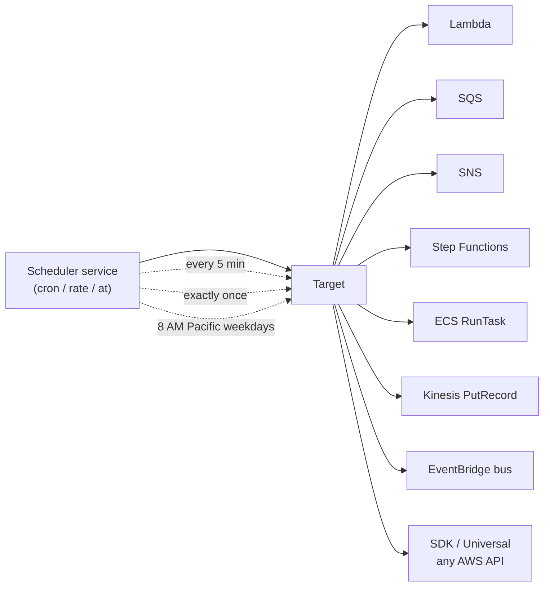

# L21 — Scheduler 101 — the Replacement for CloudWatch Events Schedule

> **Author:** Prem Vishnoi <prem.vishnoi@example.com>
> **Section:** 5 — EventBridge Scheduler
> **Duration:** 6:30

## Prereqs

- Watched **L04 — Why EventBridge? (and where CloudWatch Events fits)** so
  you know that EventBridge is the public evolution of CloudWatch Events.
- Watched **L16 — Targets 101** so you understand the menu of targets
  EventBridge already supports. Scheduler is essentially a new "front
  door" with a richer target menu and a better scheduling model.

## Key terms

- **EventBridge Scheduler** — a managed cron / rate / one-off scheduler
  that delivers a payload to any of **20+ universal targets** on a
  schedule you control. It is the *replacement* for the CloudWatch
  Events schedule API (`events:PutRule` with a `ScheduleExpression`).
- **Schedule group** — a container for schedules. Groups give you IAM
  boundaries, per-group tagging, and a unit of cleanup (`DeleteScheduleGroup`
  removes every schedule inside).
- **Flexible time window** — a window inside which the scheduler may
  invoke your target. Default is `OFF` (fire exactly on time). Setting
  `Mode=FLEXIBLE` with `MaximumWindowInMinutes=15` lets the scheduler
  spread the load and protect downstream services from thundering herds.
- **Universal target** — any of the 20+ services Scheduler can call
  directly: Lambda, SQS, SNS, Step Functions, ECS, Kinesis, Firehose,
  API Gateway, EventBridge, SageMaker, CodeBuild, … and the
  **SDK / `Universal` target** that lets you call any of 6,000+ public
  AWS APIs from a cron.
- **KMS key** — a customer-managed CMK that encrypts the schedule's
  target payload at rest. Required for many compliance postures.
- **At-expression** — `at(2026-12-31T23:59:00)` fires **once** at the
  named timestamp, then the schedule is done. (L23 covers this in depth.)
- **State** — `ENABLED` or `DISABLED`. Disabled schedules are not
  invoked, but they remain in the account and can be re-enabled.
- **IAM schedule role** — the role Scheduler assumes to invoke your
  target. Unlike a rule (where the bus implicitly has PutEvents
  permission), Scheduler needs an **explicit** `iam:PassRole` to the
  target service.

## Lecture

Hi, I'm Prem Vishnoi, and welcome back to the **AWS EventBridge Crash
Course**. In the last few sections we wired up event buses, rules, and
targets. Now we are going to look at a feature that is so useful that
many people use EventBridge *only* for it: the **Scheduler**.

### The problem Scheduler solves

In the old CloudWatch Events world, if you wanted to run something on
a cron, you wrote:

```python
events.put_rule(Name="nightly-job", ScheduleExpression="cron(0 2 * * ? *)")
events.put_targets(
    Rule="nightly-job",
    Targets=[{"Id": "1", "Arn": "arn:aws:lambda:...:function:nightly"}],
)
```

That worked. It still works. But the schedule API was bolted onto the
**event rules** engine, and it inherited a few unfortunate limits:

1. **Targets are limited to the 15-ish services that EventBridge
   rules support.** There is no first-class path to "run a cron and
   have it call ECS RunTask" or "fire a cron and write to a
   Timestream table."
2. **No one-off schedules.** A `cron` or `rate` is the only option;
   you cannot say "fire *exactly once* at 2026-12-31 23:59 UTC."
3. **No time-zone awareness.** Cron expressions are evaluated in
   **UTC**, period. If you are a US retailer that wants "8 AM Eastern
   every weekday," you have to do the UTC math yourself.
4. **No flexible time window.** A cron fires at *exactly* the wall
   clock minute; for a 100,000-job nightly batch that means all 100k
   invocations land in the same 60-second bucket.
5. **No KMS payload encryption.** The target payload is stored in
   plaintext inside the rule.

EventBridge Scheduler — launched in 2022 and steadily expanded since —
is the answer to every one of those limits.

### What Scheduler is

EventBridge Scheduler is a **standalone service** (service
prefix `scheduler`) that lives next to EventBridge in the console. It
is reachable from `boto3.client("scheduler")` and from the
**Amazon EventBridge → Scheduler** page in the console. The mental
model is:



Every "schedule" is essentially a *timer + a target*. There is no
event bus involved — Scheduler does not need a rule, an event
pattern, or a PutEvents call. You give it a schedule expression, a
target ARN, and (optionally) a payload, and it fires.

### Universal targets — the killer feature

The single biggest reason to use Scheduler instead of a CloudWatch
Events `ScheduleExpression` rule is **universal targets**. As of 2026
the service supports 20+ built-in targets:

- **Lambda, SQS, SNS, Step Functions, ECS, Kinesis, Firehose, API
  Gateway, EventBridge bus** — the classics.
- **CodeBuild, SageMaker, Glue, Athena** — analytics/ML targets.
- **Timestream, DynamoDB, S3** — common datastore writes.
- **SDK / Universal** — the *generic* target. You give Scheduler an
  AWS API call (e.g. `sqs:SendMessage`, `s3:PutObject`,
  `glue:StartCrawler`), an IAM role, and a payload. Scheduler
  invokes the API on your behalf. This is the single most useful
  feature for one-liners: "every 5 minutes, write a heartbeat row to
  DynamoDB" requires no Lambda at all.

The bottom line: **if you would have written a 5-line Lambda just to
fire a cron, Scheduler can probably do it directly.**

### The 5 new things Scheduler adds

Let me list the five features that did not exist in CloudWatch Events
schedule rules:

1. **One-off schedules** — `at(2026-12-31T23:59:00)` fires exactly
   once. Great for "send a reminder email 24 hours before a contract
   expires."
2. **Time-zone aware cron** — `cron(0 8 * * ? *)` and
   `ScheduleExpressionTimezone="America/Los_Angeles"`. Now your
   8 AM cron is *actually* 8 AM local.
3. **Flexible time window** — `FlexibleTimeWindow={"Mode": "FLEXIBLE",
   "MaximumWindowInMinutes": 15}`. The scheduler may fire the target
   at any minute within the 15-minute window. Optional, but huge for
   load balancing.
4. **Universal / SDK target** — call any AWS API as the cron target.
   Replaces many tiny Lambda functions.
5. **Customer-managed KMS encryption** — every payload field can be
   encrypted with your own CMK.

### The cost model (2026 numbers)

| Dimension | Free tier | After free tier |
|---|---|---|
| Schedule invocations | 14 million / month | $1.00 per million |
| Minimum charge | – | $0.10 / month |
| Flexible time window | included | included |

For most apps the cost is zero. A 5-minute cron running for a month
is 8,640 invocations, which is **well** under 14 million.

### A first boto3 example

Here is the smallest useful Scheduler program:

```python
import boto3

scheduler = boto3.client("scheduler", region_name="us-east-1")

# 1. Create a group so we can clean up atomically later
scheduler.create_schedule_group(Name="nightly-jobs")

# 2. Create the schedule
scheduler.create_schedule(
    Name="nightly-report",
    GroupName="nightly-jobs",
    ScheduleExpression="cron(0 2 * * ? *)",  # 2 AM UTC, every day
    ScheduleExpressionTimezone="UTC",
    FlexibleTimeWindow={"Mode": "OFF"},
    State="ENABLED",
    Target={
        "Arn": "arn:aws:lambda:us-east-1:111122223333:function:nightly-report",
        "RoleArn": "arn:aws:iam::111122223333:role/scheduler-invoke-lambda",
        "Input": '{"reportType":"nightly"}',
    },
)
```

Two things to notice that are different from `events:PutRule`:

- The `RoleArn` is **required**. Scheduler does not have implicit
  PutEvents permission the way the bus does. You have to create an
  IAM role whose trust policy lets `scheduler.amazonaws.com` assume
  it, and whose permission policy lets the role invoke your target.
- The `FlexibleTimeWindow` is a **separate field**, not a string. It
  defaults to `OFF` (fire exactly on time).

### Idempotency

`create_schedule` is **not** idempotent — calling it twice with the
same `(Name, GroupName)` returns a `ConflictException`. For a script
that you want to be re-runnable, use `update_schedule` (also a single
API call) or check `get_schedule` first. In the `schedule_cron.py`
demo in L24 we use the `update_schedule` pattern.

## Hands-on

There is no code lab in this lecture — the demo lives in **L24**, where
we walk through `code/schedule_cron.py` end to end. For now, just open
the AWS console at `EventBridge → Scheduler → Schedules` and click
**Create schedule**. Type `rate(5 minutes)`, pick a Lambda target,
and watch the invocations appear in CloudWatch Metrics in real time.

```bash
# In CloudShell or a local terminal with AWS credentials
aws scheduler list-schedules --group-name default
```

You should see your new schedule listed. Then go to **Lambda → your
function → Monitor** and confirm the invocations show up.

## Quiz prep

These are the section-5 questions to focus on:

- What two new target types does Scheduler add that a CW Events
  schedule rule did **not** have? (Universal/SDK target + ECS, etc.)
- What's the minimum IAM that the *role passed to Scheduler* needs?
  (`PassRole` + permission to invoke the target)
- How is Scheduler different from a rule + ScheduleExpression?

## Further reading

- AWS docs: [EventBridge Scheduler](https://docs.aws.amazon.com/scheduler/latest/UserGuide/what-is-scheduler.html)
- AWS blog: ["New — EventBridge Scheduler"](https://aws.amazon.com/blogs/compute/introducing-amazon-eventbridge-scheduler/)
- AWS blog: ["Universal Targets in EventBridge Scheduler"](https://aws.amazon.com/blogs/compute/using-universal-target-with-eventbridge-scheduler/)
- `../../SYLLABUS.md` — full lecture map.
- `../../downloads/eventbridge_cheat_sheet.pdf` — one-page reference.

## What's next

In **L22** we go deep on **cron** and **rate** expressions — the
syntax, the gotchas (day-of-month vs day-of-week), and the way the
Service Quotas team rate-limits aggressive crons.

**Ready? Let's write our first schedules.**
