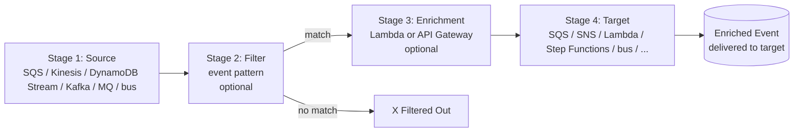

# L25 — Pipes 101 — Source, Filter, Enrichment, Target

> **Author:** Prem Vishnoi <pvishnoi@avilx.com>
> **Section:** 6 — Pipes + Archives + Replay
> **Duration:** 8:30

## Prereqs

- Watched **L16 — Targets 101** so you know the 15+ targets EventBridge
  rules can hit.
- Watched **L18 — SQS + SNS Targets** so you understand queue-based
  and pub/sub fan-out.

## Key terms

- **EventBridge Pipe** — a managed, *point-to-point* integration
  between a single **source** and a single **target**, with
  optional **filtering** and optional **enrichment** in between.
- **Source** — the producer of events. One of: SQS queue, Kinesis
  stream, DynamoDB stream, Amazon MQ broker, Kafka topic, or
  EventBridge event bus.
- **Filter** — an event pattern (the same JSON predicate language
  from L11) that drops events that do not match.
- **Enrichment** — a Lambda function or API Gateway endpoint that
  transforms each event before it is delivered. The enrichment
  return value *replaces* the original event.
- **Target** — the destination. One of: SQS, SNS, Lambda, Step
  Functions, Kinesis, Firehose, ECS, API Gateway, EventBridge bus,
  or any of the universal targets from L21.
- **Partial batch failure** — when a source delivers a batch of N
  events and the target fails on a subset, the partial batch
  response (`ReportBatchItemFailures`) tells the source which
  items to retry. Covered in L26.
- **1-to-many** vs **point-to-point** — Rules are 1-to-many (a
  single event bus can fan out to many targets via many rules).
  Pipes are point-to-point (a single pipe has exactly one source
  and one target).

## Lecture

Hi, I'm Prem Vishnoi. Welcome to section 6. In the last 4 sections
we have used EventBridge as a **pub/sub** engine: events go on a
bus, rules fan them out, many targets react. Now we are going to
use it as a **point-to-point** integration engine. That is what
**EventBridge Pipes** is for.

### The shape of a Pipe

A Pipe has up to four stages, and the first and last are mandatory:



- **Stage 1 — Source.** Exactly one. SQS, Kinesis, DynamoDB Stream,
  Amazon MQ, self-managed Kafka, or another EventBridge event bus.
- **Stage 2 — Filter.** Optional. Same event pattern language as a
  rule. Drops events that do not match.
- **Stage 3 — Enrichment.** Optional. A Lambda function or API
  Gateway endpoint that mutates the event. The enrichment's return
  value *replaces* the original payload.
- **Stage 4 — Target.** Exactly one. Any of the targets a rule can
  hit, plus a few Pipe-only ones.

A Pipe is a managed, fully-serverless integration. There is no EC2
to run, no library to import, no consumer to scale. The service
handles polling, batching, checkpointing, retries, and dead-lettering.

### Pipes vs Rules — when to use which

This is the most important distinction in the section. Both Pipes
and Rules are managed by EventBridge. Both can filter, both can
target many AWS services. The differences are:

| | **Rule** | **Pipe** |
|---|---|---|
| Source | The event bus itself | One of: SQS, Kinesis, DynamoDB, MQ, Kafka, bus |
| Number of targets | 5 per rule | 1 per pipe |
| Filtering | Yes (event pattern) | Yes (event pattern) |
| Enrichment | No (use a target Lambda) | Yes (built-in enrichment stage) |
| 1-to-many | Yes (5 targets per rule) | No (1 target per pipe) |
| Polling / checkpointing | No (bus does it) | Yes (Pipes polls sources) |
| Batch handling | N/A (one event at a time) | Yes (partial batch response) |
| Use case | Fan-out to many consumers | Stream/queue → enrich → single target |

The mental model:

- **Use a Rule when** you have events on a bus and you want N
  independent consumers to react. Example: 5 different teams each
  want to know when an order is placed.
- **Use a Pipe when** you have a stream/queue and you want to move
  events to a *single* downstream service, possibly after
  transforming them. Example: pull Kinesis records, enrich them
  with a Lambda that calls a customer profile API, and write the
  enriched events to S3.

The two are complementary, not competing. A common pattern is
**bus → rule → Kinesis → pipe → enriched target**: a rule places
events on a Kinesis stream, then a Pipe reads from the stream,
enriches, and writes to the final destination. The Pipe gives you
the batch-handling + enrichment in one service; the rule gives you
the 1-to-many fan-in.

### Source deep dive

Each source has its own quirks:

- **SQS** — long polling on the queue. Standard queue, not FIFO.
  Pipe reads up to 10 messages at a time and handles visibility
  timeouts.
- **Kinesis / DynamoDB Streams** — shared iterator model. The Pipe
  service polls shards in parallel. Batch size is configurable up
  to 10,000 records.
- **Amazon MQ** — RabbitMQ or ActiveMQ broker. Pipe consumes from a
  queue or topic.
- **Self-managed Kafka** — connects to your MSK or non-AWS Kafka
  cluster over a VPC endpoint.
- **EventBridge bus** — Pipes can be a *replacement* for a rule,
  pulling events from a source bus and delivering to a single
  target with optional filtering and enrichment. This is the
  newest source and the one that overlaps most with rules.

### Filter deep dive

The Pipe filter is **the exact same event pattern language as a
rule**. From L11:

```json
{
  "source": ["com.myapp.orders"],
  "detail-type": ["Order Placed"],
  "detail": {
    "total": [{"numeric": [">=", 100]}]
  }
}
```

If the event does not match, the Pipe *silently drops it*. There is
no DLQ for filtered events. This is usually what you want — but if
you need to keep the dropped events for audit, send them to a
"parking lot" SQS queue *before* the Pipe (with a rule), or
configure the Pipe's DLQ to capture all errors including filtered
events.

### Enrichment deep dive

The enrichment is the most powerful part of a Pipe. You give it a
Lambda function or an API Gateway endpoint. For each event, the
service invokes the enrichment with the event payload. The
enrichment's return value becomes the new event.

```python
def lambda_handler(event, _context):
    # Look up the customer profile and merge it into the event.
    customer = customer_profile_api.get(event["detail"]["customerId"])
    event["detail"]["customerName"] = customer["name"]
    event["detail"]["customerTier"] = customer["tier"]
    return event
```

That single Lambda, paired with a Pipe, replaces what would
otherwise be a 50-line boto3 consumer.

The enrichment's return value is the **entire new event** — not
just the `detail` payload. So you can transform `time`, `resources`,
or any other field, not just the body.

### Target deep dive

The target is the same menu as a rule's target (SQS, SNS, Lambda,
Step Functions, Kinesis, Firehose, ECS, API Gateway, bus, the 20+
universal targets). The Pipe invokes it with the *enriched* event
and a Pipe-specific header so the target can tell whether the event
came via a rule or a pipe.

### A first boto3 example

```python
import boto3

pipes = boto3.client("pipes", region_name="us-east-1")

pipes.create_pipe(
    Name="orders-to-enriched-s3",
    Source="arn:aws:sqs:us-east-1:111122223333:orders-queue",
    Target="arn:aws:s3:::enriched-orders-bucket",
    TargetParameters={
        "S3OutputFormat": {
            "FileFormat": "json",
        },
    },
    # Optional filter
    FilterPattern=json.dumps({
        "source": ["com.myapp.orders"],
        "detail-type": ["Order Placed"],
    }),
    # Optional enrichment
    Enrichment="arn:aws:lambda:us-east-1:111122223333:function:enrich-order",
    EnrichmentParameters={
        "LambdaParameters": {
            "InvocationType": "REQUEST_RESPONSE",
        },
    },
    RoleArn="arn:aws:iam::111122223333:role/pipe-role",
)
```

That single call wires up a fully managed SQS → filter →
Lambda-enrich → S3 pipeline. No consumer code, no polling, no
checkpointing, no DLQ plumbing.

### Cost (2026 numbers)

| Dimension | Cost |
|---|---|
| Pipes | $0.40 per million events processed |
| State requests (Kinesis) | $0.04 per million state transitions |
| Free tier | 100,000 events / month |

For a 1 million-events-per-day pipeline, that's ~$12/month — much
cheaper than the EC2 consumer it would replace.

## Hands-on

There is no code lab for this lecture. The demo lives in **L29**,
where we walk through `code/archive_replay.py` (Archives + Replay).
For Pipes, just open the AWS console at **EventBridge → Pipes →
Create pipe** and try the wizard. Pick an SQS source, a Lambda
target, no filter, no enrichment, and confirm a single message
flows through.

```bash
# In a separate terminal, send a test message
aws sqs send-message \
  --queue-url https://sqs.us-east-1.amazonaws.com/111122223333/orders-queue \
  --message-body '{"orderId":"o-1","total":99}'
```

Within 30 seconds, the message should be visible in the Lambda's
CloudWatch Logs.

## Quiz prep

These are the section-6 questions to focus on:

- What are the four stages of a Pipe? (Source, Filter, Enrichment,
  Target)
- What's the difference between a Rule and a Pipe?
- Can a Pipe have multiple targets? (No — exactly one.)

## Further reading

- AWS docs: [EventBridge Pipes](https://docs.aws.amazon.com/eventbridge/latest/userguide/eb-pipes.html)
- AWS blog: [Announcing EventBridge Pipes](https://aws.amazon.com/blogs/compute/introducing-amazon-eventbridge-pipes/)
- AWS docs: [Pipe sources](https://docs.aws.amazon.com/eventbridge/latest/userguide/eb-pipes-event-source.html)
- `../../SYLLABUS.md` — full lecture map.

## What's next

In **L26** we go deep on the **partial batch response** — the
mechanism that lets a target say "events 1, 4, 7 failed; retry
those, drop the rest." This is the single most useful failure
isolation feature in Pipes.

**Ready? Let's make Pipes fail-soft.**
