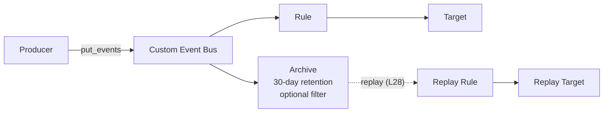

# L27 — Archives — the Event Backup

> **Author:** Prem Vishnoi <pvishnoi@avilx.com>
> **Section:** 6 — Pipes + Archives + Replay
> **Duration:** 7:00

## Prereqs

- Watched **L02 — Event-Driven Architecture** so you understand
  *why* you might want to retain events.
- Watched **L07 — Custom Event Buses** so you know that archives
  attach to a single bus, not to a rule.

## Key terms

- **Archive** — a region-scoped, 30-day-retention log of every
  event that flows through a single event bus (or a subset
  filtered by event pattern). The killer backup feature for
  event-driven systems.
- **Source bus** — the bus whose events the archive captures.
  Always a custom bus, never the default bus. (You can technically
  point an archive at the default bus, but AWS does not recommend
  it.)
- **Event pattern filter** — an optional JSON predicate that
  limits the archive to events matching the pattern. Saves money
  on high-volume buses.
- **Retention** — always 30 days, no more, no less. Hard limit
  from AWS.
- **Region-scoped** — archives are *per-region*. An archive in
  `us-east-1` cannot replay events that flowed in `us-west-2`.
- **Encryption** — the archive contents are encrypted with a
  KMS CMK, either AWS-managed or customer-managed. Customer-managed
  CMKs let you control the key policy.
- **Reconciliation** — a common pattern where you replay archived
  events into a fresh system to rebuild its state from scratch.

## Lecture

Hi, I'm Prem Vishnoi. In L26 we talked about handling failures in
real time. Now we are going to talk about *durability* — the
ability to go back in time and replay events that flowed through
your bus hours, days, or weeks ago. That is what **Archives** are
for.

### Why archives matter

If you have ever tried to debug a production event-driven system
without archives, you have run into this conversation:

> "The order was placed at 14:32:18. What was the exact event
> payload?"
>
> "I don't know. The rule fired, the target processed it, and
> the event is gone."

Without an archive, every event is a one-shot signal. The bus
delivers it, the target consumes it, and the event is no longer
recoverable. If you want to know what happened, you have to look
at the **target's** logs — and the target may not log the full
event payload, may have already rotated its logs, or may be a
managed service that doesn't expose logs at all.

An **archive** is the answer. You attach it to a bus, and AWS
retains every event (or every event matching a pattern) for
**30 days**. You can query the archive, list events, and (in
L28) **replay** the events into a new target.

### The archive model



Key properties:

1. **Source = a bus, not a rule.** An archive is attached to a
   bus. If you only want to archive a subset of events, you use
   the **event pattern filter** on the archive.
2. **Region-scoped.** An archive lives in a single region and
   only sees events that flowed through buses in that region.
3. **30-day retention.** Hard limit. There is no configuration
   for shorter or longer retention.
4. **One archive per bus, max 5 archives per bus.** Each archive
   has a unique name.
5. **Default bus can have an archive, but you should not use it.**
   The default bus is for AWS service events; archival cost is
   high (lots of CloudTrail-style events). Always archive a
   *custom* bus.
6. **Encryption is mandatory.** The archive is encrypted with a
   KMS key. The default is an AWS-managed CMK; you can swap in
   a customer-managed CMK for compliance.

### When to use an archive

Three real use cases:

1. **Debugging.** "What events flowed in the last 24 hours
   matching `source=com.myapp`?" — a query against the archive,
   not against a half-broken Lambda log.
2. **Backfill / reconciliation.** "We deployed a new analytics
   table; replay the last 7 days of `Order Placed` events into
   it." — a replay (L28) against the archive.
3. **Compliance.** "We need to retain every event for 30 days
   for audit." — an archive, plus a CloudWatch alarm on its
   ingested-event count.

If you only need #1, you can list events from the archive without
ever replaying. If you need #2 or #3, you are using the full
archive + replay combo.

### A first boto3 example

```python
import boto3

events = boto3.client("events", region_name="us-east-1")

# 1. Create the custom bus if it does not exist
events.create_event_bus(Name="orders-bus")

# 2. Create the archive against the bus
events.create_archive(
    ArchiveName="orders-archive-30d",
    EventSourceArn="arn:aws:events:us-east-1:111122223333:event-bus/orders-bus",
    RetentionDays=30,
    Description="30-day archive of every order-related event.",
    # Optional: only archive order events.
    # EventPattern=json.dumps({"detail-type": ["Order Placed", "Order Shipped"]}),
)
```

That's it. From this point on, every event placed on
`orders-bus` is also written to `orders-archive-30d` for 30 days.

### Cost (2026 numbers)

| Dimension | Cost |
|---|---|
| Archive ingest | $0.10 per million events ingested |
| Archive storage | included (30 days) |
| List / describe archive | $0.00 per 10,000 calls |

For a 1 million-event-per-day bus, that's ~$3/month. Cheap.

### Limits to know

- **5 archives per bus** (soft quota, can be increased).
- **30-day retention** is the only option.
- **No selective deletion.** You cannot delete an event from an
  archive. The 30-day window is the only way to age events out.
- **Replays count against quota.** Each replay can cover at most
  the past 30 days and at most 100,000 events per replay (soft
  limit).

### Pattern: archive + replay as a backup strategy

A common pattern in production:

1. Every event flows through `orders-bus`.
2. An archive captures every `Order Placed` event for 30 days.
3. The downstream analytics table reads from a **replay** of
   the archive on first deploy, then reads from the live bus
   afterwards.
4. If the analytics table ever gets corrupted, you delete it
   and replay the last 7 days of `Order Placed` events to
   rebuild it from scratch.

This is "infrastructure-as-database" — the event bus *is* the
source of truth, and the analytics tables are projections of
the bus. Archives make the projection rebuildable.

## Hands-on

There is no code lab for this lecture. The demo lives in **L29**,
where we walk through `code/archive_replay.py` end to end. For
now, just open the AWS console at **EventBridge → Archives →
Create archive** and try the wizard. Pick a custom bus, set
retention to 30, leave the event pattern empty, and confirm the
archive appears in the list.

```bash
# Confirm via CLI
aws events list-archives
```

You should see your new archive listed with its source bus ARN
and creation time.

## Quiz prep

These are the section-6 questions to focus on:

- How long does an archive retain events? (30 days)
- Can you archive events from the default bus? (technically yes,
  but not recommended)
- What is the difference between a rule and an archive? (a rule
  delivers events to a target; an archive retains events for
  later replay)

## Further reading

- AWS docs: [EventBridge Archives](https://docs.aws.amazon.com/eventbridge/latest/userguide/eb-archive.html)
- AWS docs: [CreateArchive API](https://docs.aws.amazon.com/eventbridge/latest/APIReference/API_CreateArchive.html)
- AWS blog: [Announcing EventBridge Archive and Replay](https://aws.amazon.com/blogs/compute/automating-event-failures-with-amazon-eventbridge/)
- `../../SYLLABUS.md` — full lecture map.

## What's next

In **L28** we cover the partner feature: **Replay**. An archive
without a replay is a passive log; an archive *with* a replay
is a "time machine" for your event-driven system. We walk
through the `start_replay` API, the time-range filter, and the
single vs multi-target decision.

**Ready? Let's rewind.**
