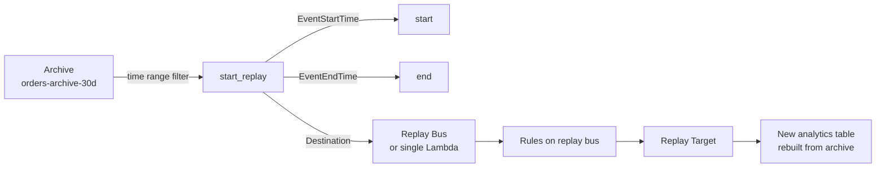

# L28 — Replay — the Killer Feature

> **Author:** Prem Vishnoi <pvishnoi@avilx.com>
> **Section:** 6 — Pipes + Archives + Replay
> **Duration:** 8:30

## Prereqs

- Watched **L27 — Archives** so you know what an archive is, what
  its 30-day retention means, and how to create one with boto3.

## Key terms

- **Replay** — a one-time, time-bounded re-delivery of archived
  events to a target bus (or a single Lambda target). Reads from
  an archive, writes to a destination.
- **`EventStartTime` / `EventEndTime`** — the time range filter
  on the replay. Events whose `time` field falls inside the
  range are replayed; events outside the range are skipped.
- **Destination** — where the replayed events are written. Either
  a single target bus ARN or a single Lambda ARN.
- **Replay state** — `STARTING | RUNNING | COMPLETED | FAILED |
  CANCELLED`. Monitored via the `describe_replay` API and via
  CloudWatch Metrics.
- **Throttle / concurrency** — the replay API has a soft limit
  of 100,000 events per replay and 1 replay per archive at a
  time. Larger requeues must be split into multiple replays.
- **Idempotency** — replays are **not** idempotent. If you replay
  the same time range twice, the events are delivered twice.
  Your targets must be idempotent (use the event's `id` field
  as a dedup key).

## Lecture

Hi, I'm Prem Vishnoi. Welcome back. In L27 we created an archive
that retains every event on a bus for 30 days. That alone is
useful — it is a 30-day queryable backup of your event stream.
But the *killer* feature is **Replay**: the ability to take those
archived events and re-deliver them to a target, with a time
range you specify.

### The replay model

A replay is a single API call that says: "for the time range
`[start, end]`, take every event in the archive, and re-deliver
it to *this* destination, *as if it had flowed through the bus
right now*."



There are two destination modes:

1. **Replay to a bus.** The replayed events land on a *target
   bus*. They are full EventBridge events — the same shape as
   live events, complete with the `id`, `time`, `source`, and
   `detail` fields. Any rules on the target bus fire as if the
   events had flowed live.
2. **Replay to a Lambda.** The replayed events are delivered
   directly to a single Lambda function as an EventBridge
   event. There is no bus, no rules, no fan-out.

The bus mode is more flexible (one replay can drive many targets
via rules). The Lambda mode is simpler (no bus to set up).

### Why this is the killer feature

The 4 use cases that justify a 30-day archive:

1. **Backfill a new system.** "We just deployed
   `analytics-orders-v2`. Replay the last 7 days of
   `Order Placed` events into it so the new table is
   populated."
2. **Rebuild after a bug.** "We had a bug on 2026-09-15 between
   14:00 and 16:00 that wrote 10,000 bad rows. Find the
   archive of the source events, replay just that 2-hour
   window, and rebuild the table from scratch."
3. **Replicate to a new region.** "We just stood up
   `eu-west-1`. Replay the last 24 hours of `Order Placed` into
   its bus to seed the new region."
4. **Audit / forensic.** "What events flowed on 2026-08-15
   between 09:00 and 09:05?" — replay them into a forensic
   bus for inspection.

Without archives + replay, all four of those would require
reproducing the events at the producer, which is usually
impossible.

### A first boto3 example

```python
import boto3
from datetime import datetime, timedelta, timezone

events = boto3.client("events", region_name="us-east-1")

now = datetime.now(timezone.utc)
one_hour_ago = now - timedelta(hours=1)

replay = events.start_replay(
    ReplayName="replay-last-hour-2026-10-10",
    # Source: the bus the archive is attached to.
    EventSourceArn="arn:aws:events:us-east-1:111122223333:event-bus/orders-bus",
    # Time range: the last 1 hour.
    EventStartTime=one_hour_ago,
    EventEndTime=now,
    # Destination: a replay bus, which has rules that fan out
    # to the targets we want to repopulate.
    Destination={
        "Arn": "arn:aws:events:us-east-1:111122223333:event-bus/orders-replay-bus",
    },
)
print("Replay ARN:", replay["ReplayArn"])
```

Five fields, one call. The replay starts asynchronously — you
poll `describe_replay(ReplayName=…)` to check progress.

### Time range and ordering

The time range is the event's `time` field, not the wall-clock
at which the replay was started. The events are delivered to the
destination in *approximate* chronological order, but **not
strictly** — the replay API does not guarantee order.

If your targets require strictly ordered processing, sort by the
event's `time` field on the target side. For 99% of use cases
(an analytics table, a search index, a log aggregator) order
does not matter.

### Single vs multi-target

| Mode | When to use | How |
|---|---|---|
| Single target | You want to repopulate one table or rebuild one system | Replay to a Lambda |
| Multi-target | You want to drive many consumers in parallel | Replay to a bus, fan out via rules |

The **multi-target** mode is more common in production, because
replays are usually about rebuilding a *projection* of the bus,
and a single replay → single bus → many rules → many targets
is the same shape as a live bus.

### Idempotency

Replays are **not** idempotent. If you run `start_replay` twice
with the same `EventStartTime` and `EventEndTime`, the events
are delivered twice. The destination receives the same event
IDs as the original flow.

This is fine for most targets (an analytics table that
upserts on `id` is naturally idempotent), but it is a footgun
for targets that append (an S3 object writer, an SNS topic
without message deduplication). Always design your targets to
be idempotent, with a dedup key of `event.id`.

### Limits

| Limit | Value |
|---|---|
| Events per replay | 100,000 (soft) |
| Replays per archive | 1 (must wait for completion) |
| Time range | up to 30 days, must be inside the archive's retention |
| Concurrent replays per account | 10 (soft) |

For larger backfills, split the work into multiple
back-to-back replays, each with a 100k-event window.

### Monitoring a replay

```python
status = events.describe_replay(ReplayName="replay-last-hour-2026-10-10")
print(status["State"], status.get("EventCountReplayed", 0))
```

The state machine is `STARTING → RUNNING → COMPLETED | FAILED |
CANCELLED`. For very large replays, the `RUNNING` state can last
hours. CloudWatch Metrics expose the per-minute replay count
under the `AWS/Events` namespace.

### Best-practice recipe for production

1. **One archive per bus.** Always.
2. **Replays go to a *replay* bus**, not the live bus. The replay
   bus has its own set of rules that target the *new* system.
   This keeps the live bus from being polluted with replayed
   events.
3. **Targets are idempotent** (dedup on `event.id`).
4. **CloudWatch alarm** on `Archive.IngestedEvents` and
   `Replay.State = FAILED`.
5. **Time range starts at 1-hour-ago** for first deployment, then
   24-hour-ago, then 7-day-ago, then full 30 days. Roll out the
   replay window incrementally to avoid bursting downstream
   systems.

## Hands-on

There is no code lab for this lecture. The demo lives in **L29**,
where we walk through `code/archive_replay.py` end to end. For
now, just open the AWS console at **EventBridge → Replays →
Start replay** and try the wizard. Pick your archive, a 1-hour
time range, and a replay bus. Watch the replay progress in
**EventBridge → Replays**.

```bash
# Confirm via CLI
aws events describe-replay --replay-name <your-replay-name>
```

You should see `State: RUNNING` initially and `State: COMPLETED`
after a few minutes.

## Quiz prep

These are the section-6 questions to focus on:

- How do you replay a specific 2-hour window? (set
  `EventStartTime` and `EventEndTime` on `start_replay`)
- Is a replay idempotent? (No — replays deliver events twice
  if you run them twice)
- What's the difference between replay-to-bus and replay-to-Lambda?

## Further reading

- AWS docs: [EventBridge Replay](https://docs.aws.amazon.com/eventbridge/latest/userguide/eb-replay.html)
- AWS docs: [StartReplay API](https://docs.aws.amazon.com/eventbridge/latest/APIReference/API_StartReplay.html)
- AWS blog: [Archive and Replay launch post](https://aws.amazon.com/blogs/compute/introducing-amazon-eventbridge-archive-and-replay/)
- `../../SYLLABUS.md` — full lecture map.

## What's next

In **L29** we close out section 6 with a recap and a walk-through
of `code/archive_replay.py` — a real, idempotent boto3 program
that creates a bus, an archive, sends test events, and starts a
replay for the last hour.

**Ready? Let's run the demo.**
