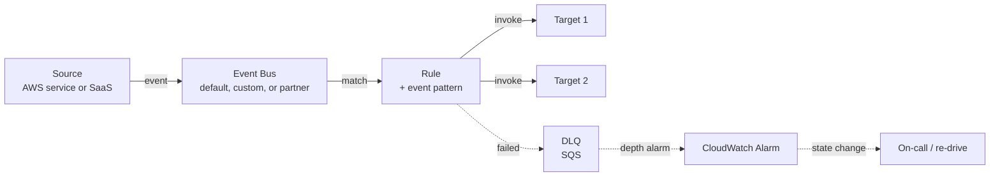

# L30 — The 10 Most Common EventBridge Patterns

> **Author:** Prem Vishnoi <prem.vishnoi@example.com>
> **Section:** 7 — Patterns + Real-World
> **Duration:** 9:30

## Prereqs

- Comfortable with **event buses**, **rules**, and **targets** (sections 2–4).
- A mental model of **DLQ + retry** (L19) and **archives/replay** (L27–L28).
- No new AWS resources are created in this lecture. It is a **catalog** of
  the patterns we have used in real consulting engagements.

## Key terms

- **Source** — the AWS service (or SaaS partner) that emits an event onto a
  bus. Examples: S3, DynamoDB Streams, API Gateway, CloudWatch, SNS, SQS.
- **Pattern** — the JSON predicate attached to a rule that decides whether
  a given event matches.
- **Target** — the AWS service invoked when a rule matches. Examples:
  Lambda, SQS, SNS, Step Functions, another event bus, Kinesis.
- **Fan-out** — one event delivered to N independent targets. EventBridge
  does this natively; a rule can have up to 5 targets per rule (and you can
  use additional rules to fan out further).
- **Anti-corruption layer** — a service whose only job is to translate one
  schema into another so downstream consumers do not break when a producer
  changes its payload.

## Lecture

Welcome to the capstone. The previous six sections taught you the moving
parts of EventBridge — buses, rules, patterns, targets, scheduler, pipes,
archives. Now we put those moving parts together.

In ten years of consulting I have seen the same **ten** EventBridge
patterns over and over. The shape of the rule, the targets, the DLQ, and
the IAM role vary — but the **topology** is recognizable. This lecture is
the catalog. The next six lectures (L31–L35) walk through the five most
production-critical patterns in detail, and L36 wraps the course.

### The 10 patterns

| # | Name | Source → Bus | Typical Target(s) | When you reach for it |
|---|---|---|---|---|
| 1 | **S3 → Lambda** | S3 → default bus | Lambda | Object ingestion, image resize, CSV → Parquet |
| 2 | **CloudWatch Alarm → SNS** | CW → default bus | SNS topic (+ SSM runbook) | Paging humans, automated remediation |
| 3 | **API Gateway → Step Functions** | APIGW → custom bus | SFN state machine | Long-running async workflows started by an HTTP POST |
| 4 | **SQS → Step Functions** | SQS → Pipes | SFN | Worker pool + durable workflow combo |
| 5 | **DynamoDB Streams → Lambda** | DDB Streams → Pipes | Lambda (with partial batch response) | CDC, audit, materialized views |
| 6 | **Schedule → Lambda** | Scheduler → target bus | Lambda (or any SDK target) | Cron jobs, batch kickoff, "every 5 minutes" ETL |
| 7 | **Cross-account bus fan-out** | Account A bus → Account B bus | Lambda / SQS in account B | Centralized event ingestion across an org |
| 8 | **SaaS partner → Lambda** | Partner bus (Auth0, Datadog, Zendesk, …) | Lambda | Third-party webhook ingestion without a public API |
| 9 | **CodePipeline state change → SNS** | CW → default bus | SNS | CI/CD notifications, deployment audits |
| 10 | **DLQ depth alarm → Lambda** | CW metric on SQS → default bus | Lambda (re-drive or page) | Self-healing, alerting on the alert system |

We will cover #1, #2, #3, and the DLQ variant in detail in L31–L34. L35
covers #7 (cross-account). L36 closes the course.

### A reusable mental model for every pattern

Every one of these patterns is the same shape under the hood:

Three things to keep in mind:

1. **The bus is the contract.** Producers and consumers never know about
   each other; they only know the bus + the pattern. That is the whole
   point of EventBridge.
2. **The pattern is the API.** Consumers should be able to onboard just
   by reading the event schema and writing a pattern. If a consumer
   needs bespoke knowledge of the producer, the abstraction has leaked.
3. **The DLQ is part of the pattern, not an afterthought.** Production
   EventBridge rules that lack a DLQ are how you get silent data loss.
   We cover DLQ patterns in L34.

### A few decisions that recur in every pattern

When you build a pattern in real life, you answer these four questions in
roughly this order:

- **Default bus or custom bus?** Use the default bus for AWS-service
  events (S3, CW, CW Logs, Glue, …). Use a custom bus for application
  events you emit yourself with `PutEvents`, and for partner events.
- **One rule or many?** One rule with up to 5 targets if the targets want
  the same event. Many rules (sharing one pattern via `ListEventBuses`
  + a parameterized rule) if you need different filtering per consumer.
- **Lambda, SQS, or SNS as the target?** Lambda when you need compute.
  SQS when you need buffering and you have a worker pool that polls.
  SNS when you need pub/sub fan-out to humans (email, SMS, Slack).
- **Where does the DLQ live?** A single SQS queue shared across all
  rules (cross-target DLQ) is the simplest. A per-rule DLQ is the most
  diagnostically useful. We compare them in L34.

### Anti-patterns to avoid

A few shapes that look like EventBridge patterns but are mistakes:

- **A Lambda that polls a database and emits events to EventBridge to
  trigger more Lambdas.** That is a database CDC problem; use DynamoDB
  Streams, Kinesis, or RDS event notifications instead.
- **Putting business logic in event patterns.** Patterns are JSON
  predicates — they match structure, not semantics. If you want
  semantic filtering ("only fire for VIP customers"), do that in the
  Lambda or in a content-filtering rule.
- **A pattern with no DLQ on a critical rule.** This is how you get
  silent failures. Every production rule should have a DLQ.
- **A bus per microservice.** If every service has its own bus you have
  re-built point-to-point queues and lost the fan-out. Use the default
  bus for AWS events; consider one shared application bus per
  bounded context.

## Hands-on

This lecture is a catalog, not a lab. Your homework before L31 is to
pick **one** of the 10 patterns above that you have not built before
and write a one-paragraph design: source, bus, pattern, target, DLQ.
Bring it to L31.

## Quiz prep

For this lecture, the section 7 quiz will ask you to:

- Name at least 6 of the 10 patterns from the table.
- Choose the right bus (default vs custom vs partner) for a given
  source.
- Identify which patterns need a DLQ and which do not.

## Further reading

- `../../SYLLABUS.md` — section 7 lecture map.
- AWS What's New for EventBridge:
  <https://aws.amazon.com/about-aws/whats-new/analytics/>
- EventBridge FAQs:
  <https://aws.amazon.com/eventbridge/faqs/>

## What's next

L31 dives into pattern #1 — **S3 → EventBridge → Lambda** — which is the
single most common EventBridge shape I have shipped in production.

**Ready? Let's start with the S3 ingestion pattern.**
