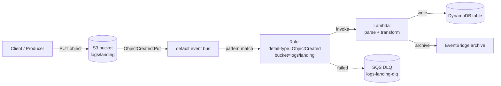

# L31 — S3 → EventBridge → Lambda

> **Author:** Prem Vishnoi <pvishnoi@avilx.com>
> **Section:** 7 — Patterns + Real-World
> **Duration:** 11:15

## Prereqs

- L30 (the 10 patterns catalog) and L19 (DLQ + retry) are the conceptual
  foundation. You should know what an event pattern looks like and what a
  dead-letter queue does.
- Comfortable with S3 bucket creation, IAM roles, and Lambda deployment
  from a previous section.

## Key terms

- **ObjectCreated event** — emitted when an object is `PUT`, `POST`,
  `COPY`, or written via a multi-part upload completion. This is the
  event you will match 90% of the time.
- **ObjectRemoved event** — emitted when an object is deleted (or expires
  via an S3 lifecycle rule). S3 → EventBridge can match this; legacy S3
  notifications cannot.
- **S3 → EventBridge integration** — a 2022 feature. Every S3 bucket can
  publish events to EventBridge by default; you just turn the
  integration on, then write rules. No more "topic per bucket".
- **S3 event source mapping** — the Lambda-side construct that pulls S3
  events. With EventBridge in the middle, **you do not need one** —
  EventBridge invokes Lambda directly as a target.

## Lecture

Pattern #1 in the catalog is the single most-shipped EventBridge
topology in real-world AWS: **a file lands in S3, and a Lambda function
runs.** Before the S3 → EventBridge integration existed (announced
late 2022, GA everywhere by 2023), you had three options and they were
all bad:

1. **S3 → SNS → Lambda.** Worked, but added a topic you had to manage,
   pay for, and IAM-permission.
2. **S3 → SQS → Lambda.** Same problem; added a queue.
3. **Lambda's S3 event source mapping.** Worked, but you could not
   filter on `detail-type`, you could not fan out to a second consumer,
   and you had to manage the mapping per bucket.

EventBridge replaces all three with a single rule. Let me walk you
through the production version of this pattern.

### The topology



There are **two** independent rules you almost always want on an S3
ingestion bucket:

- **Rule A: `ObjectCreated:Put` on `s3://logs/landing/`.** Drives the
  ingestion Lambda. This is the "happy path" rule.
- **Rule B: `ObjectRemoved:Delete` on the same bucket.** Drives a
  cleanup Lambda that removes the corresponding DynamoDB row (or
  marks it as tombstoned). This is the "no orphan rows" rule.

Both rules share the same DLQ. The cleanup rule is the one most teams
forget; without it, deleted S3 objects leave behind orphan rows in
downstream stores, and you get a slow data-drift problem that is
expensive to debug six months later.

### The event pattern (the important bit)

Here is the exact pattern I use for the ingestion rule. Note the
**two** matching conditions: `detail-type` and `bucket name`. Without
the bucket filter, the rule will fire for every bucket in the account.

```json
{
  "source": ["aws.s3"],
  "detail-type": ["Object Created"],
  "detail": {
    "bucket": {
      "name": ["prod-data-lake-landing"]
    },
    "object": {
      "key": [{ "prefix": "raw/" }]
    }
  }
}
```

A few things to notice:

- `source` is always `aws.s3` for S3 events.
- `detail-type` is `Object Created` (not `ObjectCreated:Put` — the
  S3 → EventBridge integration normalizes it).
- The `object.key` filter is a `prefix` match. We use it to scope
  ingestion to a specific prefix (e.g. only `raw/`), so the rule does
  not fire for objects dropped in `tmp/` or `archive/`.
- The `bucket.name` is an **array** because you can match multiple
  buckets in one rule. For a per-bucket rule, the array has one entry.

For the cleanup rule, the only changes are:

```json
{
  "source": ["aws.s3"],
  "detail-type": ["Object Deleted"],
  "detail": {
    "bucket": { "name": ["prod-data-lake-landing"] },
    "object": { "key": [{ "prefix": "raw/" }] }
  }
}
```

### What the Lambda receives

The full event S3 publishes onto the bus is bigger than what a legacy
S3 notification delivered. Here is a representative payload (abridged):

```json
{
  "version": "0",
  "id": "1e5527d7-bb36-4607-3370-4164db56a40e",
  "detail-type": "Object Created",
  "source": "aws.s3",
  "account": "111122223333",
  "time": "2026-10-10T13:24:18Z",
  "region": "us-east-1",
  "resources": [
    "arn:aws:s3:::prod-data-lake-landing/raw/orders/2026-10-10.json"
  ],
  "detail": {
    "version": "1.0",
    "bucket": { "name": "prod-data-lake-landing" },
    "object": {
      "key": "raw/orders/2026-10-10.json",
      "size": 184233,
      "etag": "5d41402abc4b2a76b9719d911017c592",
      "version-id": "abc123",
      "sequencer": "0065E7A9D4A1C8E2F0"
    },
    "request-id": "9F2C7AKJ7R7X4XKQ",
    "requester": "111122223333",
    "source-ip-address": "203.0.113.42",
    "reason": "PutObject"
  }
}
```

In the Lambda, you almost never need all of that. The two fields you
reach for are `detail.bucket.name` and `detail.object.key`, which you
use to build a `s3.get_object(Bucket=..., Key=...)` call.

### IAM for the rule target

EventBridge needs permission to invoke your Lambda. The cleanest way is
a resource-based policy on the function, not an IAM role on the rule:

```json
{
  "Version": "2012-10-17",
  "Statement": [{
    "Effect": "Allow",
    "Principal": { "Service": "events.amazonaws.com" },
    "Action": "lambda:InvokeFunction",
    "Resource": "arn:aws:lambda:us-east-1:111122223333:function:s3-ingest",
    "Condition": {
      "ArnLike": {
        "AWS:SourceArn": "arn:aws:events:us-east-1:111122223333:rule/prod-data-lake-landing-created"
      }
    }
  }]
}
```

The `Condition` is the part most teams forget. Without it, **any**
rule in the account can invoke the function. With it, only the named
rule can. Always scope the `SourceArn`.

### The DLQ wiring

In the AWS console, the rule has a **Dead-letter queue** section
under "Additional settings" → "Retry policy and dead-letter queue".
You set:

- **Maximum age of event**: 86400 (24 h)
- **Retry attempts**: 185 (the current maximum)
- **Dead-letter queue**: the SQS queue ARN

When the Lambda throws, EventBridge retries with exponential backoff
up to the attempt count, then moves the event to the DLQ. A separate
CloudWatch alarm on `ApproximateNumberOfMessagesVisible` on the DLQ
pages the on-call when depth > 0.

### Common pitfalls

I have shipped this pattern a lot. The same six mistakes show up
every time:

1. **Forgetting the bucket filter.** The rule fires for every S3
   bucket in the account, including future ones. Always filter on
   `detail.bucket.name`.
2. **No prefix filter.** The rule fires for every object in the
   bucket, including `tmp/`, `archive/`, and `.DS_Store` files. Use
   a `prefix` match.
3. **S3 versioning disabled.** Without versioning, a `Put` + `Delete`
   pair within seconds can race the cleanup rule and the row is left
   orphaned. Enable versioning on every ingestion bucket.
4. **Multi-part upload races.** A multi-part upload only emits
   `ObjectCreated` on the **completion** event (when the final part
   is assembled), not on each part. That is almost always what you
   want, but I have seen teams try to process parts as they land and
   fail.
5. **No DLQ.** Silent failures on the ingestion path. Always wire a
   DLQ.
6. **The Lambda is synchronous to a downstream API.** If the
   downstream API is slow, the Lambda times out and the event is
   retried 185 times. Either decouple via SQS or put the DLQ on the
   inner step, not the outer.

## Hands-on

No code is written in this lecture, but the JSON event pattern above
is the pattern you would use in a CDK `events.Rule` construct in your
own account. Try transcribing it into a CDK or CloudFormation template
and deploying it to a personal bucket; the rule should fire on a
manual `aws s3 cp`.

## Quiz prep

The section 7 quiz will test whether you can:

- Write an event pattern that filters by bucket and key prefix.
- Explain why `Object Created` is the normalized `detail-type` and not
  `ObjectCreated:Put`.
- Describe the two-rule pattern (create + delete) and why you need
  both.

## Further reading

- AWS docs: "Using EventBridge with S3":
  <https://docs.aws.amazon.com/AmazonS3/latest/userguide/EventBridge.html>
- EventBridge FAQs:
  <https://aws.amazon.com/eventbridge/faqs/>
- `../../SYLLABUS.md` — section 7 lecture map.

## What's next

L32 keeps the same shape but swaps the source: **CloudWatch Alarm state
change → EventBridge → SNS** is the alerting-side counterpart to the
S3 ingestion pattern, and it is where most teams first encounter
EventBridge.

**Ready? Let's wire up an alarm-to-SNS pattern.**
