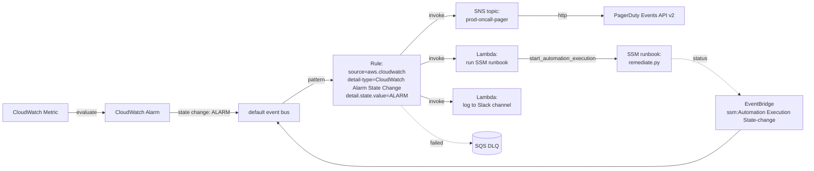

# L32 — CloudWatch Alarm → EventBridge → SNS (with SSM Runbook)

> **Author:** Prem Vishnoi <prem.vishnoi@example.com>
> **Section:** 7 — Patterns + Real-World
> **Duration:** 10:45

## Prereqs

- L30 (patterns catalog) and L19 (DLQ + retry).
- Familiarity with CloudWatch metrics and alarms. If you have shipped
  a CW alarm before, you have enough.

## Key terms

- **CloudWatch Alarm state** — every CW alarm is in one of three states:
  `OK`, `INSUFFICIENT_DATA`, or `ALARM`. EventBridge exposes every
  state change as an event.
- **`AWS::CloudWatch::Alarm` → EventBridge** — the integration is on
  by default. You do not need to enable it (unlike S3). Every alarm
  publishes its state changes to the default bus.
- **SSM Automation runbook** — a Systems Manager document that defines
  a remediation workflow. You can trigger a runbook from an EventBridge
  rule via an `aws.ssm` API call, or you can put a Lambda in the middle
  that calls `start_automation_execution`.
- **PagerDuty / Opsgenie** — incident management tools. Their "events
  API" v2 endpoint accepts JSON via SNS HTTP delivery, which is why SNS
  is usually the last hop in this pattern.

## Lecture

Pattern #2 in the catalog is the **alerting pattern** — the one that
pages humans and (optionally) tries to fix itself. Every production
AWS account I have ever worked in has this pattern, and it almost
always goes:

```
CW Alarm → EventBridge → SNS topic → (PagerDuty + Email + Slack)
                              ↓
                       Optional: SSM runbook
                       (try to remediate before paging)
```

Before EventBridge, the only way to react to a CW alarm state change
was "create an SNS topic, set it as the alarm action, and hope the
alarm action itself never failed." That worked for paging but it gave
you no fan-out, no filtering, no retry, and no archive. EventBridge
fixes all of that.

### The topology



The two things to notice in this diagram:

1. **The rule fans out to three independent targets**: SNS (for
   paging), Lambda → SSM (for remediation), and Lambda → Slack (for
   visibility). They run in parallel.
2. **The SSM runbook emits its own state-change event back onto the
   bus.** You can wire a second rule that, say, posts a Slack message
   when the automation completes. This is the "self-aware" alerting
   pattern: the alert system reports on itself.

### The event pattern

CW alarm events are verbose. The pattern that matches **only the
ALARM transition** (and not every metric update) is:

```json
{
  "source": ["aws.cloudwatch"],
  "detail-type": ["CloudWatch Alarm State Change"],
  "detail": {
    "state": {
      "value": ["ALARM"]
    },
    "alarmName": [
      { "prefix": "prod-" }
    ]
  }
}
```

A few notes:

- `detail.state.value` is the only field you need to filter on to
  get the ALARM transition. If you also want to fire on
  `INSUFFICIENT_DATA`, add it to the array. The `OK` transition
  rarely needs a target.
- `prefix: "prod-"` is the convention I use to scope alerting rules
  to production alarms only. `dev-` and `staging-` alarms match
  different rules with different target lists.
- The full event payload includes `detail.metricName`, `detail.namespace`,
  `detail.dimensions`, `detail.reason`, and `detail.previousState`.
  Your Lambda or SNS subscribers can read all of these.

### Target 1 — SNS for paging

The SNS target is the simplest. You create a **standard** SNS topic
(not FIFO — alarms are not ordered), subscribe:

- An **HTTPS** endpoint to PagerDuty Events API v2
- An **email** endpoint for the on-call distribution list
- A **Slack** channel via a Slack incoming webhook (HTTPS endpoint)

And you wire the topic ARN as a target on the rule. SNS handles
fan-out and retry; PagerDuty deduplicates by `alarmName` + `state`
so you do not get double pages for a flapping alarm.

### Target 2 — SSM runbook for auto-remediation

This is the higher-leverage part of the pattern. Instead of paging a
human to do the same boring remediation for the 50th time, you have
a Lambda call `start_automation_execution` on an SSM runbook that
does the remediation itself.

The Lambda target is just a small Python handler:

```python
import boto3, json

def handler(event, context):
    ssm = boto3.client("ssm")
    alarm_name = event["detail"]["alarmName"]
    runbook_for = {
        "prod-rds-cpu-high":  "RdsRestartSqlSession",
        "prod-ecs-task-fail": "EcsDrainStuckTask",
        "prod-s3-403-spike":  "RotateS3AccessDenied",
    }
    runbook = runbook_for.get(alarm_name)
    if not runbook:
        return {"skipped": alarm_name}
    resp = ssm.start_automation_execution(
        DocumentName=f"Automation-{runbook}",
        Parameters={"AutomationAssumeRole": ["AutomationServiceRole"]},
    )
    return {"executionArn": resp["AutomationExecutionId"]}
```

The runbook either succeeds (and you do not page) or fails (and a
second rule on `aws.ssm` `Automation Execution State-change` pages
the human). The result is a self-healing system that only pages when
the auto-remediation itself fails — which is the alert you actually
want to be woken up for.

### Target 3 — Slack (visibility)

I almost always add a third target that posts to a low-priority
Slack channel (`#ops-alerts`). The Lambda just calls Slack's incoming
webhook with a formatted message. This gives the rest of the team
visibility into what is firing without spamming the on-call
engineer's phone.

### IAM for the rule

Same as L31 — use a resource-based policy on the Lambda, scoped by
`AWS:SourceArn` to the specific rule. For the SNS target, SNS does
not need a Lambda-style resource policy; the rule just needs
`sns:Publish` permission on the topic (granted via the rule's
execution role).

### Common pitfalls

1. **Forgetting the `state.value` filter.** Without it, the rule
   fires for every state change, including `OK` → `OK` (yes, really
   — CloudWatch publishes a synthetic state change for every
   evaluation period). The SNS topic will get hammered.
2. **Wiring SSM before you have a tested runbook.** A bug in the
   runbook can fan out and cause more damage than the original
   alarm. Always run the runbook manually once before wiring it
   into the rule.
3. **No DLQ on the rule.** The same lesson as L31: silent failures
   on an alerting rule are how you discover your alerting does not
   work during a real incident.
4. **PagerDuty + Slack + Email all from the same rule.** When the
   rule fires, you want all three. When the SSM runbook succeeds,
   you want **only** Slack. Split into two rules with different
   targets.

## Hands-on

No code in this lecture. Your homework is to write the SSM runbook
mapping table for the alarms in your own account. Which alarms have
an automated remediation? Which need a human? The answers become the
table inside the Lambda.

## Quiz prep

The quiz will test:

- The right `detail-type` for CW alarm events.
- Why the `state.value` filter is required.
- The role of SSM Automation in the auto-remediation path.

## Further reading

- AWS docs: "CloudWatch alarm event formats":
  <https://docs.aws.amazon.com/AmazonCloudWatch/latest/monitoring/cloudwatch-and-eventbridge.html>
- SSM Automation docs:
  <https://docs.aws.amazon.com/systems-manager/latest/userguide/automation.html>
- EventBridge FAQs:
  <https://aws.amazon.com/eventbridge/faqs/>

## What's next

L33 is the **API Gateway → EventBridge → Step Functions** pattern —
how to start a long-running async workflow from an HTTP request
without tying up the API caller.

**Ready? Let's move from alerting to long-running workflows.**
