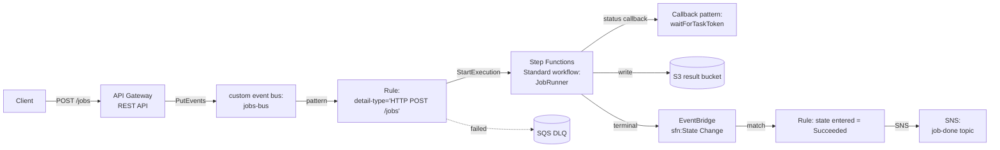

# L33 — API Gateway → EventBridge → Step Functions

> **Author:** Prem Vishnoi <pvishnoi@avilx.com>
> **Section:** 7 — Patterns + Real-World
> **Duration:** 10:20

## Prereqs

- L30 (patterns catalog) and L17 (Lambda as a target — the same IAM
  pattern applies for Step Functions as a target).
- You should know what a Step Functions state machine is and the
  difference between Standard and Express workflows.

## Key terms

- **Sync vs async API** — a *synchronous* API holds the client's HTTP
  connection open until the work is done. An *asynchronous* API
  returns 202 + a job ID immediately and processes the work in the
  background. EventBridge is the seam that turns one into the other.
- **API Gateway → EventBridge direct integration** — a feature added
  in 2023. You can wire API Gateway methods directly to EventBridge
  as a target, with no Lambda in the middle. The request body becomes
  the `detail` field of the event.
- **Standard vs Express workflow** — Standard is durable (up to 1
  year), billed per state transition, and the right choice when the
  workflow must survive a process restart. Express is short-lived
  (up to 5 min), billed per second, and the right choice for
  high-volume ETL.
- **`detail-type` for API Gateway events** — when you wire API
  Gateway → EventBridge directly, you set the `detail-type` via a
  mapping template. The convention I use is `"HTTP ${method} ${path}"`.

## Lecture

Pattern #3 in the catalog is the **long-running async workflow** —
the one that lets you take a request, return 202 in 100 ms, and do
20 minutes of work in the background. This is the most important
EventBridge pattern for any team that exposes public APIs.

The shape is:

```
Client → API Gateway → EventBridge → Step Functions → 202 + jobId
                                            ↓
                              (Standard workflow runs for minutes/hours)
                                            ↓
                                   Result written to S3 / DDB / SNS
```

### The topology



The key insight: **API Gateway is not invoking Step Functions
directly.** API Gateway is invoking EventBridge, which is invoking
Step Functions. That indirection buys you three things:

1. **The API can return 202 immediately** (within the 29-second
   API Gateway timeout) even if the workflow runs for an hour. The
   workflow's actual duration does not matter to the caller.
2. **Multiple consumers can react to the same event.** You can
   add a second rule that writes an audit row, a third that posts
   to a dashboard, and a fourth that triggers another workflow —
   all from the same `PutEvents` call.
3. **You can replay failed invocations.** If the Step Functions
   service is degraded, the events are archived; you can replay
   them from the archive after the incident. (See L28.)

### The event pattern

API Gateway → EventBridge uses a request template to build the
event. The minimum useful template is:

```json
#set($inputRoot = $input.path('$'))
{
  "version": "0",
  "account": "$context.identity.accountId",
  "time": "$context.requestTime",
  "region": "$context.region",
  "source": "acme.api",
  "detail-type": "HTTP $context.httpMethod $context.resourcePath",
  "resources": ["$context.apiId/$context.stage/$context.resourcePath"],
  "detail": {
    "requestId": "$context.requestId",
    "pathParams": $input.json("$.pathParameters"),
    "queryParams": $input.json("$.queryStringParameters"),
    "body": $input.json("$")
  }
}
```

A few notes on this template:

- `detail-type` is **dynamic per route**. That is what lets one rule
  match `POST /jobs` and another match `POST /users` independently.
- The `body` is escaped JSON. EventBridge accepts it as a string;
  the Step Functions input transformer parses it into the state
  machine's `$.detail.body`.
- `requestId` is the API Gateway request ID; include it in every
  event so you can correlate logs end-to-end.

### The matching rule

```json
{
  "source": ["acme.api"],
  "detail-type": ["HTTP POST /jobs"],
  "detail": {
    "body": {
      "jobType": ["video-transcode", "image-resize"]
    }
  }
}
```

The `body.jobType` filter is the **content filter** from L12. It
restricts the rule to two specific job types; a different rule with
a different filter handles the other job types.

### The Step Functions target

You wire Step Functions as a target by setting:

- **Target type**: `Step Functions state machine`
- **State machine**: `JobRunner` (your workflow ARN)
- **Role**: a new role EventBridge can assume with
  `states:StartExecution` on the state machine
- **Input**: the full event as JSON, or a custom path like
  `$.detail` if the state machine input should be just the body

The state machine itself is a Standard workflow with a `Map` state
or a callback pattern. The actual workflow design is beyond this
lecture, but the EventBridge side is just "StartExecution with the
event as input."

### Why not invoke Step Functions directly from API Gateway?

You can. API Gateway has a direct `AWS Service` integration for
Step Functions. But you lose three things by skipping EventBridge:

1. **No archive / replay.** If Step Functions is down or your
   input is malformed, the request vanishes. With EventBridge, the
   event is archived; you can replay it.
2. **No fan-out.** A direct integration is one-to-one. With
   EventBridge in the middle, you can add the audit row, the
   dashboard update, and the secondary workflow in seconds.
3. **No DLQ.** A direct integration has no native retry/DLQ story.
   EventBridge gives you 24-hour retry + SQS DLQ out of the box.

For a non-critical internal API, the direct integration is fine.
For anything customer-facing, the EventBridge indirection is worth
the small added cost.

### Common pitfalls

1. **Returning the workflow output in the API response.** This
   works only if the workflow finishes inside the 29-second API
   Gateway timeout. The whole point of this pattern is to **not**
   do that. Return 202 with a `jobId`, and let the client poll a
   `GET /jobs/{jobId}` endpoint.
2. **No DLQ on the rule.** Same lesson as L31/L32. Every rule that
   starts a workflow should have a DLQ; otherwise failed
   `StartExecution` calls are silent.
3. **Putting the state machine in the same account as the API but
   a different region.** `StartExecution` is a regional call; the
   event bus and the state machine must be in the same region.
4. **Mapping template that bombs on `$input.json("$")`.** If the
   body is not valid JSON (e.g. a multipart upload), the mapping
   template throws and the integration fails with a 500. Use
   `$util.escapeJavaScript($input.body)` as a fallback.

## Hands-on

No code in this lecture. The natural extension is to combine this
pattern with L34 (DLQ) and L35 (cross-account) to build a fully
production-grade async job API. Try sketching the IAM roles and the
event-bus policy for that combination.

## Quiz prep

The quiz will test:

- Why the EventBridge indirection is preferable to a direct
  API Gateway → Step Functions integration for production APIs.
- The `detail-type` convention for API Gateway events.
- The role of the Standard vs Express workflow in this pattern.

## Further reading

- AWS docs: "API Gateway → EventBridge":
  <https://docs.aws.amazon.com/apigateway/latest/developerguide/websocket-api-eventbridge-integration.html>
- Step Functions callback pattern:
  <https://docs.aws.amazon.com/step-functions/latest/dg/callback-task-sample-sqs.html>
- EventBridge FAQs:
  <https://aws.amazon.com/eventbridge/faqs/>

## What's next

L34 is the **DLQ patterns** lecture. We have mentioned DLQ in
L31–L33, and now we will look at the three concrete DLQ patterns
(cross-target, per-target, depth-alerting) and when to use each.

**Ready? Let's make our rules failure-safe.**
