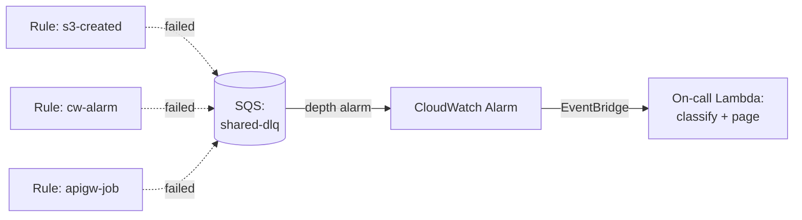
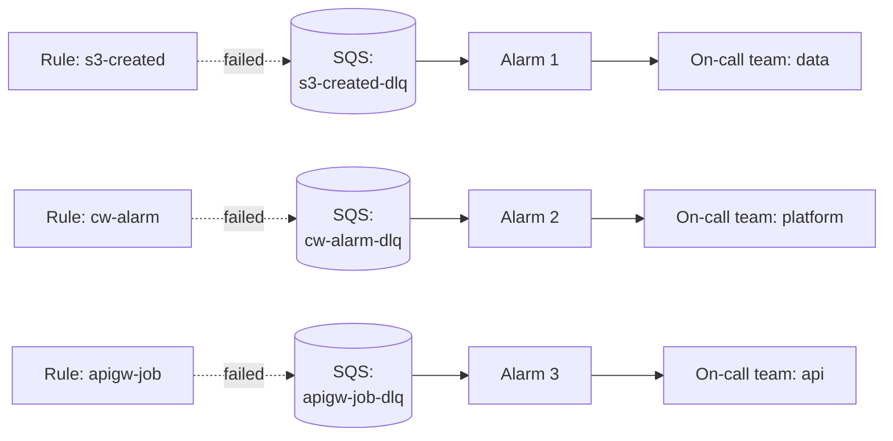

# L34 — Dead-Letter Queue Patterns

> **Author:** Prem Vishnoi <prem.vishnoi@example.com>
> **Section:** 7 — Patterns + Real-World
> **Duration:** 12:00

## Prereqs

- L19 (the DLQ + retry lecture from section 4) is the foundation.
  You should already know what a DLQ is and why EventBridge needs
  one for at-least-once delivery semantics.
- L30 (the patterns catalog) for the topology context.

## Key terms

- **Cross-target DLQ** — one SQS queue shared by many rules. The
  simplest topology, and the one most teams start with.
- **Per-target DLQ** — every rule (or every target) has its own
  SQS queue. More expensive, but you can inspect each rule's
  failures independently.
- **DLQ depth alarm** — a CloudWatch alarm on
  `ApproximateNumberOfMessagesVisible` on the DLQ. Pages the
  on-call when failures accumulate.
- **Re-drive** — the act of moving a message from a DLQ back to
  the original source (or a repaired version of the source) so the
  failed workflow can run again. There is a managed
  "SQS Re-drive" feature now (2024) that automates this.

## Lecture

In L19 we introduced the EventBridge DLQ as a checkbox: "wire an
SQS queue, set the retry policy, you're done." That is true, but
the *shape* of the DLQ wiring is one of the most consequential
decisions in a production EventBridge design. Get it wrong and you
either (a) lose the diagnostic granularity to debug a failure, or
(b) pay 5x the SQS cost for queues you do not need.

There are **three** DLQ patterns I ship in real systems. The
choice depends on how many rules you have, how independent they
are, and what your on-call workflow looks like.

### Pattern A — Cross-target DLQ (the default)



**Topology**: one SQS queue, one CW alarm, one Lambda that reads
from the queue and pages the on-call with the rule name (parsed
from the message body).

**When to use**: fewer than ~20 rules; rules are owned by the same
team; you do not need to filter failures by rule in the alarm
path.

**Pros**:

- One queue, one alarm, one Lambda to maintain.
- Cheapest option (SQS is roughly $0.40/million requests).
- Simple on-call mental model: "look at the shared DLQ."

**Cons**:

- The depth alarm cannot tell which rule failed. You have to
  inspect the message to find out.
- One runaway rule can fill the queue and starve the alarm signal
  for the others.
- The on-call Lambda has to do more work (parse the message,
  route to the right team).

**Diagnostic recipe**: enable SQS "Receive message" logging to
CloudWatch Logs. The message body has a `requestPayload` field
with the original event, a `ruleArn` field with the failing rule,
and a `errorMessage` field with the Lambda's exception text.

### Pattern B — Per-target DLQ (the diagnostic default)



**Topology**: each rule has its own SQS queue, named after the
rule. Each queue has its own CW alarm, and each alarm routes to
the team that owns the rule.

**When to use**: more than ~20 rules, or rules owned by different
teams, or you have a compliance requirement that failures be
isolated.

**Pros**:

- Each team's failures are isolated. A data-pipeline failure does
  not page the platform team.
- The depth alarm is precise (no message inspection needed to
  know which rule failed).
- Easier to reason about blast radius.

**Cons**:

- More queues, more alarms, more IAM. The operational overhead
  grows linearly with rule count.
- More expensive — each SQS queue has a fixed request cost even
  if it never sees a message.
- You have to enforce the naming convention in code (CDK construct
  with `dlq-${ruleName}-${stage}`).

**Diagnostic recipe**: the alarm message itself includes the
queue name, which includes the rule name. No parsing needed.

### Pattern C — DLQ depth alarm + re-drive (the self-healing default)

```mermaid
flowchart LR
    DLQ[(SQS DLQ)] -- depth > 0 --> A[CloudWatch Alarm]
    A -- state change ALARM --> EB[EventBridge rule]
    EB -- invoke --> FN[Lambda:<br/>re-drive handler]
    FN -- re-drive --> SRC[Original target<br/>(Lambda / SFN)]
    FN -- page --> OPS[On-call]
    SRC -- success --> R1[Log: re-drive OK]
    SRC -- failure --> R2[Log: re-drive failed,<br/>manual intervention]
```

**Topology**: any of the above, with an additional Lambda that
auto-re-drives messages from the DLQ back to the original target
when the alarm fires. The Lambda only re-drives once per message
(idempotency key) and only if the failure looks transient (e.g.
Lambda timeout, 5xx from downstream API).

**When to use**: the rule is idempotent on re-drive (so a duplicate
event is safe), and the original failure was almost certainly
transient.

**Pros**:

- Self-healing. Most transient failures (CW API throttle, S3
  eventual consistency, downstream 503) fix themselves on
  re-drive.
- On-call only gets paged for the failures that the re-drive
  could not fix.
- Keeps the DLQ queue small, which keeps the diagnostic cost low.

**Cons**:

- The re-drive Lambda is itself a Lambda that can fail. It needs
  its own DLQ (or a circuit breaker).
- Idempotency must be enforced at the target. If the target is
  not idempotent, re-drive can cause duplicates (e.g. two
  payments processed, two emails sent).
- Adds a "second hop" — the re-drive's CloudWatch Logs and
  X-Ray trace live separately from the original invocation.

### Which one should you pick?

| Question | Cross-target (A) | Per-target (B) | Self-healing (C) |
|---|---|---|---|
| < 10 rules, one team? | Yes | – | – |
| 10–50 rules, multiple teams? | – | Yes | – |
| 50+ rules or compliance requires isolation? | – | Yes | – |
| Target is idempotent? | – | – | Add C to A or B |
| Failures are usually transient? | – | – | Yes, prefer C |
| Failures are usually permanent (bad data)? | – | – | Don't add C |

In real systems I almost always ship **B + C**: per-target DLQs
plus the self-healing re-drive Lambda. The cost is real but small
(~$5/month at our scale for 30 rules), and the on-call experience
is dramatically better than the cross-target default.

### How to wire the re-drive Lambda

The Lambda subscribes to the SQS queue (yes, a Lambda can be both
the DLQ target and a consumer of the DLQ — you can read the
message and decide whether to re-drive, page, or both). The
handler is roughly:

```python
import boto3, json, os

def handler(record, context):
    body = json.loads(record["body"])
    rule_arn = body["ruleArn"]
    request_payload = json.loads(body["requestPayload"])
    is_transient = body.get("errorMessage", "").startswith(
        ("Timeout", "ServiceUnavailable", "ThrottlingException")
    )
    if is_transient:
        target_lambda = rule_arn_to_lambda(rule_arn)
        boto3.client("lambda").invoke(
            FunctionName=target_lambda,
            InvocationType="Event",
            Payload=json.dumps(request_payload),
        )
    else:
        page_oncall(rule_arn, body["errorMessage"])
```

The `is_transient` heuristic is the most important part. You do
not want to re-drive a Lambda that failed because the event body
was malformed; that just moves the failure forward and burns an
invocation.

### Common pitfalls

1. **No DLQ on a "fire-and-forget" rule.** There is no such thing
   as fire-and-forget in production. Add a DLQ.
2. **DLQ without a depth alarm.** A DLQ nobody watches is a
   silent data-loss path.
3. **Re-drive without idempotency.** If the target is not
   idempotent, re-drive creates duplicates. Always add a dedupe
   key (SQS MessageDeduplicationId, or a DynamoDB conditional
   write) at the target.
4. **Sharing a single DLQ across accounts.** Do not. SQS queues
   do not have resource policies strong enough to safely share
   across accounts. Use one DLQ per account.
5. **Forgetting the DLQ IAM permissions.** The rule needs
   `sqs:SendMessage` on the DLQ. EventBridge assumes a role for
   this; the role is created when you wire the DLQ in the
   console, but in CDK/CloudFormation you have to wire it
   yourself.

## Hands-on

No code in this lecture. The natural next step is to choose
patterns A, B, or C for the rules in your own account and write
the CDK or CloudFormation that creates the queues, the alarms,
and (if pattern C) the re-drive Lambda.

## Quiz prep

The quiz will test:

- The three DLQ patterns and when each is appropriate.
- The re-drive idempotency requirement.
- Why "fire-and-forget" rules still need a DLQ.

## Further reading

- AWS docs: "EventBridge DLQ":
  <https://docs.aws.amazon.com/eventbridge/latest/userguide/rule-dlq.html>
- SQS Re-drive (managed re-drive):
  <https://aws.amazon.com/about-aws/whats-new/2024/01/sqs-redrive/>
- EventBridge FAQs:
  <https://aws.amazon.com/eventbridge/faqs/>

## What's next

L35 covers **cross-account + cross-region fan-out** — how to wire
EventBridge rules across AWS accounts so a central "events" account
can fan out to dozens of workload accounts.

**Ready? Let's go multi-account.**
