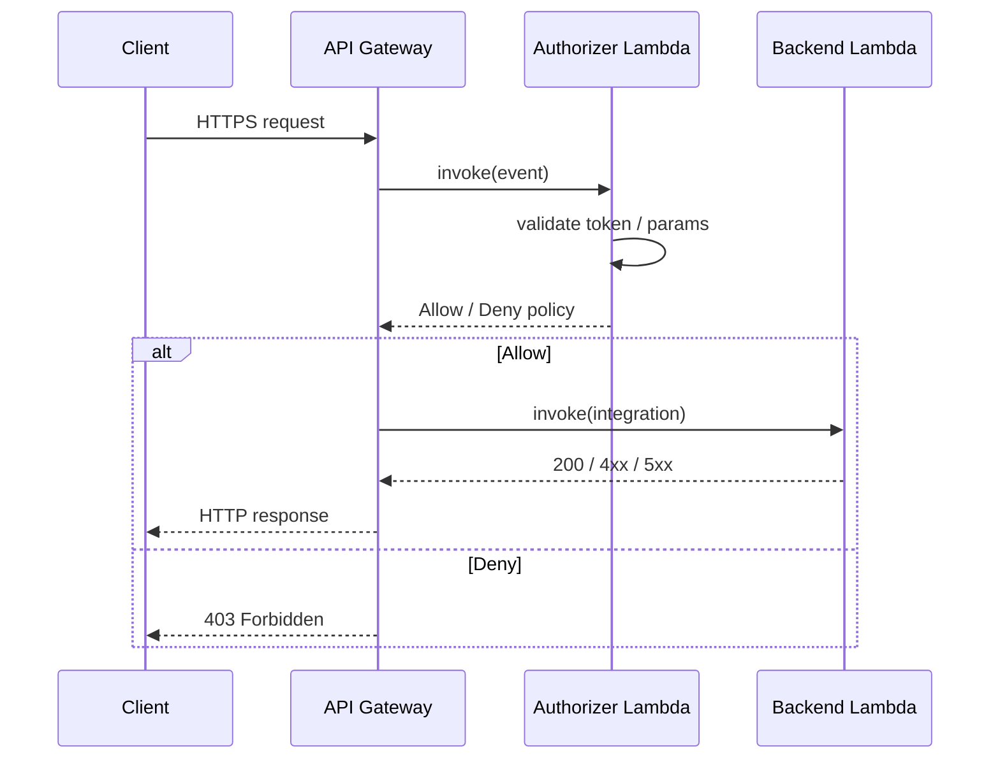

# L02 — Where the Lambda Authorizer Fits in the Request Lifecycle

> **Author:** Prem Vishnoi &lt;prem.vishnoi@example.com&gt;
> **Section:** 1 — Foundations
> **Duration:** 8:00

## Prereqs

- L01 — Course Intro.

## Key terms

- **Request lifecycle** — the sequence of hops a request makes from
  the client to your backend, with each hop either inspecting,
  transforming, or rejecting the request.
- **Authorizer step** — the hop in the API Gateway lifecycle where
  the request is held and the authorizer Lambda is invoked. No
  request reaches your backend without first passing (or failing)
  this step.
- **Allow / Deny** — the only two outcomes of the authorizer step.
  An `Allow` policy moves the request to the integration; a `Deny`
  policy causes API Gateway to return `403 Forbidden` to the client.
- **`methodArn`** — the ARN of the method being invoked, supplied by
  API Gateway in the authorizer event. The canonical resource to
  allow in the policy's `Statement[].Resource`.
- **`identitySource`** — the slice of the request the authorizer
  inspects (header, query string, stage variable, context). For a
  TOKEN authorizer this is the `Authorization` header (implicit);
  for a REQUEST authorizer you specify it explicitly.

## Lecture

The single most useful diagram in this entire course is the request
lifecycle. If you can draw it from memory, you can debug every
authorizer problem you'll ever hit.



### Step by step

1. **TLS termination** — API Gateway terminates the TLS connection.
   If the client cert fails, you get 403 here and the authorizer is
   never invoked.
2. **Route resolution** — API Gateway matches the request to a
   method on a resource. If no method matches, you get 404.
3. **Authorizer invocation** — *this is the slot we care about*. If
   the method has a Lambda Authorizer attached, API Gateway
   **synchronously** invokes the authorizer with either:
   - the full request (`type: "REQUEST"`), or
   - just the `Authorization` header value (`type: "TOKEN"`).
   The authorizer must respond within **5 seconds** (or the
   configured timeout, max 30 s) or API Gateway returns 500 to the
   client.
4. **Policy enforcement** — API Gateway inspects the returned policy
   document. If the document contains an `Allow` statement whose
   `Resource` matches the `methodArn`, the request is forwarded. If
   `Deny`, API Gateway returns 403.
5. **Integration** — the request is forwarded to the integration
   (Lambda, HTTP, AWS service, mock). The authorizer's `context` map
   is passed as headers (`X-Amzn-Apigateway-…`) and as the
   `event.requestContext.authorizer` JSON in the backend event.
6. **Response** — the integration's response flows back to the
   client, with optional response transformations.

### What the authorizer sees

For a TOKEN authorizer:

```json
{
  "type": "TOKEN",
  "authorizationToken": "Bearer eyJhbGciOi…",
  "methodArn": "arn:aws:execute-api:us-east-1:111:abcd/prod/GET/orders"
}
```

For a REQUEST authorizer:

```json
{
  "type": "REQUEST",
  "methodArn": "arn:aws:execute-api:us-east-1:111:abcd/prod/GET/orders",
  "resource": "/orders",
  "path": "/orders",
  "httpMethod": "GET",
  "headers": { "X-Tenant": "acme", … },
  "queryStringParameters": { "user": "alice", "token": "xyz" },
  "pathParameters": {},
  "stageVariables": {},
  "requestContext": { … }
}
```

The shape difference is the whole reason the two authorizer types
exist. TOKEN is the simple case (drop a JWT in `Authorization`); REQUEST
is the rich case (inspect anything).

### A worked example

The client calls `GET /orders` with `Authorization: Bearer eyJ…`.
API Gateway sees that `GET /orders` has a TOKEN authorizer attached,
so it invokes the authorizer with `authorizationToken =
"Bearer eyJ…"`. The authorizer verifies the JWT, builds an Allow
policy for `methodArn`, and returns it. API Gateway invokes your
backend with `event.requestContext.authorizer` containing the
authorizer's `context` map (e.g. `{"tenant": "acme", "scope":
"read"}`).

If the same client calls `GET /orders` again **within the policy
cache TTL**, the authorizer is **not invoked at all** — the cached
Allow policy is reused. This is the entire reason policy caching
exists and it's the focus of section 4.

## Hands-on

There's no code yet, but draw the diagram yourself on a piece of
paper. Then read through `../../diagrams/lambda_authorizer_flow.mmd`
and compare.

## Quiz prep

- What's the difference between `type: "TOKEN"` and `type: "REQUEST"`?
- How long does the authorizer have to respond? (default 5 s, max 30 s)
- What does the authorizer return when the policy is `Deny`?

## Further reading

- [`../../diagrams/lambda_authorizer_flow.mmd`](../../diagrams/lambda_authorizer_flow.mmd)
- AWS docs: [Use API Gateway Lambda authorizers](https://docs.aws.amazon.com/apigateway/latest/developerguide/apigateway-use-lambda-authorizer.html)

## What's next

**L03 — The Four Auth Patterns in API Gateway** — IAM, Cognito, Lambda
Authorizer, API Keys. When to pick which.
