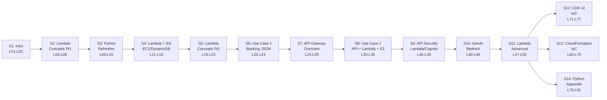

# L01 — Must Watch — Course Introduction and Download Content Slides

> **Author:** Prem Vishnoi <pvishnoi@avilx.com>
> **Section:** 1 — Introduction
> **Duration:** 4:09

## Prereqs

None. This is the very first lecture. You do not need an AWS account, a
Python install, or any prior serverless experience to follow this overview.
If you want to read ahead while you listen, the cheat sheet is linked in
**Further reading** below.

## Key terms

- **AWS Lambda** — AWS's serverless, event-driven compute service. You
  upload code, Lambda runs it on demand, and you pay only for the compute
  time you consume (measured in GB-seconds).
- **Boto3** — the AWS SDK for Python. It's the library we use throughout
  the course to call Lambda, S3, DynamoDB, EC2, and Bedrock from inside a
  Lambda function.
- **API Gateway** — the AWS front-door for HTTP/REST and WebSocket APIs. It
  sits in front of Lambda in most of our production patterns.
- **AWS Bedrock** — AWS's managed Generative AI service. We use the Cohere
  foundational model in section 10.
- **IaC (Infrastructure as Code)** — defining AWS resources (Lambda, S3,
  API Gateway, IAM) in a version-controlled template. We cover two flavors
  in this course: **AWS CDK v2** (TypeScript, section 12) and **AWS
  CloudFormation** (YAML/JSON, section 13).

## Lecture

Hi, I'm Prem Vishnoi, and welcome to **AWS Lambda, Python (Boto3) &
Serverless — Beginner to Advanced**. This is the lecture you want to watch
before you do anything else in the course. In the next four minutes I'll
explain what the course is, who it's for, what you'll build, and how the
sections hang together.

### Who this course is for

This course is designed for a few different audiences:

- **Absolute beginners to AWS Lambda or serverless.** If you've never
  written a Lambda function or aren't sure what "serverless" actually
  means, you are exactly in the right place. Section 2 starts from
  "evolution from physical servers to Lambda" before we ever open the
  console.
- **Developers who know Python but are new to AWS.** I assume you can read
  Python comfortably; I do **not** assume you know what an IAM role, an
  ENI, or a Lambda execution model is. We build those concepts from the
  ground up.
- **Engineers moving from Glue, EMR, or Data Pipeline to event-driven
  architectures.** If you're coming from my AWS Glue course, sections 4
  and 6–9 will feel familiar in shape but different in flavor — Lambda
  instead of Glue Jobs, EventBridge schedules instead of Crawlers, and
  API Gateway front-doors.

### What you'll build — the 3 hands-on use cases

The course is anchored by **three production-style use cases**. Each one
mirrors a pattern I've shipped in real consulting engagements:

1. **Enterprise Use Case 1 — Banking JSON pipeline (Section 6).** A bank
   drops a JSON file in an S3 bucket on a regular schedule. An S3 event
   notification triggers a Lambda function. Lambda parses the file and
   writes rows into a DynamoDB table. It's a small pattern, but it's the
   same shape as dozens of ingestion pipelines I've built in finance and
   retail.
2. **Enterprise Use Case 2 — Serverless CRUD API (Sections 7–9).** We
   stand up a complete REST API: API Gateway in front, Lambda behind it,
   S3 for object storage, Cognito for end-user auth, Lambda Authorizer
   for service-to-service auth, API Keys and Usage Plans for throttling.
   We then implement the **same** stack twice — once with CloudFormation
   (section 13) and once with CDK v2 (section 12) — so you can pick the
   IaC tool you prefer.
3. **Generative AI — AWS Bedrock + Cohere (Section 10).** A
   manufacturing-industry use case: a defect image / log line goes to an
   API, API Gateway invokes a Lambda, Lambda calls **AWS Bedrock** with
   the Cohere foundational model, and the summarization comes back
   through the API. It's a 40-minute end-to-end GenAI application.

### How the sections build on each other

Here is the course arc in one view:



The structure is deliberate: we learn concepts first (sections 2, 5, 11),
get hands-on with raw AWS resources (section 4), apply them in two
production patterns (sections 6 and 8), layer on security and GenAI
(sections 9 and 10), then close with infrastructure-as-code (sections 12
and 13). Section 14 is an appendix for true Python beginners — you can
skip it if you already write Python.

### The 4 downloadable resources

You have **4 downloads** in `downloads/` (linked at the top of this file):

| # | File | When you'll use it |
|---|---|---|
| 1 | `lambda_cheat_sheet.pdf` | Throughout the course — Lambda limits, env vars, IAM basics |
| 2 | `boto3_patterns_cheat_sheet.pdf` | Sections 4, 6, 8 — copy-paste client vs resource patterns |
| 3 | `cfn_serverless_template_pack.zip` | Section 13 — CloudFormation starter templates |
| 4 | `cdk_serverless_project_pack.zip` | Section 12 — CDK v2 TypeScript starter project |

I'd grab **`lambda_cheat_sheet.pdf`** right now — it's the one you'll
flip back to most often.

## Hands-on

This lecture is orientation only — no lab. Your only "homework" is to
download the cheat sheet and skim it.

```bash
# From the repo root
open aws_lambda_course/downloads/lambda_cheat_sheet.pdf
```

In L02 we'll set up your AWS account, Python, and CLI; in L03 we'll
dive into the conceptual material.

## Quiz prep

For this lecture, focus on the **big-picture** questions that show up
in section 1's quiz:

- How many use cases does the course build? (3)
- Which IaC tools does the course cover? (CloudFormation and CDK v2)
- Which GenAI service and model do we use? (AWS Bedrock, Cohere)

## Further reading

- Download: [`../../downloads/lambda_cheat_sheet.pdf`](../../downloads/lambda_cheat_sheet.pdf)
- `../../SYLLABUS.md` — authoritative lecture-to-file map.
- `../../README.md` — repo layout, "What you'll build" table.

## What's next

Next up is **L02 — Course Pre-Requisites**, where we walk through
exactly what to install and which AWS account to use.

**Ready? Let's start with section 2 — Lambda basics.**
