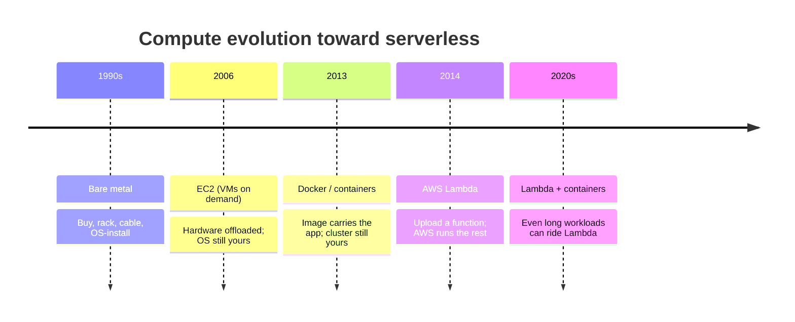

# L04 — Evolution from Physical Servers to AWS Lambda

> **Author:** Prem Vishnoi &lt;pvishnoi@avilx.com&gt;
> **Section:** 2 — AWS Lambda Basic Concepts (Part 1)
> **Duration:** 5:22

## Prereqs

- L03 — Section Overview
- General familiarity with what a "server" is (no AWS knowledge required)

## Key terms

- **Bare metal** — a single-tenant physical server in a rack you (or a
  colocation provider) own and operate.
- **Virtual machine (VM)** — a software-emulated computer running on a
  hypervisor, sharing the underlying hardware with other VMs.
- **Container** — an OS-level virtualization unit that packages an
  application with its dependencies, sharing the host kernel.
- **Serverless / FaaS** — an execution model where the cloud provider
  owns the runtime, the OS, and the scaling; you upload only your
  function's code.
- **Functions as a Service (FaaS)** — the cloud category that includes
  AWS Lambda, Azure Functions, and Google Cloud Functions.

## Lecture

Before we can talk about AWS Lambda intelligently, it helps to see how we
got here. Compute has been moving in one direction for twenty years:
**less for the developer to manage**.

### 1. Bare metal (1990s–early 2000s)

You bought a physical server, put it in a rack, installed the operating
system, and ran your application. Scaling meant buying, racking, and
cabling another server — usually weeks of lead time. Capacity planning was
guesswork: under-provision and your site goes down, over-provision and you
eat the cost of idle hardware for years.

```text
  +------------+     +------------+     +------------+
  |  App       |     |  App       |     |  App       |
  |  OS        |     |  OS        |     |  OS        |
  |  Hypervisor|     |  Hypervisor|     |  Hypervisor|
  +------------+     +------------+     +------------+
  |  Physical server 1 |  Physical server 2 |  Physical server 3 |
  +-------------------+-------------------+-------------------+
```

### 2. Virtual machines (mid 2000s)

A hypervisor (VMware ESX, then Xen, then KVM) let one physical host run
many isolated VMs. Suddenly you could right-size: a 2 vCPU VM for a small
service, a 16 vCPU VM for a big one, all on the same hardware. AWS
launched **EC2 in 2006** and put VM-style compute on a public API.
You still owned the OS — patching, securing, scaling — but the
hardware was someone else's problem.

### 3. Containers (2013+)

Docker popularized containers: lighter than VMs because they share the
host kernel, but still give you process and filesystem isolation. AWS
launched **ECS in 2014** and **EKS in 2017** for managed Kubernetes.
Containers removed the "what's installed on this machine?" question
because the image carried it. You still owned the cluster, the
node-level OS, the autoscaling rules, and the load balancer.

### 4. Serverless / FaaS (2014+)

On **November 13, 2014**, AWS launched **AWS Lambda** at re:Invent. The
pitch was radical: upload your function, and AWS handles the server, the
OS, the scaling, the patching, the availability, the logging, and the
billing. You write the handler. You pay only for the milliseconds your
code actually runs. There is nothing to "start" — the first request
triggers a cold start (covered in detail in Section 11, **L48**), and
subsequent requests reuse the warm environment.



### The mental model: "functions as a service"

Lambda treats your code as a **function**, not an application. The
contract is small:

1. AWS invokes your handler with two arguments: an `event` (a JSON
   document — S3 object created, API Gateway request, EventBridge
   schedule…) and a `context` object (request ID, deadline, log group).
2. Your function does its work and returns a value (or asynchronously
   emits a result to another service).
3. When the function returns, the environment is frozen. The next
   invocation may reuse that environment, or AWS may discard it.

This is fundamentally different from "run this program forever on a
server". You do not think in long-running processes, ports, or
`/etc/passwd`. You think in **event → handler → result**.

### Why this matters

Once you internalize that Lambda is the natural endpoint of a
twenty-year trend — *less to manage, more to ship* — the design
decisions in the rest of the course (when to use it, how to package
it, how to scale it, how to secure it) all start to make sense. We
build on this in **L05** with a concrete definition of Lambda, the
four pricing dimensions, and explicit use cases.

## Hands-on

Nothing to do for this lecture — it is conceptual. In **L06** we'll
click through the console and you'll see the "upload a function"
model in action.

## Quiz prep

Be ready to answer:

- What is the main thing you stop managing when you move from EC2 to
  Lambda?
- In what year was AWS Lambda launched, and at which event?
- What is the input contract for a Lambda handler?

## Further reading

- AWS announcement blog: *AWS Lambda – Run Code in the Cloud* (Nov 2014)
- *The Story of AWS Lambda* — internal retrospective by Tim Wagner
- L05 — What is AWS Lambda and Use Cases
- L48 — Lambda Execution and Concurrency (cold starts, Section 11)
