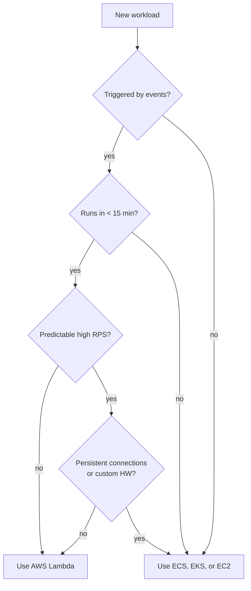

# L05 — What is AWS Lambda and Use Cases

> **Author:** Prem Vishnoi &lt;pvishnoi@avilx.com&gt;
> **Section:** 2 — AWS Lambda Basic Concepts (Part 1)
> **Duration:** 5:25

## Prereqs

- L04 — Evolution from Physical Servers to AWS Lambda
- Basic understanding of JSON, HTTP, and event-driven thinking

## Key terms

- **Handler** — the function in your code that AWS invokes when the
  function is triggered.
- **Event** — a JSON document delivered to your handler; shape depends
  on the source (S3, API Gateway, EventBridge, SQS, etc.).
- **Cold start** — the latency incurred the first time a new execution
  environment runs your function (covered in Section 11, **L48**).
- **Pay-per-use** — billing model where you are charged only for the
  compute time you actually consume, measured in GB-seconds.
- **GB-second** — one gigabyte of memory provisioned for one second.

## Lecture

### What is AWS Lambda?

> **AWS Lambda is a serverless, event-driven compute service that lets
> you run code in response to events without provisioning or managing
> servers.**

Strip the marketing away and three properties do all the work:

1. **You upload code, not servers.** A deployment package (a `.zip` or
   a container image) holds your handler and its dependencies. AWS
   chooses the hardware, the OS, the runtime, and the patch level.
2. **It runs in response to events.** Direct invocation, S3 object
   created, API Gateway request, EventBridge schedule, SQS message,
   DynamoDB stream, SNS notification, Kinesis record, and dozens more.
3. **It scales per request.** A single request can spin up one
   environment; one million requests can spin up one million — within
   the per-region concurrency limit. You do not write a scaling policy.

### The four pricing dimensions

Lambda is famous for being cheap, but only if you understand all four
axes. If you only optimize memory and ignore duration, you can still
overpay.

| # | Dimension | What it is | How it is billed |
|---|---|---|---|
| 1 | **Requests** | Number of invocations | First 1 M / month free, then $0.20 per 1 M |
| 2 | **Duration** | Wall-clock time your handler runs | GB-seconds |
| 3 | **Memory** | RAM allocated to the function (128 MB – 10,240 MB) | Higher memory → proportionally more CPU, also more $ per second |
| 4 | **Concurrency** | Number of environments running in parallel | Free up to a baseline; provisioned concurrency costs extra (Section 11, **L49**) |

A useful shortcut: doubling the memory roughly doubles the CPU and
halves the duration for CPU-bound work, so the cost stays roughly the
same but latency drops. We tune this in the console walkthrough in
**L06** and again in **L50** (Lambda Limits — Memory).

```text
  Cost ≈ Requests × (Memory / 1024) × Duration  (per invocation)
```

### When Lambda is a great fit

Use Lambda when **one or more** of these are true:

- **Event-driven, not always-on.** A function fires when a file lands
  in S3, when an API call arrives, when a scheduled cron ticks. This
  is the textbook Lambda shape — and the entire backbone of Section 6
  (S3 → Lambda → DynamoDB) and Section 8 (API Gateway → Lambda → S3).
- **Sporadic or bursty traffic.** Most workloads are not at peak
  traffic 24/7. Lambda scales from zero to thousands of concurrent
  invocations and back down without you doing anything.
- **Short, bounded work.** A request fits inside the 15-minute
  maximum timeout (Section 5, **L22**) and the 10 GB memory limit.
  Think: image thumbnailing, JSON transformation, SNS fan-out,
  DynamoDB validation, scheduled cleanup.
- **Glue between AWS services.** Lambda is the universal adapter: it
  receives an event from S3, calls DynamoDB, writes to SQS, and
  publishes to SNS — all in one function. It is the most common
  integration pattern in the course.
- **You do not want to patch an OS.** Security maintenance, kernel
  CVEs, base-image rebuilds — all owned by AWS.

### When Lambda is **not** the right tool

Be honest about the trade-offs:

- **Predictable, very high throughput.** A single long-running
  service on EC2, ECS, or EKS is usually cheaper and operationally
  simpler at sustained 1 000+ rps.
- **Long-running workloads.** Anything that needs to run for hours
  (video transcoding of feature films, large-scale Monte Carlo
  simulations) is outside the 15-minute Lambda ceiling. Step Functions
  plus ECS / Fargate is a common alternative.
- **Latency-sensitive synchronous paths with strict cold-start budgets.**
  A few hundred milliseconds of cold start on the first call can break
  tight p99 SLAs. Mitigations exist (provisioned concurrency, SnapStart)
  but they cost money and add complexity.
- **State-heavy applications.** Lambda's execution environment is
  ephemeral; persistent in-process state does not survive between
  invocations. Push state to DynamoDB, S3, or ElastiCache.
- **Custom hardware, kernel modules, or specific OS versions.** Lambda
  picks the runtime and OS for you. If you need a specific Linux
  kernel, use a container-based Lambda or move off Lambda.

### A decision sketch



### Where Lambda appears in this course

- **L06** — first hands-on in the console
- **L11–L18** — boto3 inside Lambda to manage S3, EC2, DynamoDB
- **L23–L24** — Use Case 1: S3 → Lambda → DynamoDB
- **L30–L34** — Use Case 2: API Gateway → Lambda → S3
- **L40–L46** — Bedrock + Lambda + API Gateway (GenAI)
- **L47–L59** — advanced concepts (concurrency, VPC, versions, env vars)

## Hands-on

Nothing to do for this lecture. In **L06** we click into the console
and create the function that this lecture has been describing
abstractly.

## Quiz prep

Be ready to answer:

- What are the four Lambda pricing dimensions?
- What is the maximum Lambda function timeout (Section 5, **L22** covers
  this in detail)?
- Name two workloads that fit Lambda well and two that do not.

## Further reading

- AWS Lambda pricing — official page (always-current numbers)
- AWS Lambda quotas — official page (memory, timeout, payload sizes)
- L06 — Lambda Console Walkthrough
- L22 — Lambda Limits — Timeout
- L50 — Lambda Limits — Memory
