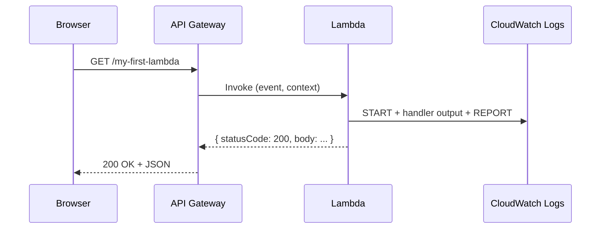

# L06 — Lambda Console Walkthrough

> **Author:** Prem Vishnoi &lt;pvishnoi@avilx.com&gt;
> **Section:** 2 — AWS Lambda Basic Concepts (Part 1)
> **Duration:** 10:38

## Prereqs

- L05 — What is AWS Lambda and Use Cases
- L02 — Course Pre-Requisites
- An AWS account with permission to create IAM roles and Lambda
  functions (free tier is fine)
- A web browser, signed into the AWS console

## Key terms

- **Runtime** — the language + version environment that runs your
  code (`python3.12`, `nodejs20.x`, `java21`, etc.).
- **Handler** — the entry point in your code, expressed as
  `file.function` (e.g. `lambda_function.lambda_handler`).
- **Trigger** — an AWS event source that invokes the function
  (API Gateway, S3, EventBridge, SQS, …).
- **Test event** — a JSON document you craft in the console and use
  to invoke the function manually.
- **CloudWatch Logs** — the log group every Lambda function writes to
  automatically; we explore this in Section 11, **L55**–**L56**.

## Lecture

This is the longest lecture in the section — about ten and a half
minutes — because we are going to **click through the entire flow
end-to-end** in the AWS console. By the end you will have a real
working function, a trigger, a test event, and a successful
invocation you can read in CloudWatch Logs.

### Step 1 — Open the Lambda service

In the AWS console search bar, type **Lambda** and click **Lambda**
under "Services". The first time, you may see a "Get started"
splash page. Click **Create a function**.

### Step 2 — Choose the authoring option

You have three options:

- **Author from scratch** — blank function, you write all the code.
- **Use a blueprint** — AWS-provided templates (e.g. S3 get-object
  Python). Good for learning; we use this in Section 4.
- **Container image** — point Lambda at a Docker image in ECR. Covered
  briefly in Section 11; we focus on `.zip` packages in this course.

Pick **Author from scratch** for this walkthrough.

### Step 3 — Basic information

Fill in three fields:

| Field | What to enter | Notes |
|---|---|---|
| **Function name** | `my-first-lambda` | Lowercase, hyphens, numbers only. Regionally unique within your account. |
| **Runtime** | `Python 3.12` | The course uses Python 3.11+ throughout. boto3 is already included. |
| **Architecture** | `x86_64` | `arm64` (Graviton2) is ~20% cheaper; we switch to it in L50. |

### Step 4 — Permissions (execution role)

This is the single most important field for the rest of the course.
The dropdown says **Change default execution role**, and you have
three choices:

- **Create a new role with basic Lambda permissions** — Lambda writes
  an IAM role for you with the
  `AWSLambdaBasicExecutionRole` managed policy attached. This is the
  right choice for today. We cover what the role does in **L07**.
- **Use an existing role** — pick one you've already created. We use
  this in Section 11 (**L51**, VPC networking) and Section 13
  (CloudFormation).
- **Create a new role from AWS policy templates** — like option 1
  plus extra policies for the trigger. Useful for S3-triggered
  functions in Section 6.

Click **Create function**.

### Step 5 — The function console

You land on the function's detail page. The left rail has six tabs;
memorize them — you'll come back to each one often:

```text
  +-------------------+--------------------------+
  | Code              | Test, Deploy, Edit       |
  | Test              | Configure test events    |
  | Configuration     | General, Env vars, VPC   |
  | Triggers          | Add / remove triggers    |
  | Monitoring        | CloudWatch metrics       |
  | Logs              | Jump to CloudWatch       |
  +-------------------+--------------------------+
```

By default, AWS seeds your function with `lambda_function.py`:

```python
import json

def lambda_handler(event, context):
    return {
        "statusCode": 200,
        "body": json.dumps({
            "message": "hello from Lambda",
            "event": event,
        }),
    }
```

Two things to internalize:

- The **handler** setting (Configuration → General → Handler) is
  `lambda_function.lambda_handler` — file name, dot, function name.
  Change one, change the other.
- The handler receives **`event`** (the JSON trigger payload) and
  **`context`** (request ID, deadline, log stream, function name,
  etc.). We use `context` heavily in Section 11.

### Step 6 — Add a trigger

Click **Add trigger** in the **Function overview** panel at the top,
or open the **Triggers** tab on the left. The console lists every
event source. For this walkthrough pick:

- **Source**: `API Gateway`
- **Intent**: `Create a new API`
- **API type**: `REST API`
- **Security**: `Open`

Click **Add**. Lambda wires up a REST endpoint; the URL appears
under **API Gateway → Details → API endpoint**.

> We cover API Gateway in depth in Section 7 (**L25**–**L29**) and
> use it as the front door for the Section 8 use case
> (S3 ↔ Lambda ↔ API Gateway).

### Step 7 — Configure a test event

The **Test** tab lets you invoke your function without a real trigger.
This is invaluable for development — you iterate on code, click
**Test**, see the result, repeat.

1. Click **Test** → **Create new event**.
2. **Event name**: `MyTestEvent`.
3. **Template**: leave as the default `hello-world` JSON.
4. The body looks like:

   ```json
   {
     "key1": "value1",
     "key2": 3,
     "key3": {
       "nested": true
     }
   }
   ```

5. Click **Save**, then **Test**.

You see three panels:

- **Response** — your function's return value (status code, body).
- **Function logs** — every `print` and `logging` line, plus
  START/END/REPORT markers.
- **Report** — duration, memory used, memory configured, billed
  duration. The `REPORT` line is gold for tuning (Section 11, **L54**).

A successful run looks like:

```text
  START RequestId: 8f3a... Version: $LATEST
  END RequestId: 8f3a...
  REPORT RequestId: 8f3a... Duration: 12.34 ms
                            Billed Duration: 13 ms
                            Memory Size: 128 MB
                            Max Memory Used: 68 MB
```

### Step 8 — Hit the API Gateway endpoint

Open the API endpoint URL from Step 6 in a browser, or `curl` it:

```bash
curl https://abc123.execute-api.us-east-1.amazonaws.com/default/my-first-lambda
```

You get back the same JSON your handler returned. The
**CloudWatch → Logs** group `/aws/lambda/my-first-lambda` now has two
invocations: the manual test and the API Gateway one.

### Step 9 — Tweak memory and watch duration

On the **Configuration → General** tab, edit **Memory** and change it
from 128 MB to 512 MB. Click **Save**. Run the test again. The
`Duration` line in the **Report** drops (because you got more CPU),
and the **Billed Duration** rises by a smaller ratio. You have just
seen one of the four pricing dimensions from **L05** in action.



### Step 10 — Clean up

If you do not want to keep the function around:

1. **Function → Actions → Delete function**.
2. Confirm by typing the function name.
3. Optionally delete the API (API Gateway console → APIs → Delete).
4. Optionally delete the IAM role (IAM console → Roles → search
   `my-first-lambda-role` → Delete). The role is not deleted with
   the function — that is a frequent source of "ghost" roles in
   accounts.

## Hands-on

You have just done the hands-on. To repeat it on your own:

1. `aws lambda create-function` is the CLI equivalent of Step 4 — but
   for your first time, the console is faster and shows you every
   detail. We switch to the CLI in Section 4.
2. After this lecture, the next time you need a function, try
   "Container image" or "Use a blueprint" — both are first-class
   options and good exposure to Lambda's flexibility.

## Quiz prep

Be ready to answer:

- What does the `file.function` handler format actually mean?
- Where do you configure the test event in the console?
- What does the `REPORT` line in CloudWatch Logs tell you, and which
  of the four pricing dimensions does it expose?
- What is the difference between the **Code** tab and the
  **Configuration** tab?

## Further reading

- AWS docs: *Create a Lambda function in the console*
- AWS docs: *Lambda event source mappings*
- L07 — Lambda Execution Role (next lecture)
- L12 — AWS Lambda Basics — Boto3, Client and Resource, Lambda
  function handler
- L51 — Lambda — VPC Networking Configuration
