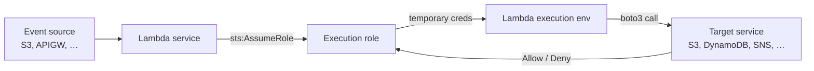

# L07 — Lambda Execution Role

> **Author:** Prem Vishnoi &lt;prem.vishnoi@example.com&gt;
> **Section:** 2 — AWS Lambda Basic Concepts (Part 1)
> **Duration:** 4:39

## Prereqs

- L06 — Lambda Console Walkthrough
- General IAM familiarity (users, roles, policies). If you have not
  used IAM before, the earlier course
  `../aws_glue_course/02_iam_kms_sns/lecture_scripts/L05_iam_101.md`
  is a quick primer.

## Key terms

- **IAM role** — an AWS identity with permission policies but no
  long-term credentials; "assumed" temporarily by a trusted entity.
- **Trust policy** — the policy on a role that says *who* can assume
  it. For Lambda, the trust principal is the `lambda.amazonaws.com`
  service.
- **Permissions policy** — the policy that says *what* the role can
  do after it is assumed.
- **Managed policy** — a reusable, AWS-maintained policy you can
  attach to many roles (e.g. `AWSLambdaBasicExecutionRole`).
- **Least privilege** — granting only the permissions required to do
  the job — no more, no less.

## Lecture

When Lambda invokes your function, your code does not run as "you" —
it runs as the **execution role** you attached to the function. Every
AWS API call your handler makes (S3 `GetObject`, DynamoDB `PutItem`,
SNS `Publish`, SQS `SendMessage`, …) is authorized by that role.

### The mechanics in one sentence

> Lambda calls `sts:AssumeRole` on the role whose ARN you supplied
> when creating the function, and the resulting temporary credentials
> are injected into the function's environment as
> `AWS_ACCESS_KEY_ID`, `AWS_SECRET_ACCESS_KEY`, and
> `AWS_SESSION_TOKEN`.

The boto3 client you instantiate inside your handler picks up those
environment variables automatically — you do not pass credentials
yourself. This is the central trick: **boto3 in Lambda "just works"**
because the SDK reads the env vars the execution role provided.

### The trust policy

For Lambda to be able to assume the role at all, the role's trust
relationship must allow `lambda.amazonaws.com`. The default trust
policy Lambda writes for you is:

```json
{
  "Version": "2012-10-17",
  "Statement": [
    {
      "Effect": "Allow",
      "Principal": { "Service": "lambda.amazonaws.com" },
      "Action": "sts:AssumeRole"
    }
  ]
}
```

If you write the role by hand in CloudFormation or the CDK, you must
include this. The course covers it explicitly in **L63** (CFN) and
**L75** (CDK).

### The permissions policy

`AWSLambdaBasicExecutionRole` is the **managed policy** AWS attaches
by default. It grants exactly two things:

```json
{
  "Version": "2012-10-17",
  "Statement": [
    {
      "Effect": "Allow",
      "Action": [
        "logs:CreateLogGroup",
        "logs:CreateLogStream",
        "logs:PutLogEvents"
      ],
      "Resource": "*"
    }
  ]
}
```

That is enough to write to CloudWatch Logs (the `/aws/lambda/<fn>`
log group). It is **deliberately minimal** — it does *not* allow
your function to read S3, write to DynamoDB, publish to SNS, or do
anything else. If you try to call S3 from your handler and your role
does not allow it, you get an `AccessDenied` error and the
invocation fails. This is a feature.

A second managed policy, `AWSLambdaVPCAccessExecutionRole`, adds the
permissions needed to put an Elastic Network Interface (ENI) into a
VPC. We attach it in **L51** (Lambda VPC networking).

### Least privilege in practice

The "create with default role" button in the console is a great
starting point. As soon as your function needs to touch another
service, you have a choice:

- **Attach a broader managed policy** — fast, but usually too broad.
  Example: `AmazonS3FullAccess` gives the function access to *every*
  S3 bucket in the account.
- **Write a custom inline policy scoped to one resource** — slower,
  but the right answer in production.

The custom policy for "this function may read one specific bucket"
looks like:

```json
{
  "Version": "2012-10-17",
  "Statement": [
    {
      "Effect": "Allow",
      "Action": [
        "s3:GetObject",
        "s3:ListBucket"
      ],
      "Resource": [
        "arn:aws:s3:::my-banking-feed",
        "arn:aws:s3:::my-banking-feed/*"
      ]
    }
  ]
}
```

The `Resource` list is the key: the function can read this bucket,
not the other 47 buckets in the account. We use this exact pattern
in the Section 6 enterprise use case (**L23**–**L24**).



### How to view and edit the role in the console

From the function page:

1. **Configuration → Permissions** (left rail).
2. Under **Execution role**, click the role name to jump to IAM.
3. Add or remove inline policies; attach or detach managed policies.
4. **Save** and the change is live on the next invocation (no redeploy
   required).

### Cross-service invocation roles

There is a second, equally important role in any real Lambda
architecture: the **resource-based policy** on the *function itself*,
which says "API Gateway is allowed to invoke this function", or "S3
is allowed to invoke this function". This is set on the function,
not the execution role, and is covered in:

- **L16** — Lambda + EC2 (EventBridge invoking the function)
- **L17** — EventBridge schedule
- **L25**–**L29** — API Gateway invoking the function
- **L67** — CloudFormation Lambda invoke permission

For now, remember the two roles are separate:

- **Execution role** — *what the function can do* (calls out).
- **Resource-based policy** — *who can call the function* (calls in).

## Hands-on

In the function you created in **L06**:

1. Open **Configuration → Permissions**.
2. Click the execution role name. You land in IAM.
3. Inspect the trust policy and the attached managed policy.
4. Attach a custom inline policy that allows
   `s3:ListBucket` on a test bucket you own (or skip if you do not
   have one yet).
5. Remove the inline policy afterwards. You should now be able to
   predict, given any future function, what its role allows and
   what it does not.

## Quiz prep

Be ready to answer:

- Which three environment variables does the execution role inject
  into the Lambda environment?
- What two actions does `AWSLambdaBasicExecutionRole` grant?
- What is the difference between an execution role and a
  resource-based policy on the function?
- Why is `Resource: "*"` in the default managed policy considered
  acceptable for logs but not for S3?

## Further reading

- AWS docs: *Lambda execution role*
- AWS docs: *AWS managed policies for Lambda*
- L23–L24 — Use Case 1 (S3 → Lambda → DynamoDB) — first end-to-end
  least-privilege role
- L51 — VPC networking — `AWSLambdaVPCAccessExecutionRole`
- L63 — CFN Lambda Execution Role
- L75 — CDK IAM Role
