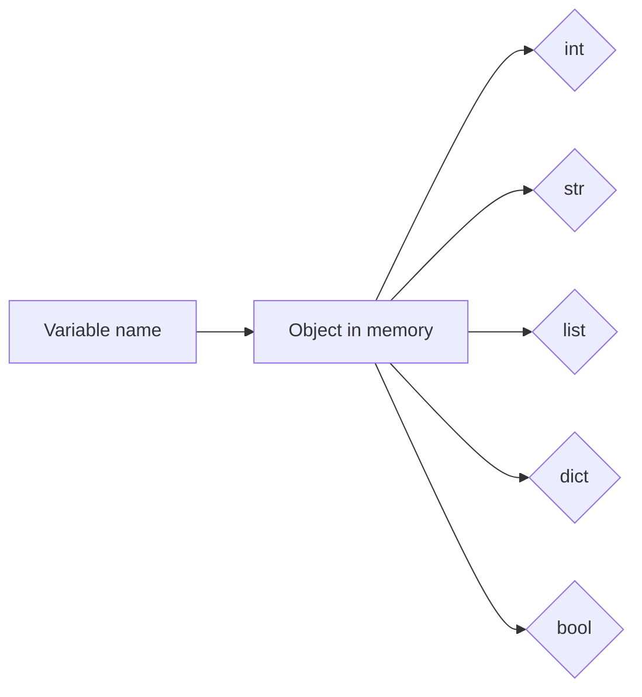
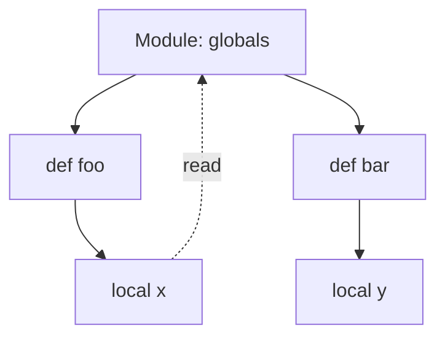

# L09 — Python Basics Refresher — Part 1

> **Author:** Prem Vishnoi &lt;pvishnoi@avilx.com&gt;
> **Section:** 3 — Python Basics Refresher
> **Duration:** 8:00

## Prereqs

- L02 — Course Pre-Requisites (Python 3.11+, AWS CLI v2)
- Python 3.11+ installed and on your `PATH` (`python3 --version`)
- A terminal you are comfortable with

This lecture assumes you have written **zero** or very little Python. If
you already know the material, skim the bullets and jump to L10.

## Key terms

- **Variable** — a name bound to a value. In Python, types are inferred,
  not declared.
- **Dynamic typing** — the same name can be re-bound to values of
  different types at different times.
- **f-string** — a string literal prefixed with `f` that evaluates
  expressions inside `{}` at runtime.
- **`def`** — the keyword that starts a function definition.
- **`return`** — sends a value back to the caller; functions with no
  `return` implicitly return `None`.
- **`*args`** — variable positional arguments, packed into a tuple.
- **`**kwargs`** — variable keyword arguments, packed into a dict.

## Lecture

### Why this lecture exists

From L11 onward, every Lambda handler in this course is written in
Python. If the Python syntax below is unfamiliar, the rest of the course
will feel like reading a foreign language. Spend 8 minutes here and you
will save hours later.

### 1. Variables and the four types you must know

Python does not require you to declare a type. You assign and the
interpreter figures it out.

```python
# 03_python_basics/code/l09_variables.py
region = "us-east-1"          # str
max_items = 25                 # int
price = 19.99                  # float
is_prod = False                # bool

print(type(region), type(max_items), type(price), type(is_prod))
# <class 'str'> <class 'int'> <class 'float'> <class 'bool'>
```

You will also see two **container** types constantly:

```python
# 03_python_basics/code/l09_containers.py
tags = ["lambda", "python", "boto3"]   # list — ordered, mutable
config = {                              # dict — key/value, mutable
    "region": "us-east-1",
    "timeout": 30,
    "memory": 512,
}
```

Both can be reassigned to other types — that is the meaning of
**dynamic typing**. Useful for quick scripts, dangerous in large
codebases. As a rule of thumb, give a name to one type and keep it
that type.



### 2. f-strings — the only way to format text in this course

`.format()` and `%`-formatting still exist. Ignore them. Use f-strings.

```python
# 03_python_basics/code/l09_fstrings.py
bucket = "prem-raw-data"
size_mb = 412.5
print(f"Bucket {bucket} holds {size_mb:.1f} MB")
# Bucket prem-raw-data holds 412.5 MB
```

Anything inside `{...}` is evaluated. You can call functions, do math,
or index into a dict:

```python
event = {"Records": [{"s3": {"bucket": {"name": "x"}}}]}
print(f"first bucket: {event['Records'][0]['s3']['bucket']['name']}")
```

### 3. Conditionals — `if` / `elif` / `else`

```python
# 03_python_basics/code/l09_conditionals.py
status = "SUCCESS"

if status == "SUCCESS":
    print("ok")
elif status == "RETRY":
    print("try again")
else:
    print(f"unexpected: {status}")
```

Truthiness: `0`, `""`, `[]`, `{}`, and `None` are **falsy**; almost
everything else is truthy. This lets you write:

```python
items = event.get("items", [])
if items:
    process(items)
```

### 4. Loops — `for` and `while`

`for` iterates over anything iterable (list, dict keys, file lines,
generator):

```python
# 03_python_basics/code/l09_loops.py
for tag in ["lambda", "python", "boto3"]:
    print(tag)

config = {"region": "us-east-1", "timeout": 30}
for key, value in config.items():
    print(f"{key} = {value}")
```

`while` is for "keep going until a condition flips":

```python
attempts = 0
while attempts < 3:
    print(f"attempt {attempts}")
    attempts += 1
```

`break` exits the loop, `continue` skips to the next iteration, `else`
runs only if the loop completed without `break`.

### 5. Functions — `def`, `return`, `*args`, `**kwargs`

```python
# 03_python_basics/code/l09_functions.py
def add(a, b):
    return a + b

print(add(2, 3))   # 5
```

Default values let the caller skip arguments:

```python
def greet(name, greeting="Hello"):
    return f"{greeting}, {name}!"

print(greet("Prem"))             # Hello, Prem!
print(greet("Prem", "Namaste"))  # Namaste, Prem!
```

`**kwargs` is everywhere in AWS SDKs and in boto3, where many APIs
accept dozens of optional parameters:

```python
def create_role(**kwargs):
    print(f"policy={kwargs['policy']}, name={kwargs.get('name', 'default')}")

create_role(policy="arn:aws:iam::...", name="lambda-exec")
```

### 6. Variable scope — the one rule that matters

Names defined at the top of a module are **global** to that module.
Names defined inside a function are **local** to that function. Read
from outer scope works; assigning to a name inside a function creates
a new local name unless you `global` it.



```python
# 03_python_basics/code/l09_scope.py
counter = 0     # global

def bump():
    global counter
    counter += 1

bump(); bump()
print(counter)  # 2
```

In practice: **avoid `global`** in Lambda code. Pass state in as
arguments and return new values. It makes handlers easy to test.

## Hands-on

1. Open a terminal, `cd` into `03_python_basics/code/`, and create a
   virtual environment (you will learn *why* in L10, just type it for
   now):
   ```bash
   python3 -m venv .venv
   source .venv/bin/activate     # macOS/Linux
   # .venv\Scripts\activate      # Windows PowerShell
   ```
2. Create `l09_variables.py`, paste the four-type snippet, run it:
   ```bash
   python3 l09_variables.py
   ```
3. Extend the file with the `f-strings`, `conditionals`, `loops`, and
   `functions` snippets above. Run after each addition. If you see a
   `TypeError` or `NameError`, read the line number and the message —
   Python errors are unusually honest.

## Quiz prep

- What is the difference between a `list` and a `dict`?
- Why do we prefer f-strings over `.format()`?
- What does `**kwargs` collect, and why is it everywhere in boto3?
- When does the `else` clause of a `while` loop run?

## Further reading

- [Python Tutorial — Official docs](https://docs.python.org/3/tutorial/)
- [Real Python — f-strings](https://realpython.com/python-f-strings/)
- L10 — Python Basics Refresher — Part 2
- L12 — boto3 client/resource and the Lambda handler signature
