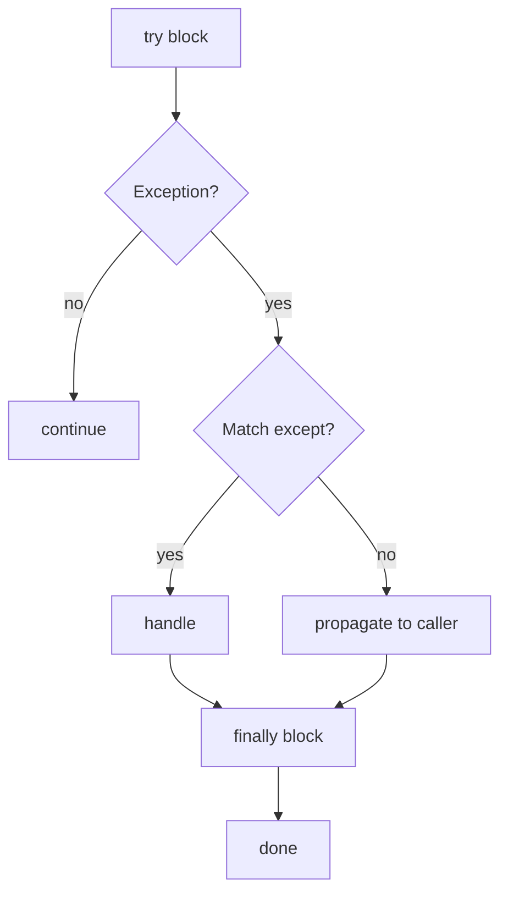

# L10 — Python Basics Refresher — Part 2

> **Author:** Prem Vishnoi &lt;prem.vishnoi@example.com&gt;
> **Section:** 3 — Python Basics Refresher
> **Duration:** 15:11

## Prereqs

- L09 — Python Basics Refresher — Part 1
- Python 3.11+ and a terminal

This lecture covers the bits of Python you will write **every day** in
this course: list/dict comprehensions, error handling with `try /
except / finally`, modules and `import`, virtual environments with
`python -m venv`, package management with `pip`, and a first look at
the `boto3` **client** interface.

## Key terms

- **Comprehension** — a one-line expression that builds a `list`,
  `dict`, `set`, or `generator` from an iterable.
- **Exception** — an object that represents a runtime error. Raised
  with `raise`, caught with `except`.
- **`finally`** — a block that always runs, whether or not an
  exception was raised (used for cleanup).
- **Module** — a `.py` file. **Package** — a directory of modules
  with an `__init__.py`.
- **Virtual environment** — an isolated Python install with its own
  `site-packages`, so one project's dependencies cannot break
  another's.
- **`boto3` client** — a low-level, AWS-API-shaped object; one
  method per AWS operation, returns dicts.
- **`boto3` resource** — a higher-level, object-oriented wrapper
  (we will see this in L12).

## Lecture

### 1. List comprehensions — replace the `for` loop 80% of the time

The shape is `[expression for item in iterable if condition]`. Read it
as: "for each item, if the condition holds, produce the expression."

```python
# 03_python_basics/code/l10_list_comp.py
sizes_mb = [12.4, 88.0, 4.1, 305.7]

# Old way
big_old = []
for s in sizes_mb:
    if s > 50:
        big_old.append(s)

# Comprehension
big = [s for s in sizes_mb if s > 50]
print(big)  # [88.0, 305.7]

# Transform
sizes_gb = [round(s / 1024, 3) for s in sizes_mb]
print(sizes_gb)  # [0.012, 0.086, 0.004, 0.299]
```

Nested comprehensions flatten one level of nesting, but if you go
deeper than 2 dimensions, switch back to a `for` loop — readability
beats cleverness.

### 2. Dict comprehensions

Same idea, produces a `dict`:

```python
# 03_python_basics/code/l10_dict_comp.py
files = ["a.csv", "b.json", "c.parquet"]
sizes = {"a.csv": 1024, "b.json": 2048, "c.parquet": 9000}

# Build a dict of file -> size in MB
sizes_mb = {f: round(sizes[f] / (1024 * 1024), 2) for f in files if f in sizes}
print(sizes_mb)
# {'a.csv': 0.0, 'b.json': 0.0, 'c.parquet': 0.01}
```

You will use this pattern constantly to filter and reshape the dicts
that come back from boto3.

### 3. Error handling — `try / except / finally`

Lambda handlers must not crash silently. AWS will retry async
triggers, but the right thing is to catch what you can handle, log what
you cannot, and `raise` so the platform can react.

```python
# 03_python_basics/code/l10_errors.py
import json
import logging

log = logging.getLogger()
log.setLevel(logging.INFO)

def parse_event(raw: str) -> dict:
    try:
        return json.loads(raw)
    except json.JSONDecodeError as e:
        log.error(f"bad JSON in event: {e}")
        raise                        # re-raise so Lambda marks the invocation as Failed

def handler(raw: str) -> str:
    try:
        data = parse_event(raw)
        return f"ok: {len(data)} keys"
    except json.JSONDecodeError:
        return "bad request"
    finally:
        log.info("handler finished")  # always runs
```

Rules that pay off later in this course:

- **Catch the narrowest exception you can.** A bare `except:` hides
  real bugs.
- **`finally` is for cleanup.** Close S3 clients, release locks,
  flush buffers.
- **Re-raise with `raise` (no argument)** to keep the original stack
  trace. `raise NewError("...")` loses the chain unless you use
  `raise NewError("...") from e`.



### 4. Modules and `import`

Any `.py` file is a module. Any directory with an `__init__.py` is a
package. Two idiomatic import styles:

```python
# 03_python_basics/code/l10_imports.py
import json                                # whole module
from datetime import datetime, timezone    # specific names
from urllib.parse import urlparse          # sub-module path
```

`from module import *` is discouraged — it pollutes the namespace and
hides where names come from. Prefer explicit `from … import name`.

A Lambda handler typically only needs `import` statements at the top
of the file. Imports run once per cold start, then the warm
environment reuses them.

### 5. Virtual environments — `python -m venv` and `pip`

A virtual environment is a self-contained Python with its own
`site-packages`. Without one, `pip install boto3` puts the package in
your global Python, and the next project that needs a different
`boto3` version breaks.

```bash
# From the section root
cd 03_python_basics/code
python3 -m venv .venv
source .venv/bin/activate          # macOS/Linux
# .venv\Scripts\activate           # Windows PowerShell

python -m pip install --upgrade pip
pip install boto3
pip freeze > requirements.txt
```

`requirements.txt` is the contract. The course's `requirements.txt`
in the repo root already lists `boto3>=1.34`; from here on, any new
dependency goes in there.

```bash
# On a fresh machine
python3 -m venv .venv && source .venv/bin/activate
pip install -r requirements.txt
```

Lambda itself does **not** use your venv — the deployment package is
the contents of your project zipped up (plus the boto3 that AWS
already pre-installs in the `python3.11` runtime). You will see this
in detail in L12.

### 6. Intro to `boto3` — the **client** interface

`boto3` is the AWS SDK for Python. There are two interfaces:

| Interface | Style | Use it when |
|---|---|---|
| **Client** | low-level, dict-in / dict-out, one method per AWS API | you want exact control, or you are reading API docs |
| **Resource** | higher-level, object-oriented | you want quick iteration (S3 objects, DynamoDB tables) |

L12 goes deep on both. For now, just remember the client pattern:

```python
# 03_python_basics/code/l10_boto3_intro.py
import boto3

# Pick a service — the client is your handle to the AWS API
s3 = boto3.client("s3", region_name="us-east-1")

# List calls return paginated results
response = s3.list_buckets()
print(f"account has {len(response['Buckets'])} buckets")
for b in response["Buckets"]:
    print(f"  - {b['Name']} (created {b['CreationDate']})")
```

Three facts to internalize:

1. **`boto3.client("service_name")` is the entry point.** Service
   name is the lowercase, dashed form AWS uses in the console
   (`s3`, `iam`, `dynamodb`, `lambda`, `apigateway`).
2. **Methods take keyword arguments, return dicts.** No magic — what
   you see in the AWS API Reference is exactly what you call.
3. **Credentials come from the standard chain.** Environment
   variables, `~/.aws/credentials`, IAM role on EC2 / Lambda, etc.
   This is why `aws configure` in L02 mattered.

A small but useful idiom — paginators, so you do not have to write
the `NextToken` loop by hand:

```python
paginator = s3.get_paginator("list_objects_v2")
for page in paginator.paginate(Bucket="my-bucket"):
    for obj in page.get("Contents", []):
        print(obj["Key"], obj["Size"])
```

### 7. Putting it all together — a tiny "list S3 buckets" script

```python
# 03_python_basics/code/l10_list_buckets.py
"""List all S3 buckets in the configured account.

Run from 03_python_basics/code with the venv active:
    python3 l10_list_buckets.py
"""
import boto3
from botocore.exceptions import ClientError, NoCredentialsError

def list_buckets():
    s3 = boto3.client("s3")
    try:
        resp = s3.list_buckets()
    except NoCredentialsError:
        print("No AWS credentials found. Run `aws configure`.")
        return []
    except ClientError as e:
        print(f"AWS call failed: {e.response['Error']['Code']}")
        return []

    names = [b["Name"] for b in resp.get("Buckets", [])]
    return names

if __name__ == "__main__":
    for name in list_buckets():
        print(name)
```

If you have not run `aws configure` yet, the script prints the
friendly "No AWS credentials" message instead of a raw traceback.
That is `try/except` doing its job.

## Hands-on

1. Activate the venv from L09 (or create a fresh one in
   `03_python_basics/code/`).
2. `pip install boto3` and run the snippets above. Confirm the
   comprehension, dict, and error-handling examples print what you
   expect.
3. Run `python3 l10_list_buckets.py`. With credentials, you will
   see your buckets. Without credentials, you will see the friendly
   message from the `except NoCredentialsError` branch.
4. Skim the [boto3 S3 reference](https://boto3.amazonaws.com/v1/documentation/api/latest/reference/services/s3.html)
   for 5 minutes. Notice that every API name maps 1:1 to a method
   on the client. That is the whole mental model.

## Quiz prep

- Rewrite a 4-line `for` loop that builds a list of uppercase names
  as a one-line comprehension.
- What is the difference between `raise` and `raise ValueError("x")`?
- Why use `python -m venv` instead of installing packages globally?
- What is the difference between a `boto3` client and a `boto3`
  resource?
- Which file captures the dependencies of a project for
  reproduction on another machine?

## Further reading

- [boto3 docs — Clients and Resources](https://boto3.amazonaws.com/v1/documentation/api/latest/guide/clients.html)
- [Python venv docs](https://docs.python.org/3/library/venv.html)
- [PEP 8 — Style Guide for Python Code](https://peps.python.org/pep-0008/)
- L12 — boto3 Client/Resource and the Lambda handler signature
- L13 — Create an S3 bucket with AWS Lambda and boto3
