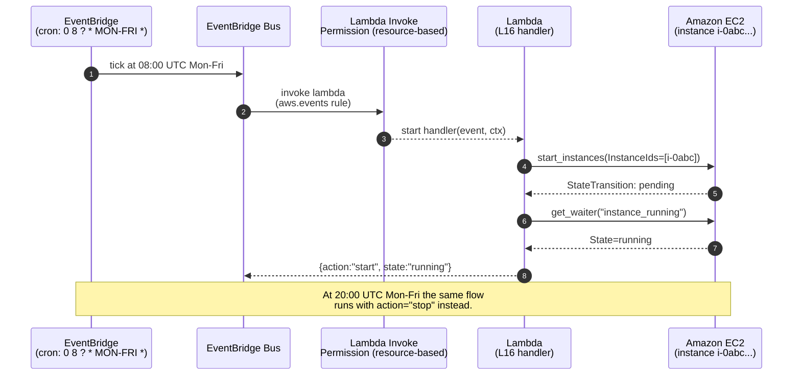
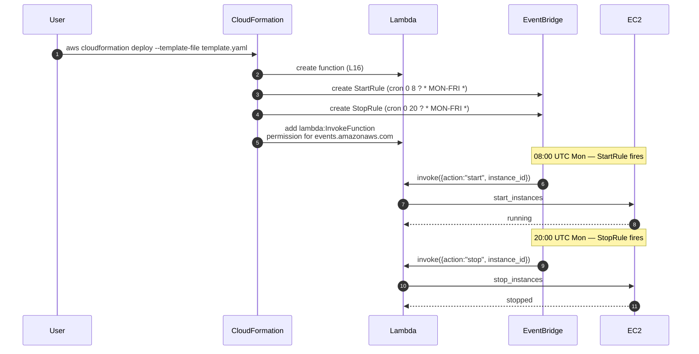

# L17 — AWS Lambda Automation Use Case: EC2, Lambda, and EventBridge

> **Author:** Prem Vishnoi &lt;prem.vishnoi.example.com&gt;
> **Section:** 4 — AWS Lambda with S3, EC2, DynamoDB
> **Duration target:** 12:29

## Prereqs

- L16 — the `create / start / stop` Lambda. This lecture wires it to
  a schedule.

## Key terms

- **EventBridge** — the AWS event bus. Replaces CloudWatch Events
  (the old name). Used for *schedules*, *event-pattern rules*, and
  *cross-account event delivery*.
- **Cron expression** — EventBridge schedules use the standard
  6-field cron (`minute hour day-of-month month day-of-week year`).
  UTC only. `cron(0 8 ? * MON-FRI *)` = 8am UTC, Mon–Fri.
- **Rate expression** — `rate(5 minutes)` is the simpler alternative
  to cron. Use cron when you need a specific time-of-day; use rate
  when you just want a fixed interval.
- **Target** — the resource an EventBridge rule invokes. In our
  case: a Lambda function.

## Lecture

> "This is the use case that ties L16 back into a real business
> problem: 'I have a dev EC2 instance that I want to start every
> weekday at 8am and stop every weekday at 8pm so I'm not paying for
> it overnight.' The architecture is three pieces: a Lambda (the
> one from L16), an IAM role for EventBridge to invoke it, and two
> EventBridge schedules — one for start, one for stop. Total cost:
> pennies per month."

### Architecture



The same diagram describes the **stop** schedule at 20:00 UTC.
Only the cron and the `event.action` differ.

### The schedule JSON

Two rules, two schedules. Here is the canonical CloudFormation-style
JSON (we ship the actual CFN template in
`code/ec2_eventbridge/eventbridge_scheduled_start_stop.py`):

```json
{
  "StartRule": {
    "Type": "AWS::Events::Rule",
    "Properties": {
      "ScheduleExpression": "cron(0 8 ? * MON-FRI *)",
      "Targets": [{
        "Id": "StartEC2Target",
        "Arn": { "Fn::GetAtt": ["StartStopLambda", "Arn"] },
        "Input": "{\"action\": \"start\", \"instance_id\": \"i-0abcdef1234567890\"}"
      }]
    }
  },
  "StopRule": {
    "Type": "AWS::Events::Rule",
    "Properties": {
      "ScheduleExpression": "cron(0 20 ? * MON-FRI *)",
      "Targets": [{
        "Id": "StopEC2Target",
        "Arn": { "Fn::GetAtt": ["StartStopLambda", "Arn"] },
        "Input": "{\"action\": \"stop\", \"instance_id\": \"i-0abcdef1234567890\"}"
      }]
    }
  }
}
```

Two important details:

1. **`Input` is a string**, not a JSON object. EventBridge passes it
   to the Lambda as the raw `event` payload. If you forget the
   outer string quotes, the Lambda receives a dict-shaped string
   and your handler crashes.
2. **The instance ID is hardcoded** in the rule input. In a real
   deployment you'd parameterize it or look it up by tag.

### The Python module

```python
import json
import logging
import os

# The actual handler is in `start_stop_ec2.py` (L16). We import it
# so this Lambda is the same one wired to both schedules.
from start_stop_ec2 import handler as ec2_lifecycle_handler

LOG = logging.getLogger()
LOG.setLevel(logging.INFO)


def handler(event, context):
    """Thin wrapper that normalizes the EventBridge event shape and
    delegates to the L16 EC2 lifecycle handler.

    EventBridge event shape:
        {"version": "0", "id": "...", "detail-type": "Scheduled Event",
         "source": "aws.events", "time": "...", "region": "us-east-1",
         "resources": ["arn:aws:events:...:rule/StartRule"],
         "detail": {}}
    """
    LOG.info("eventbridge event: %s", json.dumps(event))

    # EventBridge rules can either pass an Input string (the raw event)
    # or wrap the payload under "detail". We support both shapes.
    payload = event.get("detail") or event

    action = payload.get("action")
    if not action:
        raise ValueError("event is missing required 'action' key")

    return ec2_lifecycle_handler(payload, context)


if __name__ == "__main__":
    logging.basicConfig(level=logging.INFO)
    sample = {
        "version": "0",
        "id": "demo-event-id",
        "detail-type": "Scheduled Event",
        "source": "aws.events",
        "time": "2026-10-10T08:00:00Z",
        "region": "us-east-1",
        "resources": ["arn:aws:events:us-east-1:123456789012:rule/StartRule"],
        "detail": {"action": "start", "instance_id": "i-0123456789abcdef0"},
    }
    print(handler(sample, None))
```

### Walkthrough

1. **The wrapper.** EventBridge invokes a Lambda with a *rich*
   envelope (version, id, source, time, resources, detail). The
   L16 handler expects a *flat* shape (`{action, instance_id}`).
   The wrapper normalizes the two: if the event has a `detail` key
   we unwrap it, otherwise we pass the event through.

2. **Reusing L16.** The whole point of structuring L16 as a single
   dispatching handler is that the start/stop logic is now
   *reusable*. The wrapper just calls
   `ec2_lifecycle_handler(payload, context)`.

3. **Schedule sources.** The schedules above are the canonical
   "stop-the-dev-box-overnight" pattern. Variations:
   - **Tag-based** — instead of hardcoding the instance ID, run a
     `describe_instances` call with a tag filter and operate on the
     result.
   - **Multiple instances** — change the Lambda input to
     `{"action": "start", "tag": {"Env": "dev"}}` and have the
     handler expand the tag filter into a list of instance IDs.

4. **Permissions.** The Lambda's *execution role* is the one that
   lets it call EC2. The *resource-based* policy on the Lambda
   itself is what lets EventBridge invoke it. Without that
   `lambda:InvokeFunction` permission, EventBridge silently fails
   to invoke. The CFN template adds the right `Permission` resource:

   ```yaml
   EventBridgeInvokeLambda:
     Type: AWS::Lambda::Permission
     Properties:
       FunctionName: !Ref StartStopLambda
       Action: lambda:InvokeFunction
       Principal: events.amazonaws.com
       SourceArn: !GetAtt StartRule.Arn
   ```

   You need *one of these per rule* — so two of them in total for
   the start/stop pair.

### Mermaid: end-to-end scheduling



This is the same flow as the first diagram, just unfolded across
both schedules and with the CloudFormation deploy at the top.

## Hands-on

The `code/ec2_eventbridge/` directory ships the wrapper module above
plus a small `moto` test that asserts the wrapper normalizes both
EventBridge event shapes. The actual EventBridge rule creation is
*not* exercised by `moto` (moto's EventBridge support is partial);
the IAM/CFN is documented in comments at the top of `script.py`.

```bash
cd 04_lambda_with_aws_resources/code/ec2_eventbridge
pytest test_script.py -v
```

You should see at least 2 tests:
- `test_handler_unwraps_detail_payload` — uses the wrapped
  EventBridge shape
- `test_handler_passes_through_flat_payload` — uses the direct-input
  shape

## Quiz prep

- EventBridge replaces CloudWatch Events. Same APIs, same console
  pages, new name.
- The schedule expression `cron(0 8 ? * MON-FRI *)` means 8am UTC,
  Mon–Fri. The `?` is a placeholder for the unused day-of-month
  field.
- EventBridge rules can pass an `Input` string to the Lambda. That
  string becomes the raw `event` payload.
- A Lambda that EventBridge invokes needs a *resource-based*
  `lambda:InvokeFunction` permission granting
  `events.amazonaws.com`.

## Further reading

- AWS docs: [EventBridge scheduled rules](https://docs.aws.amazon.com/eventbridge/latest/userguide/eb-create-rule-schedule.html)
- AWS docs: [Lambda resource-based policies](https://docs.aws.amazon.com/lambda/latest/dg/access-control-resource-based.html)
- `code/ec2_eventbridge/README.md`
- `code/ec2_eventbridge/eventbridge_scheduled_start_stop.py` —
  the wrapper + the IAM/CFN documented in comments
