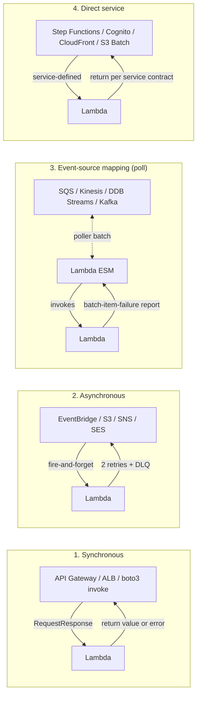

# L20 — AWS Lambda Invocation Model — Theory

> **Author:** Prem Vishnoi &lt;prem.vishnoi@example.com&gt;
> **Section:** 5 — AWS Lambda Basic Concepts (Part 2)
> **Duration:** 3:33

## Prereqs

- L07 — Lambda execution role and the principle of least privilege
- L17 — how EventBridge schedules invoke Lambda on a cron
- Familiarity with the `handler(event, context)` contract

## Key terms

- **Synchronous (sync) invocation** — the caller waits for your
  function to return. The caller receives the response or the error.
- **Asynchronous (async) invocation** — the caller hands the event
  to Lambda and moves on. Lambda is responsible for retries, the
  dead-letter queue (DLQ), and the response is **not** returned to
  the caller.
- **Event-source mapping (ESM) / poll-based** — Lambda polls a
  stream or queue (SQS, Kinesis, DynamoDB Streams, MSK, Kafka) and
  invokes your function for each batch. Lambda manages the pollers,
  checkpoints, and the DLQ.
- **Direct service invocation** — another AWS service (API Gateway,
  ALB, Step Functions, S3 notifications, SNS, EventBridge, etc.)
  invokes your function. The invocation type is determined by the
  calling service, not by you.

## Lecture

Every AWS Lambda function is invoked in **exactly one of four ways**.
Once you internalize these four, almost every Lambda behavior
question — "why didn't the caller get the error?", "why did my
function run twice?", "where is the dead-letter queue?" — has the
same one-sentence answer.

### 1. Synchronous (sync)

The caller sends the event, **blocks**, and waits for your function
to return. The response (or the exception) is delivered back to the
caller. Examples: API Gateway REST/HTTP API → Lambda, ALB → Lambda,
any direct `boto3 client.invoke` call with `InvocationType='RequestResponse'`.

- Retries: **caller's responsibility**. Lambda does not retry a
  failed sync invocation.
- Concurrency: every concurrent caller consumes one concurrent
  execution.
- Response shape: whatever your handler returns is returned to
  the caller (must be JSON-serializable).

### 2. Asynchronous (async)

The caller hands the event to Lambda and **continues immediately**.
Lambda is responsible for the retry policy (2 retries with
exponential backoff by default, configurable), the DLQ, and the
event-age cap. Examples: EventBridge (scheduled or pattern-based),
S3 event notifications (PUT, POST, COPY, etc.), SNS, SQS (when not
using an ESM), CloudWatch Logs subscription filters, SES.

- Retries: **Lambda retries on failure** (2 by default, up to 6).
- DLQ: you attach an SQS queue or SNS topic and Lambda sends
  failed events there after the retry budget is exhausted.
- Response shape: the caller never sees the function's return
  value. The handler return is discarded.

### 3. Event-source mapping (ESM) / poll-based

Lambda **polls** a stream or queue on your behalf. There is no
real-time push from the event source — instead, Lambda runs a
poller in your function's account, reads new records, batches
them, invokes your handler with the batch, and (on success)
checkpoints the progress. Sources: SQS (yes, both ways exist —
async for direct S3 → SQS, ESM for Kinesis/DDB Streams/SQS with
batching), Kinesis Data Streams, DynamoDB Streams, Amazon MSK,
self-managed Apache Kafka, Amazon MQ (ActiveMQ/RabbitMQ), Kinesis
Data Firehose (for transformation).

- Retries: **until the record expires** (or until the destination
  DLQ accepts it). Records that fail all retries are sent to the
  configured destination.
- Concurrency: each shard/partition gets its own concurrent
  poller, so concurrency scales with the source's partition count.
- Response shape: the handler must checkpoint (Lambda does this
  on a successful return) and may report batch-item failures so
  only the failed records are retried.

### 4. Direct service-to-service invocation

A few AWS services sit *outside* the three models above and
invoke Lambda with a service-defined contract. The most important
ones:

- **API Gateway** (REST and HTTP APIs) — effectively sync, but the
  integration is wired through API Gateway, not direct boto3.
- **Step Functions** — Lambda Task state, sync or waitForTaskToken.
- **CloudFront (Lambda@Edge)** — viewer-request / viewer-response /
  origin-request / origin-response.
- **S3 batch operations** — sync, with the whole job acting as a
  single invocation.
- **Cognito triggers** — pre-token-generation, pre-sign-up, etc.
  Service-specific contracts.

The mental model: any time you see "**this AWS service triggers my
Lambda**", identify which of the four slots it falls into and the
rest of the behavior (retries, DLQ, response) is determined for
you.

### Diagram — the 4 invocation models

### Quick decision rules

- Caller needs the function's return value? **Sync** (or Step
  Functions).
- Caller is fine not waiting, and you want Lambda to retry on
  failure? **Async** (with a DLQ).
- Source is a stream/queue and you want batching, checkpoints, and
  per-record retry? **Event-source mapping**.
- Trigger is a service with its own contract (Step Functions,
  Cognito, Lambda@Edge)? **Direct** — read the service docs.

## Hands-on

None for this lecture — it is theory. L21 deploys an async Lambda
plus a sync REST call to make these four models concrete.

## Quiz prep

- Q1, Q2, Q3, Q4 of `quizzes/section_5.md` directly test the
  four-model taxonomy and the retry/DLQ behavior of each.
- Be ready to name one real AWS service for each invocation model.

## Further reading

- AWS docs: [Lambda invocation models](https://docs.aws.amazon.com/lambda/latest/dg/lambda-invocation.html)
- AWS docs: [Event source mappings](https://docs.aws.amazon.com/lambda/latest/dg/invocation-eventsourcemapping.html)
- AWS docs: [Lambda retries and DLQ](https://docs.aws.amazon.com/lambda/latest/dg/invocation-async.html)
- `lecture_scripts/L21_invocation_model_hands_on.md` — hands-on
  walkthrough deploying the two most common models
