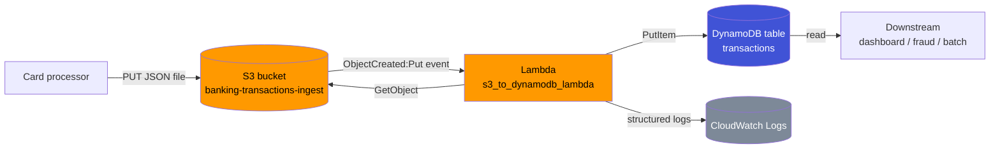

# L23 — Enterprise Use Case using S3, AWS Lambda and DynamoDB — Part 1

> **Author:** Prem Vishnoi <pvishnoi@avilx.com>
> **Section:** 06 — Enterprise Use Case 1
> **Duration:** 11:24
> **Prereqs:** L01–L22 (Introduction, Lambda basics, Python refresher, Lambda
> with S3/EC2/DynamoDB, invocation model and timeout)

## What you will learn

By the end of this lecture you will be able to:

1. describe the architecture of a fully event-driven S3 -> Lambda -> DynamoDB
   pipeline and name every moving part;
2. design a DynamoDB table for a banking transactions feed (partition key,
   attribute choices, on-demand vs provisioned);
3. design a **least-privilege** IAM execution role for the Lambda function;
4. configure an S3 event notification that targets a Lambda function
   destination.

Part 2 (L24) takes the design here and writes the actual Python handler
plus the `moto`-backed tests.

## Key terms

- **Event-driven architecture** — a system that reacts to events emitted
  by other services rather than polling for state changes.
- **S3 event notification** — a JSON message that S3 publishes to a
  destination (Lambda, SNS, SQS, EventBridge) when a bucket object is
  created, deleted, or otherwise changed.
- **Lambda execution role** — the IAM role Lambda assumes on your behalf
  when invoking your function. It controls what AWS APIs your code is
  allowed to call.
- **DynamoDB partition key** — the attribute whose value DynamoDB uses to
  distribute items across partitions. Also called the *hash key*. Must be
  unique per item if you want idempotency via `attribute_not_exists`.
- **`ConditionExpression`** — a DynamoDB write-time predicate that aborts
  the write if the condition fails. The workhorse of idempotent writes.
- **Idempotency** — the property that running an operation multiple times
  has the same effect as running it once. Required for any system that
  consumes a possibly-duplicated event stream.

## The use case in plain English

A regional bank has a long-standing relationship with a card processor.
Every morning at 06:00 UTC the processor pushes a JSON file containing
yesterday's settled transactions to an S3 bucket the bank owns. The bank
wants those rows in their analytics database within minutes, without
running any servers, without a cron, and without ever double-counting a
transaction.

The simplest system that meets that bar is:

1. the partner uploads the JSON file to S3;
2. S3 fires an `ObjectCreated:Put` event notification;
3. a Lambda function reads the file, validates each record, and writes
   one DynamoDB item per transaction;
4. downstream consumers (a dashboard, a fraud detector, an overnight
   aggregator) read from DynamoDB.

No servers. No polling. The pipeline scales from 1 transaction a day to
10 million a day with no code change.

## Architecture



Three AWS-managed services, one Lambda function, and one trust boundary
(the Lambda execution role). That is the whole production system.

## Step 1 — design the DynamoDB table

The data we are storing is a stream of immutable events (a settled
transaction never changes). DynamoDB is a natural fit because:

- we have a known, stable primary key (`transaction_id` issued by the
  processor);
- we have unpredictable, bursty write volume (5 rows one day, 50,000 the
  next);
- we want millisecond read latency for downstream consumers.

We pick:

- **Table name:** `transactions`
- **Partition key:** `transaction_id` (String) — globally unique per
  settled transaction, supplied by the processor. This is the *only* key
  we need: there is exactly one row per transaction, and the access
  pattern is "give me row N" or "scan everything in the last 24h".
- **Sort key:** none. We are not modelling "all transactions for one
  customer" as a query pattern; if we ever do, we can add a Global
  Secondary Index later without a table rewrite.
- **Billing mode:** On-demand (`PAY_PER_REQUEST`). For a feed that varies
  from 10 to 50,000 rows, on-demand is cheaper than guessing provisioned
  capacity, and there is zero warm-up time.
- **Encryption:** AWS owned CMK (the default). If the bank has a central
  KMS key requirement, switch to a customer-managed CMK; the code does
  not change.

Other attributes we will store as-is: `customer_id`, `amount`, `currency`,
`timestamp`, `merchant`. We accept the *wide-column* model — no
normalization. The processor is the source of truth, we are the cache.

The single most important design decision is the **partition key must be
unique per item**. That is what lets us use
`ConditionExpression="attribute_not_exists(transaction_id)"` to make the
pipeline idempotent in step 3 below.

## Step 2 — design the IAM execution role

A Lambda function has no implicit permissions. The execution role is what
grants it. For a *least-privilege* design we attach exactly three
permissions (see `code/iam_policy.json`):

| Permission | Why we need it |
|---|---|
| `s3:GetObject` on `arn:aws:s3:::banking-transactions-ingest/raw/*` | To read the JSON file the processor just uploaded. The `raw/*` resource scoping means the function cannot read from any other prefix in the bucket. |
| `dynamodb:PutItem` on `arn:aws:dynamodb:us-east-1:<account>:table/transactions` | To write the parsed rows. We allow only `PutItem`, not `UpdateItem` or `DeleteItem`, because once a transaction is settled we never mutate it. |
| `logs:CreateLogGroup`, `logs:CreateLogStream`, `logs:PutLogEvents` on `arn:aws:logs:*:*:*` | To write structured logs to CloudWatch. Lambda emits per-invocation log streams under `/aws/lambda/<function-name>` and we want them. |

Things we **deliberately omit**:

- `s3:ListBucket` — we never list the bucket, we only read one known key.
- `dynamodb:Scan` — not needed by the writer. If a downstream consumer
  needs to scan, it gets its own role.
- `*` on the resource side. Every statement is scoped to a specific ARN.

The trust policy is the standard Lambda assume-role policy:

```json
{
  "Version": "2012-10-17",
  "Statement": [
    {
      "Effect": "Allow",
      "Principal": {"Service": "lambda.amazonaws.com"},
      "Action": "sts:AssumeRole"
    }
  ]
}
```

## Step 3 — wire the S3 event notification

S3 event notifications are the *glue* of this architecture. They turn a
passive storage service into a publish/subscribe source. The two things
you must get right are the **event type** and the **destination**.

Open the `banking-transactions-ingest` bucket in the console:

1. **Properties** tab → scroll to **Event notifications** → **Create
   event notification**.
2. Name: `ingest-to-dynamodb`.
3. **Prefix** filter: `raw/`. This is the folder the processor writes to.
   Filtering on the prefix keeps Lambda from firing on internal prefixes
   like `archive/` or `_dlq/`.
4. **Suffix** filter (optional): `.json`. Use it if your bucket also holds
   non-JSON objects.
5. **Event types**: tick `s3:ObjectCreated:Put`. Skip `Post`, `Copy`,
   `CompleteMultipartUpload` — those are noisy and not relevant here.
6. **Destination**: Lambda function → `s3_to_dynamodb_lambda`.
7. Save.

When you save, S3 also calls `lambda:AddPermission` to give itself
permission to invoke the function. If you do the wiring programmatically
(see `deploy_notes.md`) you must call `lambda.add_permission` yourself —
otherwise the notification is created but every invocation fails with
"Access denied".

A subtle gotcha: **S3 event notifications are *at least* once**. If the
function returns an error, S3 retries. If S3 itself fails to deliver, it
retries. The processor, in turn, sometimes re-uploads the same file. So
when we look at the handler in L24, idempotency is not optional — it is
the single thing that makes this design production-safe.

## Step 4 — the sample data

For the lab we will use a small static file. It is the same shape the
processor will send in production: a top-level object with a
`transactions` array of records, each with `transaction_id`,
`customer_id`, `amount`, `currency`, `timestamp`, `merchant`. See
`code/sample_data/sample_transactions.json`.

```json
{
  "feed_id": "BATCH-2026-10-10-001",
  "source": "retail_card_processor",
  "transactions": [
    {
      "transaction_id": "TXN-1001",
      "customer_id": "CUST-42",
      "amount": 129.50,
      "currency": "USD",
      "timestamp": "2026-10-10T08:14:22Z",
      "merchant": "BlueBottle Coffee"
    }
  ]
}
```

We pick the array-under-a-key shape (not a bare array at the top level)
because the processor will eventually add metadata — `feed_id`,
`source`, `generated_at` — and a top-level object gives us somewhere to
put it without breaking consumers.

## Putting it together

The four decisions we have made in this lecture:

1. **One Lambda, one job.** The function does *parse JSON -> validate
   rows -> write to DynamoDB*. No branching by event type, no second
   concern. Single Responsibility Principle applied to functions.
2. **Partition key is the source-of-truth id.** The processor's
   `transaction_id` is unique by contract. We trust the contract and use
   it as the DynamoDB primary key — which in turn gives us free
   idempotency.
3. **Least-privilege IAM.** Every action is scoped to a specific ARN.
   The function cannot read from a different bucket, cannot write to a
   different table, and cannot change an existing row.
4. **Idempotency is built into the write.** `attribute_not_exists` in the
   `PutItem` call. S3 retries are safe; the processor's re-uploads are
   safe; our test in L24 proves this with a second invocation.

In L24 we will write the handler that turns this design into running
code, then prove it with a `moto`-backed test.

## Hands-on preview (deferred to L24 + deploy_notes.md)

You do not need to deploy anything to AWS yet. Two things you can do
right now, on your laptop:

1. **Read the IAM policy** at `code/iam_policy.json`. Notice that every
   statement has a `Sid`, a specific `Action` list, and a `Resource` ARN.
2. **Run the test suite**:

   ```bash
   cd code/lambda_function
   pip install boto3 moto pytest
   pytest -v
   ```

   All three tests should pass. They prove (a) the happy path works,
   (b) the handler is idempotent, and (c) bad rows are skipped.

The full deploy (S3 bucket, DynamoDB table, IAM role, Lambda, event
notification) is documented in `code/deploy_notes.md`. We will cover the
console walkthrough in the next lecture.

## Quiz prep

You should now be able to answer:

- What three AWS services form this use case, and which one is the
  trigger?
- Why is the partition key the right place to enforce idempotency?
- Which IAM permissions does a write-only S3 -> Lambda -> DynamoDB
  function need, and which should you **not** grant it?
- What S3 event types are relevant, and which is a no-op for this
  pipeline?
- Why is "S3 event notifications are at-least-once" a problem you have
  to design for, not a bug?

## Further reading

- AWS docs: [Using AWS Lambda with Amazon S3 event notifications](https://docs.aws.amazon.com/lambda/latest/dg/with-s3.html)
- AWS docs: [DynamoDB core components](https://docs.aws.amazon.com/amazondynamodb/latest/developerguide/HowItWorks.CoreComponents.html)
- AWS docs: [Condition expressions](https://docs.aws.amazon.com/amazondynamodb/latest/developerguide/Expressions.ConditionExpressions.html)
- `code/iam_policy.json` — the exact inline policy the role needs
- `code/deploy_notes.md` — console and boto3 deploy steps
- L24 — the handler code, idempotency in detail, CloudWatch logs walkthrough
