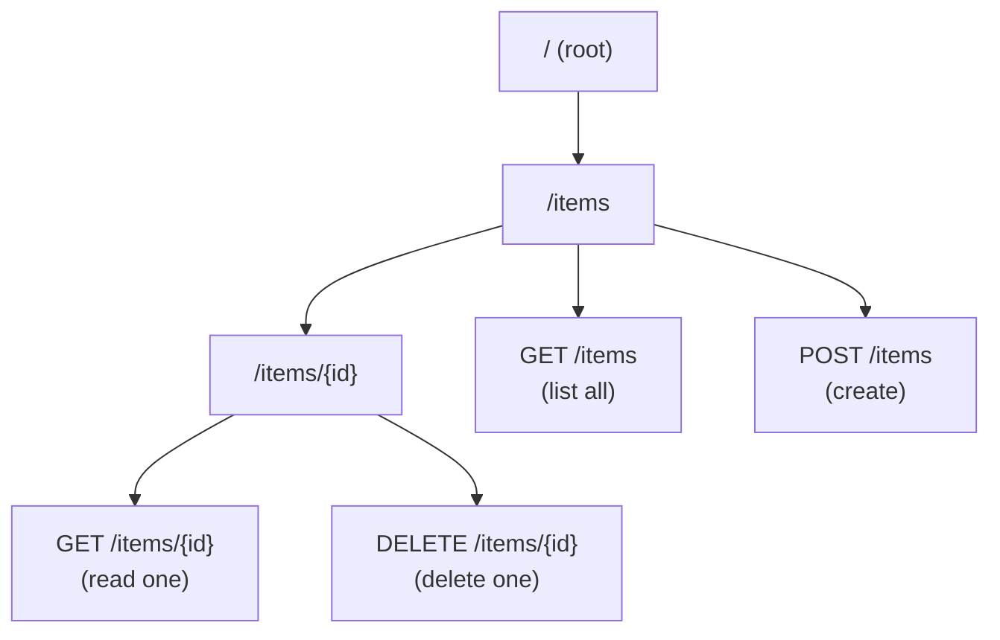

# L26 — API Gateway — Resources, Methods and Integration Types

> **Author:** Prem Vishnoi &lt;prem.vishnoi@example.com&gt;
> **Section:** 7 — API Gateway Overview
> **Lecture duration target:** 5:45

## Prereqs

- L25. You should already know that a REST API is a request/response
  surface backed by Lambda, HTTP, AWS, or MOCK integrations.
- Familiarity with HTTP verbs (GET, POST, PUT, DELETE, PATCH, OPTIONS).
- You should be able to read a JSON request/response body.

## Key terms

- **Resource** — a path in your API, e.g. `/items` or `/items/{id}`. The
  collection of resources forms a **resource tree**.
- **Method** — the HTTP verb attached to a resource: `GET /items`,
  `POST /items`, `DELETE /items/{id}`, etc.
- **Integration** — the backend that API Gateway forwards the request to.
- **MOCK integration** — return a canned response without calling any
  backend. Useful for design-phase stubs.
- **HTTP integration** — call a public HTTP endpoint. API Gateway
  transforms the request, sends it, transforms the response.
- **AWS integration** — call an AWS service action directly (S3 GetObject,
  SNS Publish, etc.). You supply the request template.
- **HTTP_PROXY** — pass the request through to an HTTP endpoint with
  minimal transformation. The simplest "passthrough" mode.
- **AWS_PROXY** — pass the request through to a Lambda function with the
  full event payload (and receive the response in the Lambda proxy
  format).
- **Lambda proxy integration** — the `AWS_PROXY` mode specifically for
  Lambda. This is what we will use for Use Case 2.

## Lecture

A REST API in API Gateway is structured as a **resource tree**. The root
of the tree is `/`. Every URI you want to expose is a child resource.
Resources can be statically named (`/items`) or contain path parameters
(`/items/{id}`). The methods (HTTP verbs) you attach to a resource
define what the API actually does. Each method, in turn, points to an
**integration** that describes *how* API Gateway should call the
backend.

### The resource tree

Imagine Use Case 2 from section 8, simplified: a serverless CRUD API
where the S3 bucket is the data store. The resource tree would look
like this:



In Use Case 2 the `GET /items` method will return a list of object keys
from an S3 bucket, `POST /items` will upload a body as a new object,
`GET /items/{id}` will read a single object, and `DELETE /items/{id}`
will delete it. The Lambda function in section 8 will dispatch on the
HTTP method, but the *API structure* lives entirely in API Gateway.

### Method configuration

Each method in the resource tree has a small, well-defined config:

- **Authorization** — who is allowed to call this method. (Covered in
  L28.)
- **API Key required** — yes/no. (Covered in L27.)
- **Request validation** — optional. You can attach a JSON Schema to
  the request body or query string parameters and reject requests that
  do not match before they ever reach the backend.
- **Method response** — what status codes the method *can* return
  (e.g. 200, 400, 500).
- **Integration** — the actual call to the backend.

### The five integration types

API Gateway defines five integration types. Three are "with
transformation" (you control the request/response shape), and two are
"passthrough" (the request flows through with minimal interference).

1. **MOCK**. API Gateway returns a hard-coded response without calling
   any backend. You use this when you are still designing the API and
   want to share the URL with a frontend team before the backend is
   ready, or to return a `200 OK` for a CORS preflight `OPTIONS`
   request.
2. **HTTP**. API Gateway makes an HTTP call to a public endpoint that
   you specify. You control how the request is shaped (request
   templates) and how the response is mapped back to the client
   (response templates). This is the integration you would use to
   front an existing public REST API.
3. **AWS**. API Gateway makes a direct call to an AWS service action
   using the AWS SDK. You can do `GET /s3-bucket/{key}` and have
   API Gateway call `s3:GetObject` on your behalf. You supply the
   request template that maps the API path to the SDK call. Useful
   when you want to expose S3 objects without a Lambda in the middle,
   but note that you cannot combine "AWS" integrations with most
   auth mechanisms.
4. **HTTP_PROXY**. The "passthrough" version of HTTP. The request
   flows to the backend almost untouched, and the response flows back
   almost untouched. This is the simplest integration when your
   backend already speaks HTTP and you do not need transformations.
5. **AWS_PROXY** (Lambda proxy integration). The "passthrough"
   version of an AWS integration, but specifically for Lambda. API
   Gateway hands the Lambda function a structured event JSON
   containing the full HTTP request — path, headers, query string,
   body — and the Lambda function returns a response JSON in a
   specific shape that API Gateway uses to build the HTTP response.
   **This is what we will use for every Lambda-backed API in this
   course, including Use Case 2.**

### Lambda proxy integration in detail

When you select "Lambda Proxy Integration" in the console, API Gateway
configures the method to call your Lambda function with an event like:

```json
{
  "resource": "/items/{id}",
  "path": "/items/42",
  "httpMethod": "GET",
  "headers": { "Accept": "application/json", ... },
  "multiValueHeaders": { ... },
  "queryStringParameters": { "verbose": "true" },
  "pathParameters": { "id": "42" },
  "body": null,
  "isBase64Encoded": false,
  "requestContext": { ... authorizer claims ... }
}
```

Your Lambda function inspects `httpMethod` and `pathParameters` (and
`queryStringParameters` for Use Case 2's query-string version of the
CRUD API), does whatever work is needed, and returns:

```json
{
  "statusCode": 200,
  "headers": { "Content-Type": "application/json" },
  "body": "{\"id\":42,\"name\":\"widget\"}"
}
```

API Gateway uses that response to build the actual HTTP response to
the client. This is the contract you will implement in L31–L32 of
section 8.

### Why this matters for the rest of the section

L27 will attach deployment and throttling concepts to the methods.
L28 will attach authentication. L29 will attach a *network* —
specifically, how the integration can reach a private backend in a
VPC. The resource tree, methods, and integration types defined in
this lecture are the stable, unchanging layer that all of those
concerns attach to.

## Hands-on

Conceptual. No code in L26. In L30 you will draw the same resource
tree on the whiteboard (or in a notebook) for the actual Use Case 2
architecture, and in L31 you will create the resources in the API
Gateway console.

## Quiz prep

Before moving on, make sure you can answer:

1. What is the difference between a resource and a method in API
   Gateway?
2. What is the difference between the `AWS` and `AWS_PROXY`
   integration types?
3. Which integration type is the "Lambda proxy integration," and
   what does the event payload look like?
4. What does a MOCK integration return, and when would you use one?
5. Sketch the resource tree for the Use Case 2 CRUD API on S3.

## Further reading

- AWS Docs — *Set up REST API integrations*:
  https://docs.aws.amazon.com/apigateway/latest/developerguide/how-to-integration-settings.html
- AWS Docs — *Lambda proxy integration*:
  https://docs.aws.amazon.com/apigateway/latest/developerguide/set-up-lambda-proxy-integrations.html
- L30 — *Serverless Enterprise Use Case 2 — Architecture*. The first
  place the resource tree in this lecture becomes a real API.
