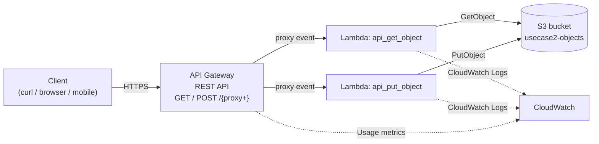

# L30 — Serverless Enterprise Use Case 2 — Architecture (API Gateway, AWS Lambda, S3)

> **Author:** Prem Vishnoi &lt;pvishnoi@avilx.com&gt;
> **Section:** 8 (Enterprise Use Case 2)
> **Duration target:** 1:01

## Prereqs

- Sections 1–7 of this course. You should already know what a REST API
  is, what API Gateway stages are, and how to deploy a Lambda function
  via the console or boto3.

## Key terms

- **Amazon API Gateway** — managed front door that exposes HTTPS
  endpoints and proxies them to backends (Lambda, HTTP services, etc.).
- **AWS Lambda** — event-driven, pay-per-invocation compute. The
  function code lives in the handler `lambda_function.lambda_handler`.
- **Amazon S3** — durable object storage with a flat namespace
  (bucket → key). Cheap, unlimited, and the natural "database" for a
  CRUD demo.
- **REST API (API Gateway v1)** — the older, fully-featured API type.
  Still the right choice for API Keys / Usage Plans (we use it here).
- **API proxy event** — the JSON shape API Gateway hands to Lambda when
  you choose `Use Lambda Proxy Integration`.

## Lecture

This section implements **Use Case 2**: a small serverless CRUD API
that stores and retrieves JSON documents in S3. Everything is fully
managed — no EC2, no load balancer, no operating system.

### Architecture

### Request flow (high level)

1. The client sends `GET https://api.../{proxy+}` or `POST
   https://api.../{proxy+}` with an `x-api-key` header.
2. API Gateway matches the method on the `{proxy+}` resource, applies
   the API Key + Usage Plan throttling, and invokes the right Lambda
   with a **proxy event**.
3. The Lambda reads `event.queryStringParameters`, `event.pathParameters`,
   or `event.body` to figure out which S3 key to touch.
4. The Lambda calls S3 (`GetObject` or `PutObject`) using an IAM
   execution role and a response is returned to API Gateway.
5. API Gateway serializes the lambda's return value into the HTTPS
   response to the client.

### Why these three services?

| Service | Role in this use case |
|---|---|
| **API Gateway** | Public HTTPS endpoint, request validation, throttling, API Keys, CloudWatch metrics. |
| **Lambda** | Stateless business logic; auto-scales per request; pay per invocation. |
| **S3** | Durable object store; versioning-friendly; ideal for JSON blobs. |

In L31 we build the first cut — a `GET / POST /{proxy+}` API with two
Lambdas and one IAM role. In L32 we add query string parameters and
mapping templates. In L33–L34 we add an API Key + Usage Plan on top.

### Why not DynamoDB?

DynamoDB is the right tool when you need queries (filters, GSIs,
transactions, sub-10 ms reads). For a teaching CRUD over arbitrary
JSON documents that the client supplies a key for, **S3 is simpler and
cheaper**, and lets us focus on API Gateway mechanics. The same
patterns apply if you swap S3 for DynamoDB or RDS later.

## Hands-on

Nothing to do in this lecture. The next one (L31) builds the entire
stack from the AWS console.

## Quiz prep

- What three AWS services make up Use Case 2?
- Which resource path captures any path segment? (`{proxy+}`)
- Why does the Lambda need an IAM execution role?

## Further reading

- [Amazon API Gateway — REST API](https://docs.aws.amazon.com/apigateway/latest/developerguide/welcome.html)
- [AWS Lambda execution role](https://docs.aws.amazon.com/lambda/latest/dg/lambda-intro-execution-role.html)
- [S3 GetObject / PutObject API reference](https://docs.aws.amazon.com/AmazonS3/latest/API/API_Operations_Amazon_Simple_Storage_Service.html)