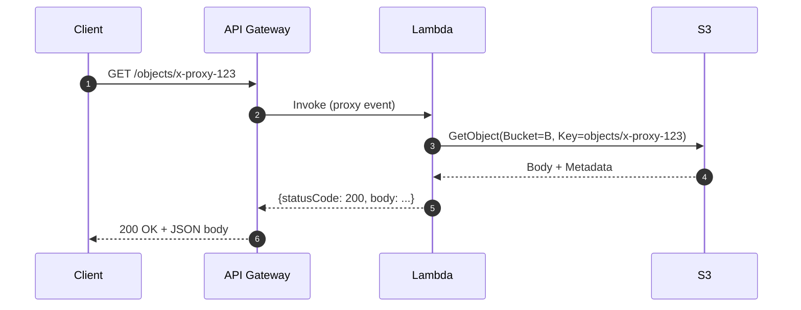

# L31 — S3, Lambda and API Gateway — Part 1

> **Author:** Prem Vishnoi &lt;pvishnoi@avilx.com&gt;
> **Section:** 8 (Enterprise Use Case 2)
> **Duration target:** 12:29

## Prereqs

- L25–L30. You should already know what a REST API, resource, method,
  and integration are. You should have built at least one Lambda before
  (section 4).

## Key terms

- **Resource** — a path component in API Gateway (e.g. `/`, `/{proxy+}`).
- **Method** — an HTTP verb attached to a resource (`GET`, `POST`, …).
- **Integration type** — how the method talks to its backend. We always
  use `Lambda Proxy Integration` so the whole event arrives as a JSON
  `event` dict in our handler.
- **Lambda execution role** — the IAM role Lambda *assumes* to run your
  code and to call AWS APIs (here: `s3:GetObject`, `s3:PutObject`).
- **API Gateway invoke permission** — the resource policy on the
  Lambda that allows API Gateway's source-ARN to invoke it. Without
  this, API Gateway gets a `403 Invalid permissions` error.
- **Stage** — a named pointer to a deployment (`prod`, `dev`, `staging`).
  Stages are what gets a public invoke URL.

## Lecture

In this lecture we build the **first version of Use Case 2** end to end:

```
GET  /{proxy+}  →  api_get_object  (read object from S3)
POST /{proxy+}  →  api_put_object  (write body to S3)
```

We use the `{proxy+}` greedy path variable so any URL works
(`/orders/123`, `/products/abc`, …) — API Gateway will route **every**
method on **any** path to our Lambda. The Lambda then uses the path or
the body to figure out which S3 key to read or write.

### High-level flow



### Step 1 — Create the S3 bucket

In the console: **S3 → Create bucket → `usecase2-objects-<your-initials>`**,
region `us-east-1`, default settings (Block *all* public access ON).
You can also create it from a Lambda via boto3 (we did this in L13).

### Step 2 — Create the Lambda execution role

In **IAM → Roles → Create role**:

- Trusted entity: **Lambda**.
- Permissions policy (inline, JSON):

```json
{
  "Version": "2012-10-17",
  "Statement": [
    {
      "Effect": "Allow",
      "Action": ["s3:GetObject", "s3:PutObject", "s3:ListBucket"],
      "Resource": [
        "arn:aws:s3:::usecase2-objects-<your-initials>",
        "arn:aws:s3:::usecase2-objects-<your-initials>/*"
      ]
    },
    {
      "Effect": "Allow",
      "Action": [
        "logs:CreateLogGroup",
        "logs:CreateLogStream",
        "logs:PutLogEvents"
      ],
      "Resource": "*"
    }
  ]
}
```

Name the role `LambdaModelRoleUseCase2`.

### Step 3 — Lambda 1: `api_put_object`

This Lambda writes whatever body it receives to the S3 key supplied in
the URL path. The full code lives in
`../code/api_put_object/lambda_function.py`:

```python
# code/api_put_object/lambda_function.py
"""Write the request body to S3 at a key derived from the URL path.

API Gateway sends a proxy event of shape:
  {"pathParameters": {"proxy": "<key>"}, "body": "<raw body>", ...}

We respond with {"statusCode": 200, "body": "..."} so API Gateway
serializes it as the HTTP response.
"""
import base64
import json
import logging
import os
import boto3

LOG = logging.getLogger()
LOG.setLevel(logging.INFO)

BUCKET = os.environ["BUCKET_NAME"]
_s3 = boto3.client("s3")


def _decode_body(event: dict) -> str:
    body = event.get("body", "") or ""
    if event.get("isBase64Encoded"):
        body = base64.b64decode(body).decode("utf-8")
    return body


def lambda_handler(event: dict, context) -> dict:
    path_params = event.get("pathParameters") or {}
    proxy = (path_params.get("proxy") or "").strip("/")
    if not proxy:
        return {
            "statusCode": 400,
            "body": json.dumps({"error": "missing key in path"}),
        }

    body = _decode_body(event)
    _s3.put_object(Bucket=BUCKET, Key=proxy, Body=body.encode("utf-8"))

    LOG.info("wrote s3://%s/%s (%d bytes)", BUCKET, proxy, len(body))
    return {
        "statusCode": 200,
        "body": json.dumps({"key": proxy, "bytes": len(body)}),
    }
```

The handler is intentionally tiny: it pulls the `proxy` path parameter,
decodes the body if it's base64, and calls `put_object`. Any non-2xx
becomes a JSON error body with the corresponding `statusCode`.

### Step 4 — Lambda 2: `api_get_object`

```python
# code/api_get_object/lambda_function.py
"""Read an S3 object whose key is the URL path, return content + metadata."""
import json
import logging
import os
import boto3
from botocore.exceptions import ClientError

LOG = logging.getLogger()
LOG.setLevel(logging.INFO)

BUCKET = os.environ["BUCKET_NAME"]
_s3 = boto3.client("s3")


def lambda_handler(event: dict, context) -> dict:
    path_params = event.get("pathParameters") or {}
    proxy = (path_params.get("proxy") or "").strip("/")
    if not proxy:
        return {
            "statusCode": 400,
            "body": json.dumps({"error": "missing key in path"}),
        }

    try:
        resp = _s3.get_object(Bucket=BUCKET, Key=proxy)
    except ClientError as e:
        code = e.response.get("Error", {}).get("Code")
        if code == "NoSuchKey":
            return {
                "statusCode": 404,
                "body": json.dumps({"error": "not found", "key": proxy}),
            }
        raise

    body = resp["Body"].read().decode("utf-8")
    meta = {k: v for k, v in resp.get("Metadata", {}).items()}
    return {
        "statusCode": 200,
        "headers": {"Content-Type": resp.get("ContentType", "application/json")},
        "body": json.dumps(
            {"key": proxy, "content": body, "metadata": meta,
             "last_modified": resp["LastModified"].isoformat()}
        ),
    }
```

### Step 5 — Configure the Lambdas

For both functions:
- **Environment variable:** `BUCKET_NAME = usecase2-objects-<your-initials>`.
- **Execution role:** `LambdaModelRoleUseCase2`.
- **Timeout:** 5 seconds (we only do one S3 call).
- **Memory:** 128 MB is fine.

### Step 6 — Create the REST API

In **API Gateway → Create API → REST API**:

- Name: `ServerlessCRUD`.
- Endpoint type: **Regional** (or Edge, depending on your account).
- IP address type: IPv4.

### Step 7 — Resources and methods

1. **Actions → Create Resource** → Resource Name: `{proxy}`, Path:
   `/{proxy+}`, Enable API Gateway CORS: no.
2. On `/{proxy+}` → **Create Method**:
   - **GET** → Integration type: Lambda Function, Lambda Proxy: ✓,
     Lambda: `api_get_object`.
   - **POST** → Integration type: Lambda Function, Lambda Proxy: ✓,
     Lambda: `api_put_object`.
3. **Actions → Deploy API** → Deployment stage: `[New Stage]`, Stage
   name: `prod`. Note the **Invoke URL** — this is your public
   endpoint.

### Step 8 — Test it

```bash
# Write
curl -X POST "$INVOKE_URL/test-object" \
     -H "Content-Type: application/json" \
     -d '{"hello":"world"}'

# Read
curl "$INVOKE_URL/test-object"
```

You should see:

```json
{"key":"test-object","bytes":17}
{"key":"test-object","content":"{\"hello\":\"world\"}","metadata":{},"last_modified":"2026-..."}
```

### Common pitfalls

| Symptom | Cause | Fix |
|---|---|---|
| `403 Invalid permissions` from API Gateway | Missing `apigateway.amazonaws.com` invoke permission on the Lambda | Re-deploy the API; API Gateway writes the permission the first time it invokes. |
| `500 Internal Server Error` with no log | Lambda failed during init (e.g. `BUCKET_NAME` not set) | Check CloudWatch Logs for the function — not API Gateway logs. |
| `403 Forbidden` from S3 | Execution role not granted `s3:GetObject` / `s3:PutObject` | Edit the IAM policy; wait ~10 s for IAM eventual consistency. |

## Hands-on

Work through `code/api_put_object/` and `code/api_get_object/`. Each has
a `README.md` and a `moto`-backed pytest:

```bash
cd code/api_get_object
python -m pytest -v
```

The tests use `moto.mock_aws` to stub S3 so you don't need a real AWS
account.

## Quiz prep

- What does `{proxy+}` mean in an API Gateway resource path?
- Why do we set `isBase64Encoded` carefully?
- What's the difference between an IAM **execution** role and an
  API Gateway **invoke** permission?

## Further reading

- [Set up Lambda proxy integration](https://docs.aws.amazon.com/apigateway/latest/developerguide/set-up-lambda-proxy-integrations.html)
- [Tutorial: Build a REST API with Lambda proxy integration](https://docs.aws.amazon.com/apigateway/latest/developerguide/apigateway-get-started-step-by-step.html)
- [Working with AWS Lambda proxy integrations for REST APIs](https://docs.aws.amazon.com/apigateway/latest/developerguide/lambda-proxy-integration.html)