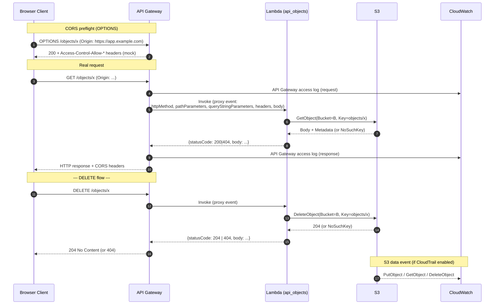

# L31a — Enterprise Use Case using API Gateway, AWS Lambda and S3 — Part 3

> **Author:** Prem Vishnoi &lt;pvishnoi@avilx.com&gt;
> **Section:** 8 (Enterprise Use Case 2)
> **Duration target:** 9:43
> **Slot:** between L31 (Part 1) and L32 (Part 2). The published curriculum
> labels the "Part 2" lecture as L32 in section 8; this script is the
> closing Part 3, which wraps the build before we layer security on top
> in section 9.

## Prereqs

- L31 — the working `GET / POST /{proxy+}` API (read / write via
  `api_get_object`, `api_put_object`).
- L32 — query string parameters, mapping templates, the L32-style
  handler that resolves the S3 key from `?key=` or the `{proxy+}` path.
- You should have an existing REST API deployed to a `prod` stage with
  an invoke URL.

## Key terms

- **CORS preflight (`OPTIONS`)** — a browser sends an `OPTIONS` request
  *before* the real cross-origin request. API Gateway can answer it
  itself (mock integration) so the request never reaches the Lambda.
- **Proxy event** — the JSON document API Gateway forwards to a Lambda
  Proxy integration. Contains `httpMethod`, `pathParameters`,
  `queryStringParameters`, `headers`, `body`, `isBase64Encoded`, plus
  request-context metadata.
- **4xx vs. 5xx** — `4xx` is the *client's* fault (bad key, missing
  object, malformed body). `5xx` is the *server's* fault (Lambda
  crash, S3 permission denied, downstream timeout). Returning the
  correct family is what makes the API debuggable.
- **Access log** — API Gateway's per-request log line. Disabled by
  default; once enabled it goes to CloudWatch Logs under the log
  group `API-Gateway-Execution-Logs_<api-id>/<stage>`.
- **Data event** — S3's per-object audit trail (PutObject, GetObject,
  DeleteObject). Off by default; you turn it on by creating a
  CloudTrail trail that includes the S3 bucket.

## Lecture

This is the final part of the Use Case 2 build. In L31 we wired
`POST /{proxy+}` and `GET /{proxy+}` to two separate Lambdas. In L32 we
refactored the GET handler to also accept `?key=` and added a Velocity
mapping template. In **this** lecture we close the loop:

1. Walk the **full request flow** end to end so you can see exactly
   where each header, query string, body byte, and log line comes from.
2. Add a **unified handler** that does both `GET` and `DELETE` on the
   same `/{proxy+}` resource (L31 and L32 each had one verb per
   function — production code rarely does).
3. Cover **CORS** for browser callers.
4. Cover the **error model**: 4xx vs. 5xx, what API Gateway returns
   when a Lambda throws, and where each failure shows up in
   CloudWatch.
5. Smoke-test the whole thing with `curl` and Postman.

At the end of this lecture **Use Case 2 is functionally complete**:
you can read, write, and delete S3 objects through a public HTTPS API.
The next section (L36–L39) layers Lambda Authorizer and Cognito
Authorizer on top of this same stack — none of the Lambda code from
L31–L31a needs to change.

### Full request flow

The diagram below shows the path of a single `GET` (left) and a
single `DELETE` (right) request, including the CORS preflight the
browser sends first.



Two things to notice:

- The `OPTIONS` preflight is **answered by API Gateway itself** (a
  *mock* integration). The Lambda is never invoked. That's why
  preflights are essentially free.
- The CloudWatch arrow is *per layer*. There are three independent log
  streams: API Gateway access log, Lambda function log, and (if
  CloudTrail is on) the S3 data event. When something breaks, you
  pick the right one based on whether the failure happened at the
  edge, in the function, or in S3.

### The proxy event — what your Lambda actually sees

API Gateway's proxy event for a `GET /objects/orders/123?version=v2`
request looks like this (heavily abbreviated):

```json
{
  "httpMethod": "GET",
  "path": "/objects/orders/123",
  "pathParameters": { "proxy": "objects/orders/123" },
  "queryStringParameters": { "version": "v2" },
  "multiValueQueryStringParameters": { "version": ["v2"] },
  "headers": {
    "Accept": "application/json",
    "Host": "abc123.execute-api.us-east-1.amazonaws.com",
    "User-Agent": "curl/8.4.0",
    "X-Amz-Date": "20261010T120000Z"
  },
  "requestContext": {
    "resourceId": "abc",
    "stage": "prod",
    "requestId": "...",
    "identity": { "sourceIp": "203.0.113.42" }
  },
  "isBase64Encoded": false
}
```

Two practical implications:

- The path is in **three** places: `path`, `pathParameters.proxy`, and
  (with greedy `{proxy+}`) the same string. L31's handler reads
  `pathParameters.proxy` because it's the canonical location; the
  L32-style handler falls back to `?key=` from the query string.
- `requestContext.identity.sourceIp` is the *caller's* IP. This is
  what shows up in the API Gateway access log, and (combined with
  the API Key) is what Usage Plan throttling counts against.

### Unified `api_objects` handler (GET + DELETE)

In production, you'd usually have **one** Lambda per resource and let
API Gateway route by HTTP method, instead of one Lambda per verb. The
code in `code/api_pt3_handlers/lambda_function.py` is exactly that:
a single handler that branches on `event["httpMethod"]`. The full
file is ~110 lines and is fully testable with `moto`; here is the
shape of it:

```python
# code/api_pt3_handlers/lambda_function.py (abridged)
from __future__ import annotations

import json
import logging
import os
from typing import Any

import boto3
from botocore.exceptions import ClientError

LOG = logging.getLogger()
LOG.setLevel(logging.INFO)

BUCKET: str = os.environ["BUCKET_NAME"]
_s3 = boto3.client("s3")

CORS_HEADERS = {
    "Access-Control-Allow-Origin": "*",
    "Access-Control-Allow-Methods": "GET,DELETE,OPTIONS",
    "Access-Control-Allow-Headers": "Content-Type,Authorization",
}


def _resolve_key(event: dict[str, Any]) -> str:
    q = event.get("queryStringParameters") or {}
    if q.get("key"):
        return q["key"]
    path = event.get("pathParameters") or {}
    return (path.get("proxy") or "").strip("/")


def _resp(status: int, body: dict[str, Any]) -> dict[str, Any]:
    return {
        "statusCode": status,
        "headers": {**CORS_HEADERS, "Content-Type": "application/json"},
        "body": json.dumps(body),
    }


def _get(event: dict[str, Any]) -> dict[str, Any]:
    key = _resolve_key(event)
    if not key:
        return _resp(400, {"error": "key is required (?key=... or /<key>)"})
    try:
        obj = _s3.get_object(Bucket=BUCKET, Key=key)
    except ClientError as exc:
        if exc.response.get("Error", {}).get("Code") in ("NoSuchKey", "404"):
            return _resp(404, {"error": "not found", "key": key})
        LOG.exception("S3 GetObject failed")
        raise  # → 5xx (see "Error model" below)
    return _resp(200, {
        "key": key,
        "content": obj["Body"].read().decode("utf-8"),
        "size": obj.get("ContentLength"),
    })


def _delete(event: dict[str, Any]) -> dict[str, Any]:
    key = _resolve_key(event)
    if not key:
        return _resp(400, {"error": "key is required (?key=... or /<key>)"})
    # Pre-check existence so we can return a friendly 404. S3 itself
    # is idempotent on DELETE — DeleteObject on a missing key succeeds
    # silently — but our API contract is friendlier with 404.
    try:
        _s3.head_object(Bucket=BUCKET, Key=key)
    except ClientError as exc:
        if exc.response.get("Error", {}).get("Code") in ("NoSuchKey", "404", "NotFound"):
            return _resp(404, {"error": "not found", "key": key})
        LOG.exception("S3 HeadObject failed")
        raise
    _s3.delete_object(Bucket=BUCKET, Key=key)
    return _resp(204, {"key": key, "deleted": True})


def lambda_handler(event: dict[str, Any], context: Any) -> dict[str, Any]:
    method = (event.get("httpMethod") or "").upper()
    LOG.info("method=%s path=%s", method, event.get("path"))
    if method == "GET":
        return _get(event)
    if method == "DELETE":
        return _delete(event)
    return _resp(405, {"error": f"method {method} not allowed"})
```

Two deliberate choices:

- **Re-raise on unexpected `ClientError`.** A `NoSuchKey` we map to
  `404`. Anything else (e.g. `AccessDenied`, throttling) propagates,
  API Gateway turns it into `500`, and CloudWatch gets the full
  traceback. That is the *correct* 4xx-vs-5xx split.
- **Hard-coded CORS headers in the response.** The `OPTIONS` preflight
  is answered by API Gateway itself (next subsection), but the *real*
  response still has to include the `Access-Control-Allow-Origin`
  header or the browser will discard it. Putting it in `_resp` means
  we can never forget it.

### CORS

In the API Gateway console, on the `/{proxy+}` resource:

1. **Actions → Enable CORS** (or manually: add an `OPTIONS` method).
2. Choose `OPTIONS` → Integration type: **Mock**.
3. Return headers: `Access-Control-Allow-Origin`, `-Methods`,
   `-Headers`. Status `200`.
4. Re-deploy the API.

For a real API, replace `*` with your front-end origin. If the
preflight returns wrong headers, the browser will *never* send the
real request — the symptom is a `Failed to fetch` error in the
console, not a 4xx/5xx in the network tab.

### Error model

| Failure                                              | Lambda returns | API Gateway returns | CloudWatch stream                           |
|------------------------------------------------------|----------------|---------------------|---------------------------------------------|
| Missing key in path / query                          | `400`          | `400`               | Lambda log: `key is required`               |
| Key not in S3                                        | `404`          | `404`               | Lambda log: `not found`                     |
| `DELETE` of missing key                              | `404`          | `404`               | Lambda log: `not found`                     |
| Wrong HTTP verb (e.g. `PATCH`)                       | `405`          | `405`               | Lambda log: `method PATCH not allowed`      |
| Lambda throws (e.g. `AccessDenied` on the S3 bucket) | *uncaught*     | `500`               | Lambda log: full traceback                  |
| Lambda timeout                                       | *timeout*      | `502` / `504`       | Lambda log + API GW log: `Task timed out`   |
| API Gateway throttled (Usage Plan exceeded)          | —              | `429`               | API GW log: `Quota Exceeded` / `Rate Exceeded` |

Rule of thumb: **if you caught the error in your code, it's 4xx. If
you didn't, it's 5xx.** The reason to keep them straight is that
CloudWatch alarms on `5xx` should page someone; alarms on `4xx` should
not.

### Smoke test

```bash
INVOKE="https://abc123.execute-api.us-east-1.amazonaws.com/prod"

# 1) CORS preflight
curl -i -X OPTIONS "$INVOKE/test" \
     -H "Origin: https://app.example.com" \
     -H "Access-Control-Request-Method: GET"

# 2) 404 when the object is missing
curl -i "$INVOKE/does-not-exist"

# 3) Round-trip GET
curl -X POST  "$INVOKE/orders/1" \
     -H "Content-Type: application/json" \
     -d '{"id":1,"total":99.95}'
curl -i "$INVOKE/orders/1"

# 4) DELETE
curl -i -X DELETE "$INVOKE/orders/1"

# 5) DELETE again — 404
curl -i -X DELETE "$INVOKE/orders/1"
```

In Postman, the same five calls work as a folder with five requests;
Postman is useful here because it shows you the response headers
(CORS ones included) which `curl -i` flattens to a wall of text.

### Common pitfalls

| Symptom                                                       | Cause                                                  | Fix                                                                  |
|---------------------------------------------------------------|--------------------------------------------------------|----------------------------------------------------------------------|
| `OPTIONS` returns `403` or `Method Not Allowed`               | You didn't enable CORS / add a mock `OPTIONS` method   | Re-run "Enable CORS" on `/{proxy+}`; redeploy                        |
| Browser console: `Failed to fetch`, network tab: nothing      | CORS preflight failed; browser never sent the request  | Check the `OPTIONS` response headers                                 |
| API Gateway `500` with an empty body                          | Lambda threw during init (e.g. `BUCKET_NAME` unset)    | Inspect the Lambda log group, not the API Gateway log group          |
| `AccessDeniedException` from S3                               | Execution role missing `s3:DeleteObject`              | Add `s3:DeleteObject` to the IAM policy; wait ~10 s                  |
| `409 BucketNotEmpty` (only if you also want to delete buckets)| Trying to delete a non-empty bucket                   | Out of scope here — this is a `Bucket`, not an `Object`              |

## Hands-on

```bash
cd code/api_pt3_handlers
python -m pytest -v
```

The suite has four cases (GET 200, GET 404, DELETE 204, DELETE 404)
plus a method-not-allowed case, all driven by `moto.mock_aws`.

If you want to wire this in front of the existing REST API:

1. Replace `api_get_object` and the existing `POST` Lambda with the
   single `api_objects` function (or add it as a *new* function and
   point `GET` and `DELETE` at it).
2. Add a `DELETE` method on `/{proxy+}` → Lambda Proxy → `api_objects`.
3. Enable CORS as described above.
4. Re-deploy to `prod` and re-run the smoke test.

## Quiz prep

- What HTTP status does API Gateway return for an unhandled Lambda
  exception? (Answer in the section quiz.)
- Where does the API Gateway access log go by default? (Answer in the
  section quiz.)
- Why is the `OPTIONS` preflight served by API Gateway, not the
  Lambda?
- What's the rule of thumb that separates a 4xx from a 5xx?

## Further reading

- [CORS in API Gateway](https://docs.aws.amazon.com/apigateway/latest/developerguide/how-to-cors.html)
- [Setting up CloudWatch logging for REST APIs](https://docs.aws.amazon.com/apigateway/latest/developerguide/set-up-logging.html)
- [Logging API Gateway REST API calls with CloudTrail](https://docs.aws.amazon.com/apigateway/latest/developerguide/cloudtrail.html)
- [S3 server access logging vs. CloudTrail data events](https://docs.aws.amazon.com/AmazonS3/latest/userguide/logging-channels.html)

---

**Use Case 2 is complete. Next we secure it — section 9.**
