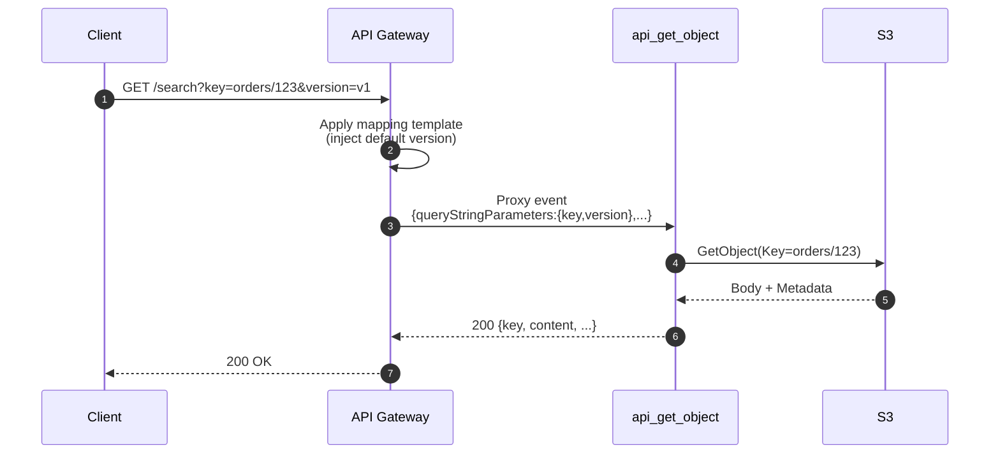

# L32 — S3, Lambda and API Gateway with Query String Parameters — Part 2

> **Author:** Prem Vishnoi &lt;prem.vishnoi.example.com&gt;
> **Section:** 8 (Enterprise Use Case 2)
> **Duration target:** 9:43

## Prereqs

- L31 — the working `GET / POST /{proxy+}` API. The full code lives in
  `code/api_get_object/` and `code/api_put_object/`.

## Key terms

- **Query string parameter** — `?key=foo&limit=10`. API Gateway forwards
  them in `event.queryStringParameters` (dict) or
  `event.multiValueQueryStringParameters` (list-of-lists).
- **Path parameter** — captured from `{name}` in the resource path.
  Greedy `{proxy+}` matches any number of segments.
- **Mapping template** — a Velocity template (API Gateway v1) that
  transforms the incoming request before the integration. We use one
  in this lecture to inject defaults.
- **Integration request** — the message that actually hits the Lambda
  (or HTTP backend). Mapping templates live here.
- **Content-Type negotiation** — choosing JSON vs. raw text vs.
  base64 binary based on `Content-Type` / `Accept` headers.

## Lecture

In L31 we always read the **S3 key from the URL path**. In real APIs
the key is more often in the **query string** (because the path is
reserved for resource names, e.g. `/search?q=hello&page=2`). This
lecture extends the GET endpoint to support:

```
GET /{proxy+}?key=orders/123      ← key from query string (preferred)
GET /{proxy+}/orders/123          ← key from path (fallback)
```

We also add a **mapping template** to inject a default
`?version=v1` if the caller didn't send one. Mapping templates are
API Gateway v1 only — they don't exist in HTTP APIs (v2) or REST APIs
in the same way.

### GET flow with query string



### Updated `api_get_object` handler

The Lambda now decides whether the key is in the query string or the
path. Either is valid; query string wins.

```python
# code/api_get_object/lambda_function.py (updated)
import json
import logging
import os
import boto3
from botocore.exceptions import ClientError

LOG = logging.getLogger()
LOG.setLevel(logging.INFO)
BUCKET = os.environ["BUCKET_NAME"]
_s3 = boto3.client("s3")


def _resolve_key(event: dict) -> str:
    """Prefer ?key=... over the {proxy+} path."""
    q = event.get("queryStringParameters") or {}
    if "key" in q and q["key"]:
        return q["key"]
    path = event.get("pathParameters") or {}
    return (path.get("proxy") or "").strip("/")


def lambda_handler(event: dict, context) -> dict:
    key = _resolve_key(event)
    if not key:
        return {
            "statusCode": 400,
            "body": json.dumps({"error": "key is required (?key=... or /<key>)"}),
        }

    # Optional: use the ?version=... param as the S3 versionId
    q = event.get("queryStringParameters") or {}
    version_id = q.get("version")

    try:
        kwargs = {"Bucket": BUCKET, "Key": key}
        if version_id:
            kwargs["VersionId"] = version_id
        resp = _s3.get_object(**kwargs)
    except ClientError as e:
        code = e.response.get("Error", {}).get("Code")
        if code == "NoSuchKey":
            return {
                "statusCode": 404,
                "body": json.dumps({"error": "not found", "key": key}),
            }
        raise

    body = resp["Body"].read().decode("utf-8")
    return {
        "statusCode": 200,
        "headers": {
            "Content-Type": resp.get("ContentType", "application/json"),
            "X-S3-Version-Id": resp.get("VersionId", ""),
        },
        "body": json.dumps({
            "key": key,
            "content": body,
            "last_modified": resp["LastModified"].isoformat(),
            "metadata": dict(resp.get("Metadata", {})),
        }),
    }
```

### Adding a mapping template

In the API Gateway console:

1. Select your `GET` method on `/{proxy+}`.
2. **Integration Request → Mapping Templates → Add mapping template**.
3. Content-Type: `application/json`.
4. Paste this Velocity template:

```velocity
#set($allParams = $input.params())
{
  "queryStringParameters": {
    #foreach($key in $allParams.keySet())
      "$key": "$util.escapeJavaScript($allParams.get($key))"
      #if($foreach.hasNext),#end
    #end
  },
  "pathParameters": "$input.params().path",
  "version": "v1"
}
```

What this does:

- Forwards every query string parameter as a JSON object.
- Forwards the path parameters verbatim.
- Injects a default `version: v1` so every event has a value, even if
  the client didn't send one.

### Try it

```bash
INVOKE="https://abc123.execute-api.us-east-1.amazonaws.com/prod"

# 1) Write a doc with POST
curl -X POST "$INVOKE/test" \
     -H "Content-Type: application/json" \
     -d '{"hello":"world","n":42}'

# 2) Read it back via query string
curl "$INVOKE/search?key=test"

# 3) Read it back via path (still works)
curl "$INVOKE/test"

# 4) 404 when key is missing
curl -i "$INVOKE/search"
```

### Why a mapping template when the proxy event already has everything?

Three good reasons:

1. **Default values** — you can inject a default region, a build
   version, a tenant id, etc. without forcing the client to send them.
2. **Renaming** — turn a friendly `?file=...` into the S3-internal
   `?key=...` and keep the public contract stable.
3. **Bypass limits** — proxy integration passes the whole query string
   through, but if a client sends a malformed value you can pre-validate
   it before the Lambda even runs.

### When NOT to use a mapping template

- When you want a 400 response on a missing required parameter without
  paying for a Lambda invocation. Use **request validators** instead.
- When you're on **HTTP APIs (v2)** — they don't support mapping
  templates. Use parameter mapping (a different, simpler mechanism).

## Hands-on

1. Deploy the updated `code/api_get_object/` handler.
2. Add the mapping template to the `GET` method.
3. Re-test with both query string and path styles.

## Quiz prep

- Where in the proxy event does API Gateway put query string params?
- What's the difference between `queryStringParameters` and
  `multiValueQueryStringParameters`?
- When would you use a request validator instead of a mapping template?

## Further reading

- [Set up request validation in API Gateway](https://docs.aws.amazon.com/apigateway/latest/developerguide/api-gateway-method-request-validation.html)
- [API Gateway mapping template reference](https://docs.aws.amazon.com/apigateway/latest/developerguide/api-gateway-mapping-template-reference.html)
- [Tutorials for API Gateway mapping templates](https://docs.aws.amazon.com/apigateway/latest/developerguide/rest-api-data-transformations.html)