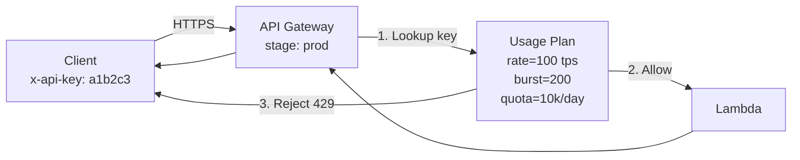

# L33 — API Keys and Usage Plans — Theory

> **Author:** Prem Vishnoi &lt;prem.vishnoi.example.com&gt;
> **Section:** 8 (Enterprise Use Case 2)
> **Duration target:** 4:10

## Prereqs

- L25–L32. You should know what an API Gateway stage is and how a
  REST API is deployed.

## Key terms

- **API Key** — an opaque string (e.g. `a1b2c3d4e5f6...`) that the
  client sends in the `x-api-key` header. It identifies the *caller*
  for metering, not for authentication.
- **Usage Plan** — a bundle of throttling and quota limits that is
  associated with one or more API stages. A Usage Plan says: "for any
  API Key attached to this plan, the caller may make N requests / sec
  and M requests / month."
- **Throttling** — rate limit per second (steady-state + burst).
- **Quota** — long-term limit per day / week / month. Enforced in UTC.
- **API Key source** — currently only `HEADER` (`x-api-key`) for REST
  APIs. HTTP APIs add `AUTHORIZER` as an alternative.
- **Stage association** — links a Usage Plan to one or more deployed
  stages. Without this, a Key has no plan applied.
- **Method throttle override** — per-method overrides that supersede
  the Usage Plan defaults.

## Lecture

API Keys in API Gateway are a **metering / throttling** mechanism, **not
an authentication mechanism**. This is the most common point of
confusion.

> An API Key tells us "who" is calling (so we can throttle and bill).
> It does **not** tell us "whether they are who they say they are".

For real authentication you need one of:

- **IAM auth** (SigV4) — strong, works for AWS SDK callers, awkward
  for browsers.
- **Lambda Authorizer** (formerly "Custom Authorizer") — we cover this
  in L36–L37.
- **Cognito User Pool Authorizer** — we cover this in L38–L39.
- **Mutual TLS** — for private APIs.

API Keys are still useful for:

| Use case | Why a key helps |
|---|---|
| Public REST API | Cheap way to throttle noisy / abusive callers. |
| Internal API | Lets you attribute traffic to a team or product by key. |
| Billing / metering | CloudWatch usage metrics are per-key. |
| Soft "front gate" | Discourages casual abuse; *not* a security boundary. |

### How a request flows through a Usage Plan

Steps:

1. **Extract** the `x-api-key` header. If absent, API Gateway returns
   `403 Forbidden` (when an API Key is *required* on the method).
2. **Look up** the key in the Usage Plan. If the key isn't associated
   with a plan that covers the current stage, you get `403 Forbidden`
   with `Invalid API Key`.
3. **Check** throttling and quota. If either is exceeded, you get
   `429 Too Many Requests` with `Rate Exceeded` or `Quota Exceeded`.
4. **Invoke** the integration and return the response.

### Throttling vs. Quota

| | Throttling | Quota |
|---|---|---|
| Unit | Requests / second | Requests / period |
| Typical values | 10 000 tps (account default) | 1 000 000 / month (free) |
| Resets | Continuous (token bucket) | At period start (UTC) |
| Visible in CloudWatch | `4XXError` + `Throttle` | `QuotaExceeded` |

When the account-level throttling is exceeded, every method on every
API in that account gets a `429`. The Usage Plan throttling is per-key,
per-stage, and is the more useful knob.

### Method-level throttling

You can also set throttling on a single method (in the console:
**Method → Throttle**). Method-level overrides take precedence over
the Usage Plan default. The override applies to *all* callers of that
method, not just one key.

### Common mistakes

- Treating the API Key as a secret. It is — but **a leaked key is
  equivalent to a leaked URL**. There is no signing, no expiry, and
  no rotation story. Rotate by issuing a new key, deprecating the
  old one in the plan, then deleting the old one.
- Setting throttling too low. Account default is 10 000 tps across
  all APIs; if you set a Usage Plan to 1 tps, every caller shares
  that 1 tps.
- Forgetting to **deploy the API** after enabling API Key required
  on a method. The change doesn't take effect until next deployment.

## Hands-on

Nothing hands-on in this lecture. L34 walks through the boto3 code
end-to-end.

## Quiz prep

- Is an API Key an authentication mechanism? (No — it's metering.)
- What HTTP status do you get for a throttled request? (`429`)
- What's the difference between throttling and quota?

## Further reading

- [API Gateway — Create and use usage plans with API keys](https://docs.aws.amazon.com/apigateway/latest/developerguide/api-gateway-api-usage-plans.html)
- [Throttle API requests for better throughput](https://docs.aws.amazon.com/apigateway/latest/developerguide/api-gateway-request-throttling.html)
- [Best practices for API keys and usage plans](https://docs.aws.amazon.com/whitepapers/latest/aws-serverless-multi-tier-architectures-api-gateway-lambda/api-gateway-best-practices.html)