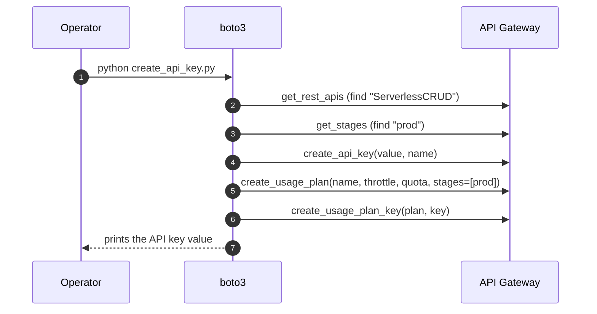

# L34 — API Keys and Usage Plan — Hands On

> **Author:** Prem Vishnoi &lt;prem.vishnoi.example.com&gt;
> **Section:** 8 (Enterprise Use Case 2)
> **Duration target:** 7:56

## Prereqs

- L33 (theory) and L31 (working `GET / POST /{proxy+}` API).
- The boto3 client for API Gateway v1: `boto3.client("apigateway")`.

## Key terms

- **`apigateway.create_api_key`** — mints a new key. We pass
  `value=...` for a known string, or omit it to get a generated value
  back in the response.
- **`apigateway.create_usage_plan`** — creates the plan with throttle
  and quota settings.
- **`apigateway.create_usage_plan_key`** — links a key to a plan.
- **`apigateway.update_usage_plan`** — adds stage associations (and
  per-method throttles, if needed).
- **`x-api-key` header** — the only place REST API v1 looks for the key.

## Lecture

In this lecture we take the L31 stack and add an **API Key + Usage Plan**
entirely from Python. The full script lives in
`../code/api_keys_setup/create_api_key.py`.

### What the script does



### The idempotent boto3 script

The script can be run twice without errors: on the second run it
finds the existing key and plan, updates them, and reports.

```python
# code/api_keys_setup/create_api_key.py
"""Idempotently create / update an API Key and a Usage Plan for Use Case 2.

Usage:
    export AWS_REGION=us-east-1
    export API_NAME=ServerlessCRUD
    export STAGE_NAME=prod
    export API_KEY_NAME=usecase2-demo-key
    export USAGE_PLAN_NAME=usecase2-demo-plan
    python create_api_key.py
"""
from __future__ import annotations

import argparse
import logging
import os
from typing import Optional

import boto3
from botocore.exceptions import ClientError

LOG = logging.getLogger("usecase2.api_keys")
logging.basicConfig(level=logging.INFO, format="%(asctime)s %(levelname)s %(message)s")


# ── helpers ────────────────────────────────────────────────────────────
def find_rest_api_id(client, name: str) -> str:
    """Return the API ID of the REST API with the given name, or raise."""
    paginator = client.get_paginator("get_rest_apis")
    for page in paginator.paginate():
        for api in page["items"]:
            if api["name"] == name:
                return api["id"]
    raise RuntimeError(f"REST API named {name!r} not found")


def ensure_api_key(
    client,
    name: str,
    value: Optional[str] = None,
    *,
    enabled: bool = True,
) -> str:
    """Return the API Key ID. Reuses an existing key with the same name."""
    paginator = client.get_paginator("get_api_keys")
    for page in paginator.paginate(includeValue=True):
        for k in page["items"]:
            if k["name"] == name:
                # Update the enabled flag in case it changed
                client.update_api_key(apiKey=k["id"], patchOperations=[
                    {"op": "replace", "path": "/enabled", "value": str(enabled).lower()},
                ])
                LOG.info("reusing existing API Key id=%s name=%s", k["id"], name)
                return k["id"]

    params = {"name": name, "enabled": enabled}
    if value:
        params["value"] = value
    resp = client.create_api_key(**params)
    LOG.info("created new API Key id=%s name=%s", resp["id"], name)
    return resp["id"]


def ensure_usage_plan(
    client,
    name: str,
    *,
    rate_limit: float,
    burst_limit: int,
    quota_limit: int,
    quota_period: str,
    stages: list[dict],
) -> str:
    """Create or update a Usage Plan with the given throttle / quota."""
    paginator = client.get_paginator("get_usage_plans")
    existing = None
    for page in paginator.paginate():
        for p in page["items"]:
            if p["name"] == name:
                existing = p
                break
        if existing:
            break

    if existing:
        plan_id = existing["id"]
        client.update_usage_plan(
            usagePlanId=plan_id,
            patchOperations=[
                {"op": "replace", "path": "/throttle/rateLimit", "value": str(rate_limit)},
                {"op": "replace", "path": "/throttle/burstLimit", "value": str(burst_limit)},
                {"op": "replace", "path": "/quota/limit", "value": str(quota_limit)},
                {"op": "replace", "path": "/quota/period", "value": quota_period},
            ],
        )
        LOG.info("updated existing Usage Plan id=%s name=%s", plan_id, name)
    else:
        resp = client.create_usage_plan(
            name=name,
            throttle={"rateLimit": rate_limit, "burstLimit": burst_limit},
            quota={"limit": quota_limit, "period": quota_period},
            stages=stages,
        )
        plan_id = resp["id"]
        LOG.info("created new Usage Plan id=%s name=%s", plan_id, name)
    return plan_id


def attach_key_to_plan(client, plan_id: str, key_id: str) -> None:
    """No-op if the key is already attached."""
    resp = client.get_usage_plan_keys(usagePlanId=plan_id)
    if any(k["id"] == key_id for k in resp.get("items", [])):
        LOG.info("key %s already attached to plan %s", key_id, plan_id)
        return
    client.create_usage_plan_key(usagePlanId=plan_id, keyId=key_id, keyType="API_KEY")
    LOG.info("attached key %s to plan %s", key_id, plan_id)


# ── main ───────────────────────────────────────────────────────────────
def main() -> int:
    parser = argparse.ArgumentParser()
    parser.add_argument("--api-name", default=os.environ.get("API_NAME", "ServerlessCRUD"))
    parser.add_argument("--stage", default=os.environ.get("STAGE_NAME", "prod"))
    parser.add_argument("--key-name", default=os.environ.get("API_KEY_NAME", "usecase2-demo-key"))
    parser.add_argument("--plan-name", default=os.environ.get("USAGE_PLAN_NAME", "usecase2-demo-plan"))
    parser.add_argument("--rate", type=float, default=50.0, help="requests / sec")
    parser.add_argument("--burst", type=int, default=100, help="burst capacity")
    parser.add_argument("--quota", type=int, default=10_000, help="requests / period")
    parser.add_argument("--quota-period", default="DAY", choices=["DAY", "WEEK", "MONTH"])
    args = parser.parse_args()

    region = os.environ.get("AWS_REGION", "us-east-1")
    client = boto3.client("apigateway", region_name=region)

    api_id = find_rest_api_id(client, args.api_name)
    LOG.info("found REST API id=%s", api_id)

    key_id = ensure_api_key(client, args.key_name, enabled=True)
    plan_id = ensure_usage_plan(
        client,
        args.plan_name,
        rate_limit=args.rate,
        burst_limit=args.burst,
        quota_limit=args.quota,
        quota_period=args.quota_period,
        stages=[{"apiId": api_id, "stage": args.stage}],
    )
    attach_key_to_plan(client, plan_id, key_id)

    # Print the key value so the operator can copy it
    key_resp = client.get_api_key(apiKey=key_id, includeValue=True)
    print()
    print("=" * 60)
    print(f"API ID    : {api_id}")
    print(f"STAGE     : {args.stage}")
    print(f"PLAN ID   : {plan_id}")
    print(f"KEY ID    : {key_id}")
    print(f"KEY VALUE : {key_resp['value']}")
    print("=" * 60)
    return 0


if __name__ == "__main__":
    raise SystemExit(main())
```

### Running the script

```bash
cd code/api_keys_setup
python create_api_key.py
```

Sample output:

```
found REST API id=abc123def
reusing existing API Key id=...
updated existing Usage Plan id=...
key ... already attached to plan ...
============================================================
API ID    : abc123def
STAGE     : prod
PLAN ID   : ghi456jkl
KEY ID    : mno789pqr
KEY VALUE : a1b2c3d4e5f6g7h8
============================================================
```

### Test it

```bash
INVOKE="https://abc123def.execute-api.us-east-1.amazonaws.com/prod"
KEY="a1b2c3d4e5f6g7h8"

# 1) No key → 403 (if method requires API Key)
curl -i "$INVOKE/test-object"

# 2) With key → 200
curl -i -H "x-api-key: $KEY" "$INVOKE/test-object"

# 3) Burn the quota: blast a few hundred requests
for i in $(seq 1 200); do
  curl -s -H "x-api-key: $KEY" "$INVOKE/loop-$i" -o /dev/null
done
# Eventually you'll see 429 with "Rate Exceeded" or "Quota Exceeded"
```

### Verifying in the console

In API Gateway → **API Keys** → click the key → **Usage Plans** tab
should show the plan you just attached. In **Usage Plans** → click
your plan → **Stages** should show the `prod` stage.

### Enabling "API Key Required" on a method

By default, API Keys are *optional*. To enforce:

1. Select the method (e.g. `GET /{proxy+}`).
2. Click **Method Request**.
3. Set **API Key Required** to `true`.
4. **Deploy the API** again — this is required.

After redeploy, calls without `x-api-key` get `403 Forbidden`.

## Hands-on

1. Run `create_api_key.py`.
2. Re-deploy the API with **API Key Required = true** on both methods.
3. Test with and without the key.
4. Inspect CloudWatch metrics: `AWS/ApiGateway` namespace, metric
   `4XXError`, dimension `ApiName=ServerlessCRUD, Stage=prod`.

## Quiz prep

- Why is the script idempotent?
- What's the difference between setting the key on the plan vs. on the
  method? (Method-level `API Key Required` is a binary on/off; the
  plan governs rate and quota.)
- Where in CloudWatch do you see per-key usage? (The dimension is
  `ApiKey`, but you need a usage plan attached to the stage.)

## Further reading

- [boto3 API Gateway client reference](https://boto3.amazonaws.com/v1/documentation/api/latest/reference/services/apigateway.html)
- [Generating SDKs from REST APIs in API Gateway](https://docs.aws.amazon.com/apigateway/latest/developerguide/how-to-generate-sdk.html)
- [Monitoring REST APIs with CloudWatch](https://docs.aws.amazon.com/apigateway/latest/developerguide/monitoring.html)