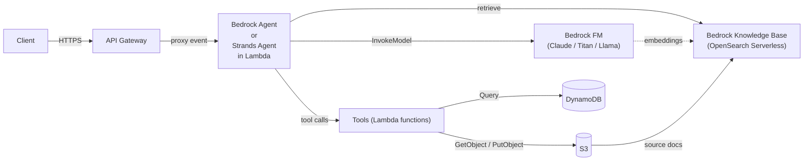
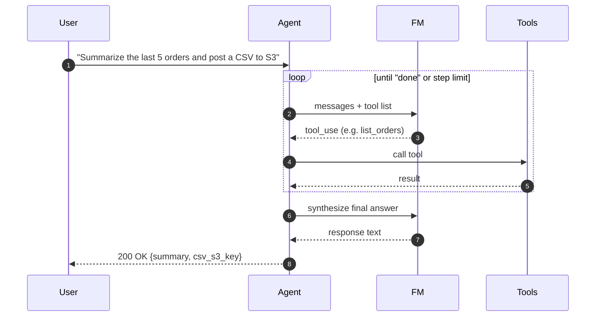

# L35 — Agentic AI Architect Roadmap on AWS: Skills You Need to Learn in 2026 (Optional)

> **Author:** Prem Vishnoi &lt;prem.vishnoi.example.com&gt;
> **Section:** 8 (Enterprise Use Case 2)
> **Duration target:** 10:10
> **Optional:** read at the end of the section if you have time.

## Prereqs

- All sections so far. You should be comfortable with API Gateway,
  Lambda, S3, IAM, and Python (boto3).
- No prior AI/ML experience required.

## Key terms

- **Agentic AI** — a system that can plan, use tools, observe
  results, and iterate without a human in the loop. As opposed to a
  single "prompt → answer" LLM call.
- **Foundational model (FM)** — a large pre-trained model you call
  via an API. On AWS: **Amazon Bedrock** hosts Anthropic Claude, AI21,
  Cohere, Meta Llama, Mistral, Stability AI, and Amazon Titan.
- **Tool use / function calling** — letting the model emit a JSON
  blob describing which function to call next; your code runs the
  function and feeds the result back.
- **Retrieval-Augmented Generation (RAG)** — grounding the model's
  answer in your own documents (typically via a vector index).
- **MCP (Model Context Protocol)** — an open protocol (originated by
  Anthropic, 2024) for connecting models to **tools** and
  **resources** in a standard way. Think of it as "USB-C for agents."
- **Bedrock Agents** — AWS-managed agent runtime with built-in
  orchestration, memory, knowledge bases, and action groups.
- **Strands Agents** — open-source AWS-released SDK (2024) for
  building agents in Python and TypeScript.
- **Knowledge Base** — a Bedrock-managed RAG pipeline: S3 source →
  chunk → embed → OpenSearch Serverless / Aurora pgvector / Pinecone
  → query at runtime.

## Lecture

The serverless stack you just built in L30–L34 is the **plumbing** of
modern agentic AI on AWS. The only new ingredient is a model: you
swap the deterministic `lambda_function` for a model call (or a chain
of model calls), and the rest of the architecture stays the same.
This lecture maps the skills you already have onto that future.

### The same architecture, with an agent in the middle



The yellow boxes (API Gateway, Lambda, S3, IAM) are the same skills
you've been learning. The new pieces are: an FM, a vector index, and
the agent loop.

### The agentic loop

Every agent — Bedrock-managed, Strands, LangGraph, or hand-rolled —
runs the same four-step loop:



The agent **decides** which tool to call, in what order, and when to
stop. Your job as the architect is to make the tool set correct, the
prompts clear, and the safety rails strong.

### The 2026 skill stack on AWS

Think of agentic AI on AWS as four layers. The bottom two are the
AWS fundamentals you already have; the top two are new.

| Layer | What it is | AWS services | Your current skill |
|---|---|---|---|
| 1. Foundation | Compute, storage, IAM, networking | Lambda, S3, DynamoDB, IAM, VPC | L01–L22 of this course |
| 2. API layer | Front door, auth, throttling, observability | API Gateway, Cognito, CloudWatch | L25–L34 |
| 3. Model layer | FM inference, embeddings, RAG | Bedrock, Bedrock Knowledge Bases, OpenSearch Serverless | L40–L46 (Section 10) |
| 4. Agent layer | Orchestration, tool use, memory, MCP | Bedrock Agents, Strands, AgentCore, Lambda-as-tool | **This lecture** |

### Skill 1 — Prompt engineering that survives a tool call

- **System prompts** should specify the agent's persona, the available
  tools, the JSON schema for each tool, and the **stop conditions**.
- **Few-shot examples** in the system prompt dramatically improve
  tool-choice accuracy.
- **Re-prompt on errors.** If a tool call fails validation, return
  the error to the model and let it retry. This is *agentic
  recovery*, not try/except.

### Skill 2 — Model Context Protocol (MCP)

MCP is becoming the standard way to expose tools to an agent. An MCP
**server** is a small process that advertises tools, resources, and
prompts over JSON-RPC. An MCP **client** (Claude Desktop, Strands,
your custom agent) connects and discovers them.

On AWS, you can run an MCP server in:

- A **Lambda** (via `lambda-streamable-http` transport) — cheapest
  for stateless tools.
- A **Fargate** task (via `stdio` transport) — best for tools that
  need long-lived connections (a Postgres pool, an SSH tunnel).
- **Amazon Bedrock AgentCore Gateway** (announced 2025) — managed
  MCP gateway with auth and observability baked in.

The pattern:

```
MCP client ──JSON-RPC──> MCP server (your Lambda)
                              │
                              └─> tool: get_order(id)
                              └─> tool: search_docs(q)
                              └─> resource: s3://kb/raw/*
```

If you learn one new thing in 2026, learn MCP. The protocol is small
(~50 message types) and most of the heavy lifting is your existing
Lambda + API Gateway work.

### Skill 3 — Bedrock Agents

Bedrock Agents give you a managed agent runtime. You provide:

1. **Instruction** — the system prompt.
2. **Foundation model** — e.g. Claude 4 Sonnet.
3. **Action groups** — OpenAPI schemas that describe your tool Lambdas.
4. **Knowledge bases** — RAG indexes over S3 documents.
5. **Session / memory** — either stateless, or with a session id that
   ties together a multi-turn conversation.
6. **Guardrails** — content filters, denied topics, PII redaction.

The agent runtime handles the loop, retries, and token accounting. You
ship less code and you ship it faster — at the cost of one more
managed service to learn.

### Skill 4 — Strands Agents

Strands is AWS's **open-source** agent SDK (2024, Python + TypeScript).
It runs **inside your own Lambda or container**, so you control the
runtime, the IAM, the network, and the cost.

The minimal Strands agent:

```python
from strands import Agent
from strands_tools import http_request, file_read

agent = Agent(
    model="anthropic.claude-4-sonnet-20251001",
    tools=[http_request, file_read],
    system_prompt="You are a serverless ops engineer. Use the docs at /kb.",
)
response = agent("Why is my api_get_object Lambda throttled?")
```

Strands shines when you need:

- **Local development** without a Bedrock dependency.
- **Multi-agent** patterns (handoff, supervisor).
- **Streaming** responses back through API Gateway.
- **Custom control loops** the managed runtime can't express.

### Skill 5 — RAG with Bedrock Knowledge Bases

For "talk to my docs" agents:

1. Drop PDFs / markdown into an S3 bucket.
2. Create a Bedrock Knowledge Base pointing at that bucket.
3. Choose a chunking strategy (default 300 tokens, 20% overlap).
4. Choose an embedding model (Titan Embeddings v2 is the AWS-native
   pick).
5. Choose a vector store: **OpenSearch Serverless** (managed,
   per-OCU pricing) or **Aurora pgvector** (PostgreSQL you control).
6. The agent calls `Retrieve` / `RetrieveAndGenerate` at inference
   time.

The whole pipeline is **declarative** — you write no chunking code,
no embedding code, no vector-store code. Bedrock handles it.

### Skill 6 — Observability for agents

A 2-second agent call might be 8 model invocations + 12 tool calls.
You need:

- **CloudWatch GenAI Observability** (2025) — per-step traces with
  model id, prompt, response, latency, tokens, cost.
- **Langfuse or Arize** (open source) — if you self-host Strands.
- **Custom structured logging** in your tool Lambdas — every tool
  call should log a JSON line with `trace_id`, `step`, `tool_name`,
  `latency_ms`, `status`.

This is the same "structured logging" practice from L55–L56, scaled
up.

### Skill 7 — Safety

Agents fail in new ways: prompt injection, infinite loops, runaway
tool calls, PII exfiltration. You need:

- **Bedrock Guardrails** — content filters, denied topics, PII
  redaction, word filters.
- **Step limits** — cap the max iterations in the agent loop.
- **Tool allow-listing** — never let an agent call `iam:*` or
  `s3:DeleteBucket`.
- **Human-in-the-loop** — for any irreversible action, require
  confirmation.
- **Prompt injection tests** in your CI (e.g. garak, promptfoo).

### What to learn next (concrete, ordered)

1. **Finish this course.** Sections 9 (Cognito / Lambda Authorizer)
   and 10 (Bedrock) give you exactly the model-layer and
   auth-layer skills you need.
2. **Build a Strands agent** that calls the L30–L34 API Gateway
   stack as a tool. ~1 weekend project.
3. **Read the MCP spec** (modelcontextprotocol.io) and stand up an
   MCP server in a Lambda.
4. **Build a RAG chatbot** with Bedrock Knowledge Bases + a
   S3-bucket of your PDFs. ~1 day.
5. **Wire up CloudWatch GenAI Observability** and learn to read a
   trace. ~half a day.
6. **Earn the AWS Certified AI Practitioner** (AIF-C01) and **AWS
   Certified Machine Learning Engineer – Associate** (MLA-C01).

## Hands-on

Optional: build a 1-page plan for a 12-week self-study track that
turns the skills you've learned in this course into an **Agentic AI
Architect** profile. Suggested structure:

| Week | Focus | Deliverable |
|---|---|---|
| 1–2  | Re-do all sections of this course as IaC (CFN + CDK) | Repo with both stacks deployed |
| 3–4  | Section 10: Bedrock + Cohere | GenAI manufacturing demo, end to end |
| 5–6  | Strands agent that calls your Use Case 2 API as a tool | Agent repo |
| 7–8  | MCP server in Lambda | MCP server repo + Claude Desktop integration |
| 9–10 | Bedrock Knowledge Base + RAG | RAG chatbot over your own docs |
| 11   | CloudWatch GenAI Observability | Trace dashboard |
| 12   | Capstone + AWS cert | Capstone project + exam date |

## Quiz prep

- Is an API Key an authentication mechanism? (No — but a Lambda
  Authorizer is.)
- Name three AWS services that show up in an agentic AI stack on AWS
  that you've already used in this course.
- What's MCP, in one sentence?

## Further reading

- [AWS Bedrock Agents — developer guide](https://docs.aws.amazon.com/bedrock/latest/userguide/agents.html)
- [Strands Agents on GitHub](https://github.com/awslabs/strands-agents)
- [Model Context Protocol specification](https://modelcontextprotocol.io/)
- [Amazon Bedrock Knowledge Bases](https://docs.aws.amazon.com/bedrock/latest/userguide/knowledge-base.html)
- [AWS Certified AI Practitioner (AIF-C01) exam guide](https://aws.amazon.com/certification/certified-ai-practitioner/)
